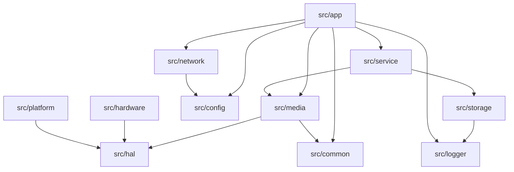

# t32_yb 项目目录结构现状与合理性评估

## 1. 背景与目标

目标：评估 `t32_yb` 当前目录结构是否合理，说明每个目录职责，并给出可执行的优化建议。

评估时间：2026-03-03

---

## 2. 现状快照（Top Level）

当前顶层目录（排除 `.git` 内部细节）：

```text
t32_yb/
├── .kiro/           # 需求/设计/任务规范（AI协作产物）
├── .vscode/         # IDE 本地配置
├── doc/             # 项目文档
├── res/             # 默认配置与资源样例
├── script/          # 安装/发布脚本
├── sdk/             # 平台 SDK 头文件与库（二进制）
├── src/             # 业务源码
├── tests/           # 测试代码与测试素材
└── third_party/     # 第三方依赖源码/封装
```

体量分布（目录大小）：

- `src`: 17M
- `sdk`: 49M
- `third_party`: 25M
- `tests`: 246M（主要是媒体素材）
- `doc`: 448K
- `res`: 6.0M

---

## 3. 每个目录的作用

### 3.1 顶层目录职责

| 目录 | 作用 | 现状评价 |
|---|---|---|
| `.kiro/` | 规范化需求、设计、任务文档 | 合理，属于研发流程资产 |
| `.vscode/` | 编辑器配置 | 合理，开发辅助 |
| `doc/` | 设计、评审、任务、方案文档 | 合理，但分类体系与命名不统一 |
| `res/` | 运行配置和资源（`config.ini`、`setting.json`、样例图片） | 基本合理 |
| `script/` | 部署/发布脚本（`install.sh`、`release.sh`） | 基本合理 |
| `sdk/` | 芯片/系统 SDK（`include/`、`lib/glibc`、`lib/uclibc`） | 合理，边界清晰 |
| `src/` | 业务代码主目录 | 合理，已有分层 |
| `tests/` | 测试代码+配置+媒体素材 | 功能完整，但大文件管理不合理 |
| `third_party/` | 外部依赖（jsoncpp/libevent/sqlite/smolrtsp 等） | 合理，集中管理 |

### 3.2 `src/` 子目录职责

| 目录 | 作用 |
|---|---|
| `src/app` | 可执行程序入口与应用编排（`htc_main_app`、`htc_media_app`、`htc_daemon_app`） |
| `src/common` | 通用能力（misc/time/utils） |
| `src/config` | 配置管理（设备配置、环境、setting） |
| `src/hal` | 硬件抽象层（Ingenic 实现 + 仿真实现） |
| `src/hardware` | 具体硬件能力（mcu/gpio/power/disk/daynight） |
| `src/logger` | 日志初始化与封装 |
| `src/media` | 媒体能力（audio/video/snap/rtsp/fifo/base） |
| `src/network` | 网络交互与设备对外通信 |
| `src/platform` | 平台差异能力（`sdk_stub`、工具程序） |
| `src/service` | 服务层（daemon/http_server/camera） |
| `src/storage` | 数据库存储与媒体索引 |

### 3.3 分层关系（代码组织视角）



---

## 4. 合理性判断

### 4.1 结论

**整体“基本合理”，但存在明显可维护性风险。**

可给出结论：**7/10（结构方向正确，执行一致性不足）**。

### 4.2 合理点

1. `src/` 分层已经形成（应用/服务/媒体/硬件/HAL/配置）。
2. `sdk/` 与 `third_party/` 分离，依赖边界清楚。
3. 支持真机与仿真双构建（`BUILD_FOR_SIMULATION` + `platform/sdk_stub`）。

### 4.3 不合理点（关键）

1. **根目录混放较多测试脚本与RTSP说明文件**
   - 顶层存在大量 `test_*.sh` 和 `RTSP_CONFIG_*` 文件，和 `script/`、`doc/` 职责重叠。
2. **文档目录分类不统一**
   - 同时存在 `doc/design`、`doc/job`、`doc/review`、`doc/solution`，且有文档散落在根目录，检索成本高。
3. **测试资源过大且直接入仓**
   - `tests/assets` 约 246M（含 191M 的 `full_frame_camera.h264`），显著增加仓库体积和克隆成本。
4. **目录演进后存在构建引用漂移**
   - `src/service/camera/CMakeLists.txt` 仍引用 `src/media/common` 和 `media_video`（当前结构中不存在对应目标）。
   - `src/service/daemon/CMakeLists.txt` 中部分 include 路径仍指向旧层级（`../config/...`）。
5. **命名一致性问题**
   - `daemon`/`Deamon` 混用，增加认知负担与搜索成本。

---

## 5. 优化建议（按优先级）

### P0（建议立即执行）

1. 修复目录结构与构建定义不一致问题  
   - 清理 `service/camera`、`service/daemon` 中过时路径与目标名，确保与现目录一致。
2. 根目录收敛  
   - 将 `test_*.sh` 迁移到 `script/rtsp/` 或 `tests/e2e/`；  
   - 将 `RTSP_CONFIG_*` 迁移到 `doc/reference/rtsp/`。
3. 测试大文件治理  
   - 使用 Git LFS 或“按需下载脚本+外部对象存储”管理 `tests/assets` 大媒体文件。

### P1（短期执行）

1. 统一文档分类规范  
   - 固化为 `doc/analysis|solution|roadmap|adr|reference|backlog`，旧目录逐步归档迁移。
2. 命名标准化  
   - 统一 `daemon` 拼写（文件名、类名、日志TAG、文档词汇）。
3. 测试分层  
   - `tests/unit`、`tests/integration`、`tests/e2e`，并在 CMake 中对应分组。

### P2（中期优化）

1. 每个 `src` 一级模块增加简版 `README.md`  
   - 说明职责、边界、依赖方向、对外接口。
2. 为根目录增加 `docs index` 与 `scripts index`  
   - 降低新成员上手成本。

---

## 6. 最终判断

当前结构已经具备工程化基础，不建议“大拆大改”。  
建议采取**“小步快跑”整理策略**：先做 P0 对齐（构建一致性 + 根目录收敛 + 大文件治理），再做 P1/P2 的规范化演进。
