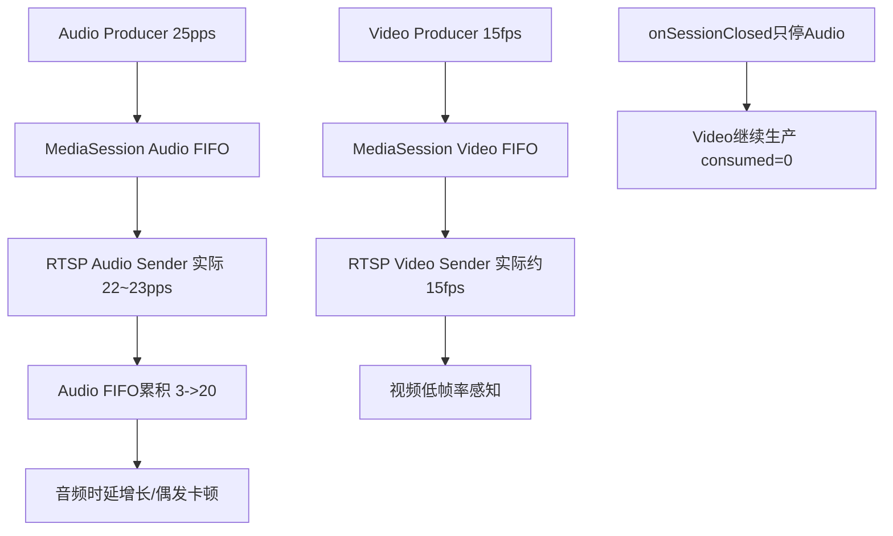

# RTSP SIMU AV不同步与卡顿分析（2026-03-04）

## 背景与目标
- 场景：`t32_yb`，`BUILD_FOR_SIMULATION=ON`，RTSP 播放测试。
- 现象：AV 不同步、音频偶发卡顿、视频帧率感知偏低。
- 目标：基于本次日志定位主要原因，并给出可执行改进项。

## 输入与范围
- 日志文件：`build_sim/sdcard/logs/app.log`
- 代码范围：
  - `src/media/rtsp/MediaSession.cpp`
  - `src/media/rtsp/RtspServer.cpp`
  - `src/media/rtsp/rtsp.c`

## 现状证据

### 1) 音频生产速率高于消费速率，FIFO 持续累积
- 日志连续统计显示：
  - `produced=25/s`
  - `consumed=22~23/s`
  - `fifo=3 -> 20`（约 9 秒内持续增长）
- 停止时汇总：
  - `produced=232`
  - `consumed=210`
  - `duration=9.264 sec`
  - `avg_produced=25.04 pps`
  - `avg_consumed=22.67 pps`
- 含义：音频链路每秒落后约 `2~3` 包，累计会导致音频时延增大，并触发播放器端抖动/卡顿感。

### 2) 视频帧率低主要是配置结果，不是异常退化
- 视频配置固定为 15fps：
  - `RtspServer.cpp` 中 `cfg.fps_num = 15`
- 运行统计也接近 15fps：
  - 生产约 `15~16/s`
  - 消费约 `14~16/s`（会话进行期间）
- 结论：当前“视频看起来低帧率”与配置一致。

### 3) 会话关闭流程存在不对称停止
- `onSessionClosed` 仅执行 `uninitAudio()`，未停止 `videoSession`。
- 日志表现：
  - 会话关闭后视频仍继续 `produced=16/s consumed=0/s`，FIFO 持续增长（`20 -> 36 -> 52`）。
- 风险：资源释放不完整、下次会话状态污染、统计误导。

## 根因判断
1. 音频发送节拍与期望 25pps 存在长期偏差（实际 22~23pps）。
2. 音频/视频发送回调基于“回调结束后再 `event_add(interval)`”的相对调度，回调耗时会累积漂移。
3. 视频回调中 NAL 处理和发送在同一事件循环内，可能挤占音频回调时机，加剧音频节拍变慢。
4. 视频 15fps 为配置行为，不属于链路异常。

## 结论与建议

### P0（建议立即）
1. 将音频发送调度改为“绝对deadline”模型（固定下一目标时间，而非相对回调时长累积）。
2. 同步改造视频发送调度为 deadline 模式，减少 A/V 漂移源头。
3. 修复 `onSessionClosed`：音频和视频会话都应停止，保证会话生命周期一致。

### P1（建议尽快）
1. 若期望更顺滑画面，将 simu 视频从 `15fps` 调整到 `25/30fps`。
2. 将 `rtsp.c` 中关键 `printf` 迁移到统一日志系统，保证 `app.log` 可见网络背压、发送节拍等关键线索。

### P2（策略项）
1. 保持你要求的“音视频联动丢帧”方向：不要做音频单独丢帧策略，后续设计为统一 A/V 时延控制。

## 流程示意（本次问题）

## 参考定位
- 音频/视频会话统计：`build_sim/sdcard/logs/app.log`
- 视频 fps 配置：`src/media/rtsp/RtspServer.cpp`（`cfg.fps_num = 15`）
- 会话关闭处理：`src/media/rtsp/RtspServer.cpp`（`onSessionClosed`）
- 音频发送调度：`src/media/rtsp/rtsp.c`（`send_audio_packet_cb`）
- 视频发送调度：`src/media/rtsp/rtsp.c`（`send_video_packet_cb`）
