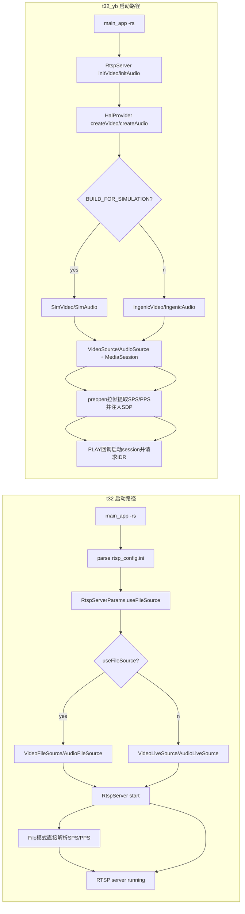

# t32 vs t32_yb：RTSP 启动时 Source 决策与 SPS/PPS 时机对比

## 1. 背景与目标

目标：比较 `t32` 与 `t32_yb` 在 RTSP Server 启动时如何决定 video/audio source、如何处理 SPS/PPS，以及评估哪种方案更合理。

---

## 2. 结论先行

1. **Source 决策机制**  
   - `t32`：偏“运行时策略分支”（`useFileSource`，FileSource/LiveSource 显式切换）。  
   - `t32_yb`：偏“抽象层工厂分发”（`HalProvider` + `IVideo/IAudio`，由编译模式决定底层实现）。

2. **SPS/PPS 注入时机**  
   - `t32`：File 模式在 `start()` 时直接从视频文件解析 SPS/PPS；Live 模式通常不预注入。  
   - `t32_yb`：统一采用“预开 session 拉帧提取 SPS/PPS -> 注入 SDP -> 再等待 PLAY 正式启动”。

3. **合理性判断**  
   - 从“架构一致性 + 可维护性 + RTSP 协议完整性”看：**`t32_yb` 更合理**。  
   - 从“仿真测试可控性（文件源显式开关）”看：`t32` 在测试入口上更直接。

---

## 3. t32：Source 决策方式

## 3.1 决策入口

在 `SIMULATION_MODE` 下，`main_app -rs` 会读取 `tests/assets/configs/rtsp_config.ini`，构建 `RtspServerParams` 并设置：

- `params.useFileSource = true`
- `videoFilePath/audioFilePath/fps/codec` 等来自 ini

参考：
- [t32/src/app/main_app.cpp](/home/zengping/project/huntcam/code/t32/src/app/main_app.cpp:1116)
- [t32/src/app/main_app.cpp](/home/zengping/project/huntcam/code/t32/src/app/main_app.cpp:1121)
- [t32/src/app/main_app.cpp](/home/zengping/project/huntcam/code/t32/src/app/main_app.cpp:1174)

## 3.2 RtspServer 启动分支

`RtspServer::start()` 中按 `serverParams.useFileSource` 分支：

- `true`：创建 `VideoFileSource`；音频优先 `AudioFileSource`（有文件），否则 `AudioLiveSource`
- `false`：创建 `VideoLiveSource` + `AudioLiveSource`

参考：
- [t32/src/media/rtsp/RtspServer.cpp](/home/zengping/project/huntcam/code/t32/src/media/rtsp/RtspServer.cpp:310)
- [t32/src/media/rtsp/RtspServer.cpp](/home/zengping/project/huntcam/code/t32/src/media/rtsp/RtspServer.cpp:399)
- [t32/src/media/rtsp/RtspServer.cpp](/home/zengping/project/huntcam/code/t32/src/media/rtsp/RtspServer.cpp:442)

---

## 4. t32_yb：Source 决策方式

## 4.1 决策入口

`main_app -rs` 不再显式传入 `useFileSource`。  
`RtspServer::initVideo/initAudio` 直接走 HAL 抽象：

- `HalProvider::createVideo()`
- `HalProvider::createAudio()`

参考：
- [t32_yb/src/app/main_app.cpp](/home/zengping/project/huntcam/code/t32_yb/src/app/main_app.cpp:1201)
- [t32_yb/src/media/rtsp/RtspServer.cpp](/home/zengping/project/huntcam/code/t32_yb/src/media/rtsp/RtspServer.cpp:369)
- [t32_yb/src/media/rtsp/RtspServer.cpp](/home/zengping/project/huntcam/code/t32_yb/src/media/rtsp/RtspServer.cpp:416)

## 4.2 Source 实现选择（通过 HAL 工厂）

`HalProvider` 在 `BUILD_FOR_SIMULATION` 下返回 `SimVideo/SimAudio`，否则返回 `IngenicVideo/IngenicAudio`：

参考：
- [t32_yb/src/hal/HalProvider.cpp](/home/zengping/project/huntcam/code/t32_yb/src/hal/HalProvider.cpp:9)

随后由 `VideoSource/AudioSource` 统一包装 `IVideoStream/IAudioStream`：

参考：
- [t32_yb/src/media/rtsp/VideoSource.cpp](/home/zengping/project/huntcam/code/t32_yb/src/media/rtsp/VideoSource.cpp:7)
- [t32_yb/src/media/rtsp/AudioSource.cpp](/home/zengping/project/huntcam/code/t32_yb/src/media/rtsp/AudioSource.cpp:7)

---

## 5. SPS/PPS 获取时机对比

## 5.1 t32

### FileSource 模式

- 在 `RtspServer::start()` 里直接读取完整视频文件，扫描 NALU 提取 SPS/PPS，然后写入 `rtsp_param.video_sps/video_pps`。

参考：
- [t32/src/media/rtsp/RtspServer.cpp](/home/zengping/project/huntcam/code/t32/src/media/rtsp/RtspServer.cpp:323)
- [t32/src/media/rtsp/RtspServer.cpp](/home/zengping/project/huntcam/code/t32/src/media/rtsp/RtspServer.cpp:389)

### LiveSource 模式

- 无统一“启动前预提取 + 注入”路径。  
- 通过首次拉流时请求 IDR（`pullFrame()` 中）改善首帧关键帧可用性，但 SDP 里通常没有 `sprop-parameter-sets`（除非参数已注入）。

参考：
- [t32/src/media/rtsp/RtspServer.cpp](/home/zengping/project/huntcam/code/t32/src/media/rtsp/RtspServer.cpp:621)
- [t32/src/media/rtsp/rtsp.c](/home/zengping/project/huntcam/code/t32/src/media/rtsp/rtsp.c:304)
- [t32/src/media/rtsp/rtsp.c](/home/zengping/project/huntcam/code/t32/src/media/rtsp/rtsp.c:323)

## 5.2 t32_yb

- 启动阶段先 `videoSession_->start()` 做 preopen，限时拉帧并 `extractSpsPps`。  
- 提取到后 `set_server_param(RTSP_SERVER_PARAM_VIDEO_SPS/PPS)` 注入 SDP。  
- 然后 `videoSession_->stop()`；真正推流在 PLAY 回调里再启动 session，并主动 `requestIDR()`。

参考：
- [t32_yb/src/media/rtsp/RtspServer.cpp](/home/zengping/project/huntcam/code/t32_yb/src/media/rtsp/RtspServer.cpp:295)
- [t32_yb/src/media/rtsp/RtspServer.cpp](/home/zengping/project/huntcam/code/t32_yb/src/media/rtsp/RtspServer.cpp:327)
- [t32_yb/src/media/rtsp/RtspServer.cpp](/home/zengping/project/huntcam/code/t32_yb/src/media/rtsp/RtspServer.cpp:350)
- [t32_yb/src/media/rtsp/rtsp.c](/home/zengping/project/huntcam/code/t32_yb/src/media/rtsp/rtsp.c:425)

---

## 6. 相同点与不同点

| 维度 | t32 | t32_yb |
|---|---|---|
| Source 决策位置 | `RtspServer::start()` 显式分支 | `RtspServer::init*` + `HalProvider` 工厂分发 |
| 仿真文件源入口 | `rtsp_config.ini` + `useFileSource=true` | `Sim*` 内部按配置文件取样本（由 HAL 实现管理） |
| RTSP 与 source 耦合 | 较高（知道 File/Live 细节） | 较低（面向 stream/source 抽象） |
| SPS/PPS 注入 | File 模式有，Live 模式弱 | 统一 preopen 提取并注入 |
| 会话启动时机 | 客户端首次 `pullFrame` 时延迟启动 | `PLAY` 回调启动（协议语义更直接） |
| 可测试性（显式切换） | 强（useFileSource 非常直观） | 中（需理解 HAL/sim 配置路径） |

---

## 7. 架构流程图（Mermaid）

---

## 8. 哪个更合理（评估）

综合评估：**`t32_yb` 更合理**，理由如下：

1. **分层更清晰**：RTSP 层不再强耦合 File/Live 细节，source 决策下沉到 HAL/stream 抽象。  
2. **协议完整性更好**：统一 preopen 提前注入 SPS/PPS，客户端 SDP 兼容性更高。  
3. **行为一致性更好**：无论 sim 还是真机，路径一致（`HalProvider -> stream -> VideoSource/AudioSource`）。

但 `t32` 的优点仍值得保留：

1. FileSource 开关显式，测试与复现实验非常直接。  
2. `rtsp_config.ini` 人工调试门槛更低。

---

## 9. 建议（收敛方向）

建议采用“`t32_yb` 架构 + `t32` 的配置便利性”：

1. 在 `t32_yb` 增加统一 `RtspSourceConfig`（例如 `mode=live/file`），但仍通过 HAL 接口落地。  
2. 保留 preopen+SPS/PPS 注入机制，不回退到 Live 模式无 SDP 参数。  
3. 将“仿真文件选择”收敛到单一入口（避免 `rtsp_config.ini` 与 `res/config.json` 双轨并存）。  
