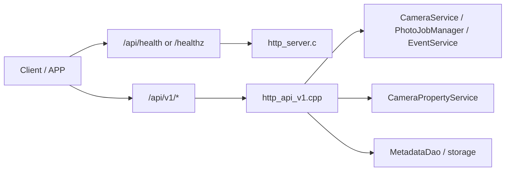

# HTTP API Legacy 与 V1 现状评估

## 背景与目标

本文档回答四个问题：

- 旧版 `/api/*` 与新版 `/api/v1/*` 的差异是什么
- 为什么历史上会同时存在两套接口
- 现在应该用哪一套
- 从纯技术角度看，旧版是否可以移除

本结论基于 2026-03-24 对当前代码、SIMU 构建和脚本验证的核查结果。

## 当前结论

一句话结论：

> legacy 业务层已经完成删除，后续只应继续使用 `/api/v1/*`，`/api/health` 与 `/healthz` 作为基础探针保留。

## 当前结构



相关代码位置：

- `src/service/http_server/http_server.c`
- `src/service/http_server/http_api_v1.cpp`
- `src/service/http_server/test_http_server.c`
- `doc/reference/20260305-http-simu-test-usage.md`

补充说明：

- 原 `src/service/http_server/http_api.c` 已删除
- legacy 业务路由现在统一返回 `404`

## 为什么历史上会有两套接口

### Legacy `/api/*`

legacy 的本质是过渡层，不是真正长期维护的正式版本。

特点：

- 直接把旧 TCP 控制语义平移到 HTTP
- 路径风格偏命令式，例如 `/api/record/start`
- 返回体多为手工拼装 JSON，常见 `status:0`
- 大量实现停留在硬编码或 `TODO`

### V1 `/api/v1/*`

V1 的本质是正式演进起点。

特点：

- 路径资源化、版本化
- 统一返回 `code/message/data`
- `camera` 域已经接入 service 层、任务管理、事件推送和数据库
- `device/system/storage` 也已有统一 V1 归属

因此，两套接口同时存在只是迁移中间态，不是长期双版本策略。

## Legacy 与 V1 的核心差异

| 维度 | Legacy `/api/*` | V1 `/api/v1/*` |
|------|------------------|----------------|
| 设计风格 | 命令式 | 资源化、版本化 |
| 返回格式 | 各接口自行拼装 JSON | 统一 `code/message/data` |
| 领域组织 | device / sensor / system / storage / camera 混杂 | 按 `device/system/storage/camera` 分域 |
| 业务接线 | 大量占位实现 | `camera` 域接线较深，外围域已有统一归属 |
| 扩展能力 | 弱 | 强 |
| 当前状态 | 已退役 | 主线 |

## 旧版到新版映射关系

### `camera` 域

| 旧版接口 | 新版接口 |
|---------|----------|
| `GET /api/params` | `GET /api/v1/camera/properties` |
| `POST /api/params/set` | `POST /api/v1/camera/properties` |
| `POST /api/params/reset` | `POST /api/v1/camera/properties/reset` |
| `GET /api/record/status` | `GET /api/v1/camera/video/status` |
| `POST /api/record/start` | `POST /api/v1/camera/video/start` |
| `POST /api/record/stop` | `POST /api/v1/camera/video/stop` |
| `GET /api/snapshot` | `POST /api/v1/camera/photo` |

### `device/system/storage` 域

| 旧版接口 | 新版接口 |
|---------|----------|
| `GET /api/device/info` | `GET /api/v1/device/info` |
| `GET /api/sensor/data` | `GET /api/v1/device/sensors` |
| `POST /api/system/datetime` | `POST /api/v1/system/datetime` |
| `POST /api/system/workmode` | `POST /api/v1/system/workmode` |
| `GET /api/storage/info` | `GET /api/v1/storage/info` |
| `POST /api/storage/format` | `POST /api/v1/storage/format` |

### `health`

`health` 没有放进业务版本号，而是单独保留为基础探针：

- `GET /api/health`
- `GET /healthz`

## 当前完成度评估

### 基础探针

| 路径 | 状态 | 说明 |
|------|------|------|
| `/api/health` | 可用 | 保留的基础探针 |
| `/healthz` | 可用 | 更明确的基础探针别名 |

### V1 `/api/v1/*`

| 接口组 | 状态 | 判断 |
|--------|------|------|
| `device/info` | 已迁入 V1，当前仍是占位数据 | 基本可用 |
| `device/sensors` | 已迁入 V1，当前仍是占位数据 | 基本可用 |
| `system/*` | 已迁入 V1，当前仍是请求接收与确认 | 基本可用 |
| `storage/*` | 已迁入 V1，当前仍是占位返回 | 基本可用 |
| `camera/photo*` | 已接入 `CameraService` 与 `PhotoJobManager` | 可用 |
| `camera/video*` | 已接入 `CameraService`，部分 T32 状态仍偏弱 | 基本可用 |
| `camera/properties*` | 已接入统一属性服务与持久化 | 可用 |
| `camera/presets*` | 已接入预设集合并可应用 | 可用 |
| `camera/photos` / `video/list` | 已基于数据库/媒体列表返回 | 基本可用 |
| `camera/preview` / `thumbnail` | 可返回 JPEG / MJPEG 或 DB 缩略图 | 可用 |
| `camera/database/*` | 已提供数据库文件下载 | 基本可用 |

### Legacy `/api/*`

| 接口组 | 状态 | 判断 |
|--------|------|------|
| 业务路由 | 已删除 | 已退役 |

结论：V1 已覆盖当前全部业务域，是唯一应继续演进的 HTTP API 主线。

## 实测结果

### 1. V1 正向验证

执行：

```bash
./script/test_http_api_v1_simu.sh
```

结果：

- `pass=43`
- `fail=0`

覆盖：

- `GET /api/health`
- `GET /healthz`
- `GET /api/v1/device/info`
- `GET /api/v1/device/sensors`
- `GET /api/v1/storage/info`
- `POST /api/v1/system/datetime`
- `POST /api/v1/system/workmode`
- `POST /api/v1/storage/format`
- `GET/POST /api/v1/camera/*` 核心路径

### 2. Legacy 退役验证

执行：

```bash
./script/test_http_api_simu.sh
```

结果：

- `pass=13`
- `fail=0`

该脚本当前不再做正向验证，而是确认以下 legacy 业务路径全部返回 `404`：

- `/api/device/info`
- `/api/sensor/data`
- `/api/system/datetime`
- `/api/system/workmode`
- `/api/storage/info`
- `/api/storage/format`
- `/api/params*`
- `/api/record*`
- `/api/snapshot`

## 技术判断

### 应该用哪一套

后续应只使用：

```text
/api/v1/*
```

以及基础探针：

```text
/api/health
/healthz
```

原因很直接：

- 路径组织更清晰
- 响应格式统一
- `camera` 域实现深度明显高于 legacy
- 继续维护旧路径只会制造重复成本

### 旧版是否可移除

从纯技术角度，答案现在是：可以，而且已经完成。

已完成的动作：

- 删除 legacy `camera` 业务路由
- 为 `device/system/storage` 补齐 V1 路径
- 将 `health` 下沉为基础探针
- 删除 `src/service/http_server/http_api.c`
- 将 legacy 脚本改为 404 退役验证

### 当前仍需注意的事实

legacy 已删除，并不等于所有新接口都已经是最终完成态。

当前残留的真实技术事实是：

- `device/system/storage` 仍以最小占位实现为主
- `camera` 域成熟度最高
- T32 下部分录像状态相关能力仍需继续补强

这属于“继续完善 V1”，不再是“是否保留 legacy”的理由。

## 最终建议

- 不再恢复任何 legacy 业务路径
- 对外和对内统一只讲 `/api/v1/*`
- `health` 只作为基础探针存在
- 后续投入应全部用于补强 V1 的真实业务接入深度
