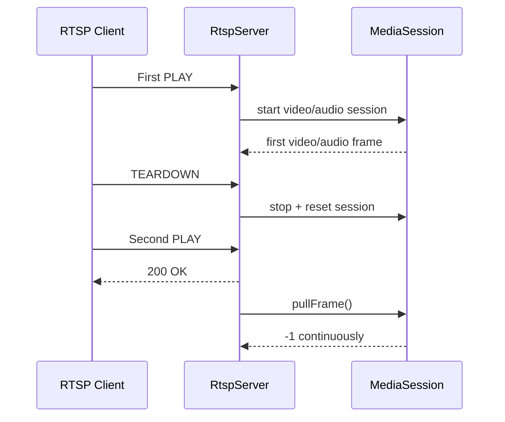

# RTSP 重复连接失败日志分析

## 背景与目标

现象：RTSP 服务启动后，客户端第一次连接可以正常播放，断开后第二次再连接无法正常播放。  
目标：基于本次测试日志，定位失败发生在哪一层，并给出代码级根因与修复建议。

## 现状描述

本次分析基于日志文件：

- `build_sim/sdcard/logs/app.log`

从日志看，第一次连接和第二次连接的差异很明显：

## 问题 / 发现

### 1. 第一次连接时，RTSP 协议握手和媒体启动都正常

日志显示第一次连接的 `OPTIONS -> DESCRIBE -> SETUP -> PLAY` 全部正常，随后视频和音频 session 均启动，并成功送出首帧：

- `PLAY` 发生在 `03:13:34.588`
- `onSessionPlay: video session started` 出现在 `03:13:34.639`
- `onSessionPlay: audio session started` 出现在 `03:13:34.644`
- 视频首帧出现在 `03:13:34.678`
- 音频首帧出现在 `03:13:34.698`

对应日志位置：

- `build_sim/sdcard/logs/app.log:45`
- `build_sim/sdcard/logs/app.log:52`
- `build_sim/sdcard/logs/app.log:59`
- `build_sim/sdcard/logs/app.log:66`
- `build_sim/sdcard/logs/app.log:67`

### 2. 第一次断开后，服务端把 session 对象直接销毁了

第一次 `TEARDOWN` 出现在 `03:13:46.926`，随后立刻进入 `onSessionClosed`，并停止 video/audio session：

- `TEARDOWN`：`build_sim/sdcard/logs/app.log:126`
- `onSessionClosed`：`build_sim/sdcard/logs/app.log:127`
- 视频 session stop：`build_sim/sdcard/logs/app.log:128`
- 音频 session stop：`build_sim/sdcard/logs/app.log:129`

代码里 `RtspServer::onSessionClosed()` 不只是停流，而是直接调用：

- `uninitVideo()`
- `uninitAudio()`

对应代码：

- `src/media/rtsp/RtspServer.cpp:232`
- `src/media/rtsp/RtspServer.cpp:237`
- `src/media/rtsp/RtspServer.cpp:238`

而 `uninitVideo()` / `uninitAudio()` 会在 `stop()` 后立刻 `reset()` 掉 session 指针：

- `videoSession_.reset()`：`src/media/rtsp/RtspServer.cpp:425`
- `audioSession_.reset()`：`src/media/rtsp/RtspServer.cpp:488`

这意味着 RTSP 服务器虽然还在监听端口，但媒体 session 已经被释放。

### 3. 第二次连接时，RTSP 协议层正常，但媒体层没有重新建立

第二次连接从 `03:13:57.586` 开始，`OPTIONS / DESCRIBE / SETUP / PLAY` 全部成功，说明网络和 RTSP 协议层是通的：

- `OPTIONS`：`build_sim/sdcard/logs/app.log:134`
- `DESCRIBE`：`build_sim/sdcard/logs/app.log:135`
- `SETUP(audio/video)`：`build_sim/sdcard/logs/app.log:139`、`145`
- `PLAY`：`build_sim/sdcard/logs/app.log:151`

但和第一次不同，第二次连接后没有出现下面这些关键日志：

- `onSessionPlay: video session started`
- `onSessionPlay: audio session started`
- `First frame`

取而代之的是从 `03:13:57.631` 开始，视频一直 `Pull result: -1`：

- `build_sim/sdcard/logs/app.log:159`
- 后续持续到连接关闭

这说明第二次连接失败点不在 RTSP 握手，而在媒体帧拉取阶段。

### 4. `pullFrame()` 在 session 指针为空时会直接返回 `-1`

代码中 `RtspServer::pullFrame()` 和 `pullAudioFrame()` 都有同样的保护逻辑：

- 当 `videoSession_ == nullptr` 时直接返回 `-1`
- 当 `audioSession_ == nullptr` 时直接返回 `-1`

对应代码：

- `src/media/rtsp/RtspServer.cpp:247`
- `src/media/rtsp/RtspServer.cpp:250`
- `src/media/rtsp/RtspServer.cpp:265`
- `src/media/rtsp/RtspServer.cpp:268`

而 `onSessionPlay()` 只是“如果 session 还存在且未运行，则 start”，并不会重新 `initVideo()` / `initAudio()`：

- `src/media/rtsp/RtspServer.cpp:365`
- `src/media/rtsp/RtspServer.cpp:370`
- `src/media/rtsp/RtspServer.cpp:376`

因此，一旦第一次断开时把 `videoSession_` / `audioSession_` 释放掉，第二次 `PLAY` 只能进入 RTSP transport 发送流程，但拿不到任何真实媒体帧。

### 5. `onSessionClosed` 在一次断开中被调用了两次

日志中第一次断开时，`onSessionClosed` 打印了两次：

- `build_sim/sdcard/logs/app.log:127`
- `build_sim/sdcard/logs/app.log:132`

对应中间还有一次 `Connection closed`：

- `build_sim/sdcard/logs/app.log:131`

代码里这两个回调点都存在：

- `TEARDOWN` 时主动调用关闭回调：`src/media/rtsp/rtsp.c:869`
- TCP 连接收到 `BEV_EVENT_EOF` 时再次调用关闭回调：`src/media/rtsp/rtsp.c:537`

这说明当前关闭路径至少存在“TEARDOWN 主动关闭 + 底层连接关闭事件”两次回调。  
这不是第二次连接失败的主因，但会放大状态清理问题，值得后续单独确认。

## 结论与建议

### 结论

本次“第一次可播、第二次不可播”的直接根因是：

`RtspServer::onSessionClosed()` 在客户端第一次断开后销毁了 `videoSession_` 和 `audioSession_`，但 RTSP 服务器仍保持运行；第二次客户端重新连接时，RTSP 协议握手虽然成功，但媒体 session 没有被重新创建，导致 `pullFrame()` 持续返回 `-1`，最终无法播放。

### 建议

建议按下面优先级处理：

1. 如果目标是“服务器持续运行、客户端可反复连接”，`onSessionClosed()` 不应调用 `uninitVideo()` / `uninitAudio()` 直接销毁 session。
2. 更合理的做法是只 `stop()` 当前 `MediaSession`，保留 `videoSession_` / `audioSession_` 对象，在下一次 `onSessionPlay()` 时重新 `start()`。
3. 如果确实必须销毁底层流对象，则需要在下一次 `PLAY` 前显式重新执行 `initVideo()` / `initAudio()`，而不是只依赖 `onSessionPlay()`。
4. 建议在 `pullFrame()` / `pullAudioFrame()` 因 session 为空返回 `-1` 时补充明确日志，避免当前这种只能从侧面推断的排查方式。
5. 额外确认 `onSessionClosed` 被重复触发的原因，避免重复清理带来更多重入问题。
