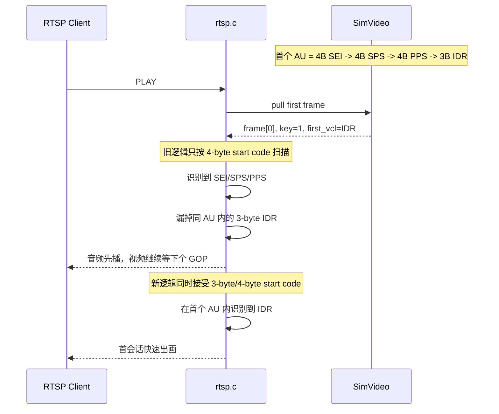

# RTSP Simu 首画面延迟根因与修正评审

## 背景与目标

现象：

- simu 环境下，RTSP 客户端连接后声音几乎马上出来
- 画面通常要约 3 秒后才出现
- UDP 和 TCP interleaved 都能稳定复现

目标：

- 明确首画面延迟的最终根因
- 记录已采用的修正方法
- 对根因确认前做过的修改逐项 review，判断是否必要

## 现状描述

本次结论基于以下证据：

- 日志文件 [build_sim/sdcard/logs/app.log](/home/zengping/project/huntcam/code/t32_yb/build_sim/sdcard/logs/app.log)
- 当前测试视频源 [build_sim/bin/res/full_frame_camera.h264](/home/zengping/project/huntcam/code/t32_yb/build_sim/bin/res/full_frame_camera.h264)
- RTSP 实现 [src/media/rtsp/rtsp.c](/home/zengping/project/huntcam/code/t32_yb/src/media/rtsp/rtsp.c)
- simu 视频源实现 [src/hal/simu/SimVideo.cpp](/home/zengping/project/huntcam/code/t32_yb/src/hal/simu/SimVideo.cpp)

用户侧最终验证结果：

- 修正后，VLC 测试已恢复为快速出画

本地进一步复现实验结果：

- 修正前，`ffmpeg` 首个视频帧时间约 `3.32s`
- 修正后，`ffmpeg` 首个视频帧时间约 `0.20s`

## 问题与发现

### 1. `PLAY` 时序不是最终根因

日志已经证明，`PLAY` 响应与实际启动推流的时序是正常的：

- `PLAY: 200 OK queued`
- `PLAY: deferred start scheduled`
- `PLAY: deferred start fired`
- 随后很快出现 `[VIDEO] First frame`

这说明：

- “客户端还没处理完 `PLAY 200 OK`，服务端就过早发首帧”不是这次 `3 秒后才出画` 的最终根因

### 2. `SimVideo` 的首个 AU 确实就是关键帧

在 `SimVideo` 侧增加日志后，首帧已经被明确记录为关键帧：

- `start: first_au{offset=0, bytes=69561, first_vcl=IDR(5), key=1}`
- `frame_after_start[0]: pts=0 key=1 offset=0->69561 bytes=69561 first_vcl=IDR(5)`

这说明：

- simu 文件源的第 0 帧本身就是可解码起播点
- “首帧不是 IDR”这个方向可以排除

### 3. 码流头部混用了 4-byte 和 3-byte start code

对 `full_frame_camera.h264` 头部直接解析，前几个 NAL 顺序为：

- `offset=0` `4-byte` `SEI(6)`
- `offset=93` `4-byte` `SPS(7)`
- `offset=127` `4-byte` `PPS(8)`
- `offset=135` `3-byte` `IDR(5)`
- `offset=69561` `4-byte` `NON_IDR(1)`

也就是说，第一个 AU 内部不是统一 start code 格式，而是混合的：

- 前导 NAL 用 `00 00 00 01`
- 首个 IDR 用 `00 00 01`

### 4. 旧 RTSP NAL 遍历逻辑只按“首种 start code”扫描

`smolrtsp_determine_start_code()` 会根据当前帧起始位置决定使用 `3-byte` 或 `4-byte` tester。

旧逻辑的问题在于：

- 第一个 AU 以 `4-byte start code` 开头
- RTSP 后续遍历就一直只用 `4-byte tester`
- 当扫描到 `offset=135` 的 `3-byte IDR` 时，RTSP 侧无法把它识别成新的 NAL 起点

结果就是：

- RTSP 在首帧里只看到了 `SEI/SPS/PPS`
- 没有在首帧里走到真正的 `IDR`
- 启动门控继续认为“还没等到 IDR”
- 一直等到下一个 GOP 的 IDR，表现为约 3 秒后出画

### 5. 日志已经把上述根因坐实

修正前的关键日志链路：

- `SIMVID frame_after_start[0]: ... first_vcl=IDR(5)`
- `RTSP [VIDEO] First frame: capture_ts=0 us, rtp_ts=0`
- `RTSP [VIDEO] Startup waiting IDR: allow unit_type=6 ts=0`
- 之后持续 `drop unit_type=1`
- 直到约 `ts=269997` 才出现 `Startup IDR reached`

这组日志说明：

- simu 首帧里确实有 IDR
- RTSP 首帧扫描时却没有在同一帧里把 IDR 找出来
- 问题发生在 RTSP 对同一 AU 的 NAL 切分/遍历阶段

## 最终根因

最终根因是：

- **RTSP 侧对 H.264 NAL 边界的扫描逻辑不兼容同一 AU 内混用 `3-byte` / `4-byte` start code 的码流**

所以首帧虽然是关键帧，但 RTSP 在启动阶段没有在首个 AU 内成功识别出其中的 `IDR`，导致客户端实际等到了后续 GOP 的关键帧才出画。

## 修正方法

### 1. 核心修正

在 [src/media/rtsp/rtsp.c](/home/zengping/project/huntcam/code/t32_yb/src/media/rtsp/rtsp.c) 中新增统一起始码检测逻辑：

- `detect_nal_start_code_len()`

修正点：

- 每次扫描 NAL 边界时，优先沿用当前帧推断出的 tester
- 如果未命中，再尝试另一种 start code
- 这样同一 AU 内无论混用 `3-byte` 还是 `4-byte`，都能正确切分出 NAL

应用位置：

- `h264_buffer_contains_idr()`
- `send_video_packet_cb()` 的逐 NAL 遍历路径

### 2. 启动期保留辅助判定

仍保留了：

- `h264_buffer_contains_idr()` 的整帧 IDR 预判

作用：

- 启动期如果当前 frame 内已经包含 IDR，可更早清掉 `need_idr`
- 不再依赖逐 NAL 走到 `IDR` 才解除启动门控

### 3. 定位期日志的作用

在根因定位阶段，曾短暂增加过：

- `Startup IDR frame detected before NAL walk`
- `Mixed NAL start code detected: preferred=4 actual=3 ts=0`

这些日志帮助确认了：

- 首帧本身包含 IDR
- 首帧内部确实混用了 `3-byte` 和 `4-byte` start code

在当前收敛后的代码里，这些高针对性的定位日志已移除，只保留功能修复本身。

## 验证结果

修正验证阶段的关键日志曾显示：

- `[VIDEO] First frame: capture_ts=0 us, rtp_ts=0`
- `[VIDEO] Startup IDR frame detected before NAL walk: ts=0 size=69561`
- `[VIDEO] Mixed NAL start code detected: preferred=4 actual=3 ts=0`

这些日志已经完成定位使命，后续在收敛代码时被移除；但它们对应的功能修复仍然保留。

本地 `ffmpeg` 复现结果：

- 修正前：`frame=1 ... time=00:00:03.32`
- 修正后：`frame=1 ... time=00:00:00.20`

用户实测结果：

- VLC 测试恢复为快速出画

## 根因确认前修改的 Review

下面仅从“这次首画面延迟问题是否需要它”这个角度评估，不等同于“代码价值为零”。

| 修改项 | 位置 | 原目的 | 对本问题是否必要 | 评审结论 |
| --- | --- | --- | --- | --- |
| `PLAY 200 OK` 先回，播放延后到下一轮 event-loop | [src/media/rtsp/rtsp.c](/home/zengping/project/huntcam/code/t32_yb/src/media/rtsp/rtsp.c) | 排除客户端状态切换与首帧过早发送的竞态 | 不是 | 对本问题不是根因修复。日志已证明即使 deferred play 生效，仍会 3 秒后出画。若追求最小 patch，可作为候选回退项；若保留为协议鲁棒性改进，也说得通。 |
| 启动期 `Startup waiting IDR` / `Startup IDR reached` 日志 | [src/media/rtsp/rtsp.c](/home/zengping/project/huntcam/code/t32_yb/src/media/rtsp/rtsp.c) | 观测启动门控实际行为 | 不是 | 对定位过程非常有价值，但不属于功能修复。问题关闭后可按日志噪声情况保留、降频或移除。 |
| `need_idr` 时允许所有非 VCL（含 SEI）先通过 | [src/media/rtsp/rtsp.c](/home/zengping/project/huntcam/code/t32_yb/src/media/rtsp/rtsp.c) | 避免把 `SEI` 误当成必须丢弃的非 IDR 视频数据 | 不是根因，但语义正确 | 即使没有它，这次真正导致 3 秒延迟的仍是 mixed start code 扫描失败。但从 H.264 prefix NAL 语义看，这个修改是合理的，建议保留。 |
| `h264_buffer_contains_idr()` 整帧预判 | [src/media/rtsp/rtsp.c](/home/zengping/project/huntcam/code/t32_yb/src/media/rtsp/rtsp.c) | 提前识别“当前 frame 内含 IDR” | 不是唯一必要项 | 不是本次问题的核心根因修复；核心仍是 mixed start code 兼容。但它能让启动门控更稳健，建议保留。若未来追求最小实现，也可以在回归测试充分后再评估是否删除。 |
| mixed start code 兼容扫描 | [src/media/rtsp/rtsp.c](/home/zengping/project/huntcam/code/t32_yb/src/media/rtsp/rtsp.c) | 正确识别同一 AU 内混用的 `3-byte/4-byte` 起始码 | 是 | 这是本次问题的核心修复，必须保留。 |
| `SimVideo::start()` 复位 `frame_index_/last_pts_/read_offset_` | [src/hal/simu/SimVideo.cpp](/home/zengping/project/huntcam/code/t32_yb/src/hal/simu/SimVideo.cpp) | 避免重连后从旧位置和旧时间戳继续 | 对本问题不是根因，但对 simu 语义是必要的 | 这不是首画面延迟的根因修复，但它修正了 simu 会话重启的一致性问题，建议保留。 |
| `SimVideo` 启动/首帧/requestIDR 调试日志 | [src/hal/simu/SimVideo.cpp](/home/zengping/project/huntcam/code/t32_yb/src/hal/simu/SimVideo.cpp) | 证明首帧是否为 IDR，证明 `requestIDR()` 是否真实生效 | 不是 | 纯定位辅助。保留有助后续排查，若担心 HAL 日志噪声，可在问题关闭后裁剪。 |
| simu 默认测试源切换到 `full_frame_camera.*` | [src/hal/simu/res/config.json](/home/zengping/project/huntcam/code/t32_yb/src/hal/simu/res/config.json) | 让默认测试源与当前排查对象一致 | 不是功能修复 | 这是测试环境配置，不是根因修复。是否保留取决于团队是否要把 `full_frame_camera.*` 作为默认 simu 测试源。 |
| 554 端口绑定失败补充日志 | [src/media/rtsp/rtsp.c](/home/zengping/project/huntcam/code/t32_yb/src/media/rtsp/rtsp.c) | 便于在普通用户环境定位端口权限问题 | 不是 | 与本问题无关，但开发体验有价值，可保留。 |

## 建议的保留策略

如果目标是“只保留本问题真正需要的最小功能改动”，建议按下面理解：

### 必须保留

- `rtsp.c` 中 mixed start code 兼容扫描

### 建议保留

- `rtsp.c` 中允许非 VCL prefix NAL 通过的逻辑
- `rtsp.c` 中 `h264_buffer_contains_idr()` 整帧预判
- `SimVideo::start()` 的状态复位

### 可选保留

- deferred `PLAY` 启动逻辑
- RTSP 启动门控调试日志
- `SimVideo` 调试日志
- 554 端口权限提示日志

### 与根因修复无关、按测试策略决定

- simu 默认测试源是否继续使用 `full_frame_camera.*`

## 当前收敛结果

本轮已经按“让代码更合理则保留，只是排查堆出来的复杂度则移除”的标准做过一次代码收敛：

- 已保留：
  - `rtsp.c` 中 mixed start code 兼容扫描
  - `need_idr` 阶段允许 non-VCL prefix NAL 通过
  - `h264_buffer_contains_idr()` 整帧预判
  - deferred `PLAY` 启动逻辑
  - `SimVideo::start()` 对 `frame_index_/last_pts_/read_offset_` 的复位
- 已移除或收敛：
  - `SimVideo.cpp` 中仅用于排查的 `SimVideoAuInfo` / `inspect_linear_au()` / `frame_after_start[]` / `start:first_au` 等重型定位代码
  - `rtsp.c` 中仅用于定位的启动期高噪声日志与对应状态字段

收敛后已重新编译并做本地回归：

- `ffmpeg` 首个视频帧时间仍约为 `0.20s`
- 说明清理没有破坏本次首画面修复效果

## 结论与建议

结论：

- 本次 `声音马上出来、画面约 3 秒后才出现` 的最终根因已经明确，不是 VLC 特例，不是 UDP 丢包，也不是 `PLAY` 时序本身，而是 **RTSP 对 mixed start code 的 H.264 首帧切分错误**。
- 本次真正必须保留的功能修复是 RTSP 侧对 `3-byte` / `4-byte` start code 混用的兼容处理。
- 根因确认前做过的多项改动中，有几项对定位非常有帮助，但并不是这次问题的必要修复。

建议：

1. 当前先保留现有修复集，继续观察一轮实际测试。
2. 若后续要收敛 patch，优先审视 deferred `PLAY` 逻辑和大段调试日志。
3. `SimVideo` 位于 `src/hal/**`，属于 HAL 侧；如果后续要清理其中的调试日志或再做行为调整，建议与 PIC 责任人同步后再动。
4. 下一轮如果继续排查 AV Sync，可单独关注当前仍存在的 video DTS 非单调告警，这与本次“首画面 3 秒延迟”不是同一个问题。

## 过程示意

