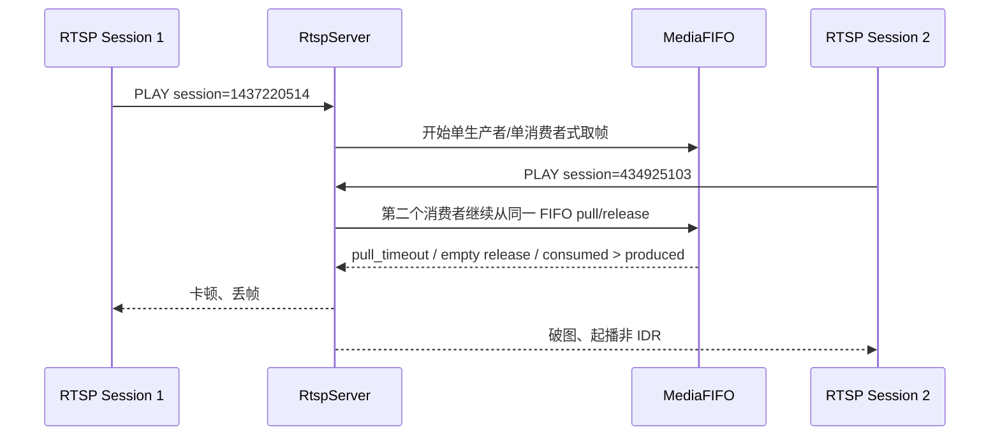

# RTSP 预览卡顿与破图分析

## 背景与目标

- 时间: 2026-04-13
- 场景: `build_sim/bin/htc_main_app -m` 预览时出现明显卡顿和破图
- 目标: 基于 `build_sim/sdcard/logs/app.log` 判断主要问题是否来自网络、码流、会话管理或 FIFO 读写逻辑

## 现状描述

- RTSP 服务端已成功提取并注入 SPS/PPS，启动流程正常。
- 仿真视频源为 `full_frame_camera_no_b_30s.h264`。
- 仿真音频文件缺失，日志显示回退到 synthetic audio。
- 预览建立后，很快出现第二个新的 RTSP `SETUP/PLAY` 会话，且旧会话未先 teardown。

## 问题与发现

### 1. 同一时段存在两个并发 RTSP 会话，共用同一套 MediaSession/FIFO

- 第一组会话在日志 [app.log](/home/zengping/project/huntcam/code/t32_cam/build_sim/sdcard/logs/app.log#L41) 到 [app.log](/home/zengping/project/huntcam/code/t32_cam/build_sim/sdcard/logs/app.log#L75) 建立并开始播放，session 为 `1437220514`。
- 约 3.5 秒后，第二组会话又在 [app.log](/home/zengping/project/huntcam/code/t32_cam/build_sim/sdcard/logs/app.log#L101) 到 [app.log](/home/zengping/project/huntcam/code/t32_cam/build_sim/sdcard/logs/app.log#L121) 建立，session 为 `434925103`。
- 服务端代码允许新的 `PLAY` 继续创建新的 per-stream 播放上下文，没有拒绝或回收旧会话，见 [rtsp.c](/home/zengping/project/huntcam/code/t32_cam/src/media/rtsp/rtsp.c#L1008)。

结论:
- 当前实现不是“单预览独占”，而是“多个 session 共享同一视频/音频 MediaSession”。
- 如果移动端预览会重复建链，就会出现两个消费者同时从同一个 FIFO 取数据。

### 2. MediaFIFO 的 `pop`/`release` 设计只适合单消费者，不适合并发 session

- `popBlocking()` 只返回 `head_` 指向的帧，但不会推进 `head_`，见 [MediaFIFO.cpp](/home/zengping/project/huntcam/code/t32_cam/src/media/fifo/MediaFIFO.cpp#L168)。
- 真正推进 `head_` 和减少 `count_` 是在 `release()` 里完成，见 [MediaFIFO.cpp](/home/zengping/project/huntcam/code/t32_cam/src/media/fifo/MediaFIFO.cpp#L185)。
- `MediaSession::pullDataInternal()` 每次 pull 只做 `consumedCount_++`，不对 FIFO 做“占用标记”，见 [MediaSession.cpp](/home/zengping/project/huntcam/code/t32_cam/src/media/rtsp/MediaSession.cpp#L326)。
- `MediaSession::releaseDataInternal()` 也没有校验释放的是否就是当前 head，对外传入什么指针都直接 `fifo_->release(frame)`，见 [MediaSession.cpp](/home/zengping/project/huntcam/code/t32_cam/src/media/rtsp/MediaSession.cpp#L345)。

结论:
- 两个消费者可在同一帧尚未 release 前反复 pull 到同一个 `head_`。
- 后续 release 会把 FIFO 向前推进多次，导致:
  - 某些帧被重复发送
  - 某些帧被直接跳过
  - release 次数和真实 pull/占用状态失配
  - 最终出现空释放告警与持续 pull timeout

### 3. 日志已经出现典型的“多消费者错误消费”特征

- 第二个会话建立后，视频统计立刻出现 `produced=31/s consumed=33/s`，见 [app.log](/home/zengping/project/huntcam/code/t32_cam/build_sim/sdcard/logs/app.log#L126)。
- 对一个单生产者 FIFO，正常情况下 `consumed` 不应长期高于 `produced`。
- 会话结束汇总时视频统计为 `produced=1567 consumed=1576 pull_timeout=587`，见 [app.log](/home/zengping/project/huntcam/code/t32_cam/build_sim/sdcard/logs/app.log#L541)。
- 日志多次出现 `Attempted to release from empty FIFO`，如 [app.log](/home/zengping/project/huntcam/code/t32_cam/build_sim/sdcard/logs/app.log#L156)。

结论:
- 这不是普通网络抖动，而是消费侧状态机已经乱了。

### 4. 破图还叠加了“第二个会话起播不是 IDR 帧”的问题

- 仿真视频源明确记录 `requestIDR ignored for simulation file source`，见 [app.log](/home/zengping/project/huntcam/code/t32_cam/build_sim/sdcard/logs/app.log#L59)。
- 第二个会话的 primed video 首帧时间戳已经是 `3399966`，不是从 0 开始，见 [app.log](/home/zengping/project/huntcam/code/t32_cam/build_sim/sdcard/logs/app.log#L116)。
- 第二个会话的第一帧也随之从 `capture_ts=3399966` 起播，见 [app.log](/home/zengping/project/huntcam/code/t32_cam/build_sim/sdcard/logs/app.log#L123)。

结论:
- 第二个会话大概率是从 GOP 中间的非 IDR 帧起播。
- 在仿真文件源不支持强制 IDR 的情况下，这本身就会表现为“花屏/破图直到下一个 IDR”。

### 5. 不是网络背压，也不是 FIFO 满导致的丢帧

- 日志中没有出现 `Network buffer full`。
- 统计里 `fifo_drops=0`，说明不是因为 FIFO 满而主动丢帧。
- SPS/PPS 提取与 DESCRIBE 返回也都正常，见 [app.log](/home/zengping/project/huntcam/code/t32_cam/build_sim/sdcard/logs/app.log#L38) 到 [app.log](/home/zengping/project/huntcam/code/t32_cam/build_sim/sdcard/logs/app.log#L40)。

结论:
- 主因不在发送链路带宽或 SPS/PPS 缺失。
- 主因在会话管理和 FIFO 消费模型不匹配。

## 结论与建议

### 结论

- 卡顿主因: 多个 RTSP session 并发消费同一个 `MediaSession`/`MediaFIFO`，而当前 FIFO 实现实际只支持单消费者。
- 破图主因: 第二个会话从运行中的文件流中途起播，且 simulation 模式不支持强制 IDR，导致新会话起播帧可能不是 IDR。

### 建议

1. 短期止血:
   - 明确只允许单个活跃预览会话。
   - 新 `PLAY` 到来时拒绝第二个 session，或先 teardown 旧 session 再切换。

2. 正确方案:
   - 不要让多个 RTSP 客户端共享同一个“单消费者 FIFO”。
   - 改为“每个客户端独立订阅队列”或“引用计数帧缓存 + 广播分发”。

3. 仿真模式补强:
   - 第二个会话启动时必须从 IDR 开始。
   - 文件源若不能 `requestIDR()`，则至少在新会话建立时跳到下一个 IDR 再开始送流。

4. 代码安全性:
   - 给 `releaseDataInternal()` 增加帧身份校验，避免空释放和错释放。
   - 给 `MediaFIFO::popBlocking()` 增加“已借出”状态，或直接改为 pop 时出队，release 只释放外部资源不再推进 head。
