# RTSP Server Audio/Video Source 架构分析与重构方案

## 1. 概述

本文档深入分析当前RTSP Server的Audio Source和Video Source架构，对比两者设计的异同，识别存在的问题，并提出统一的架构改进方案。

## 2. 当前架构分析

### 2.1 Audio Source 架构

#### 2.1.1 类层次结构

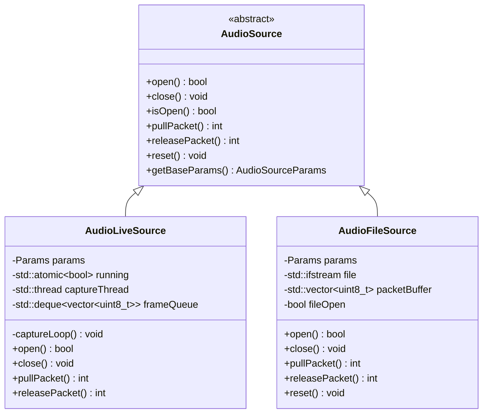

#### 2.1.2 AudioLiveSource 数据流

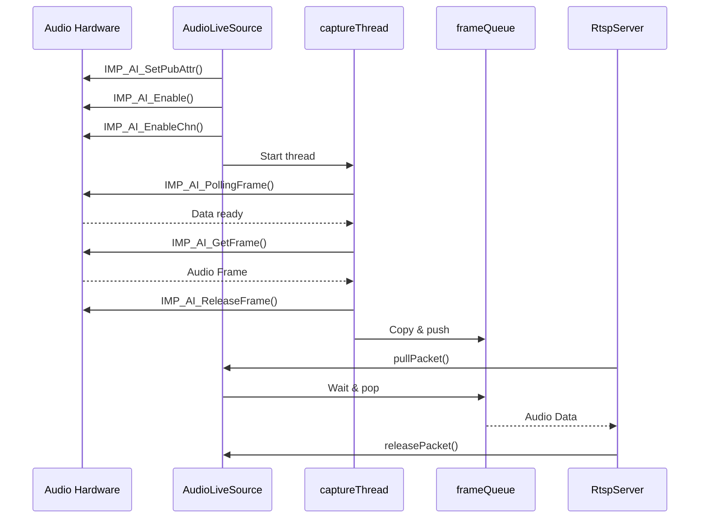

#### 2.1.3 AudioLiveSource 关键特性

**独立线程采集** (AudioLiveSource.cpp:65):
```cpp
running = true;
captureThread = std::thread(&AudioLiveSource::captureLoop, this);
```

**内部队列管理** (AudioLiveSource.cpp:93-127):
```cpp
void AudioLiveSource::captureLoop() {
    while (running) {
        IMP_AI_PollingFrame(params.devId, params.chnId, 1000);
        IMP_AI_GetFrame(params.devId, params.chnId, &frm, BLOCK);
        
        // Copy to internal queue
        std::vector<uint8_t> data(frm.len);
        memcpy(data.data(), frm.virAddr, frm.len);
        
        frameQueue.push_back(std::move(data));
        queueCv.notify_one();
    }
}
```

**阻塞式pull接口** (AudioLiveSource.cpp:129-149):
```cpp
int pullPacket(void** data, size_t* size) {
    std::unique_lock<std::mutex> lock(queueMutex);
    queueCv.wait_for(lock, std::chrono::milliseconds(200), 
        [this]{ return !frameQueue.empty() || !running; });
    
    if (!frameQueue.empty()) {
        currentFrame = std::move(frameQueue.front());
        frameQueue.pop_front();
        *data = currentFrame.data();
        *size = currentFrame.size();
        return 0;
    }
    return -1;
}
```

#### 2.1.4 AudioFileSource 数据流

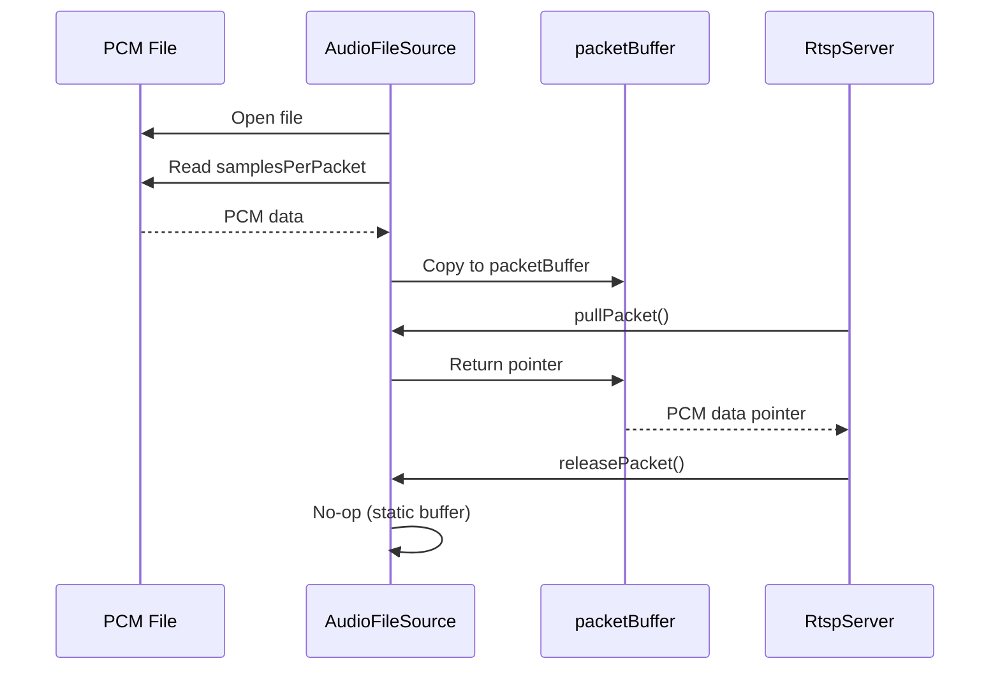

### 2.2 Video Source 架构

#### 2.2.1 当前结构（真机模式）

当前真机模式下**没有**独立的VideoSource类，视频获取逻辑直接嵌入在RtspServer中：

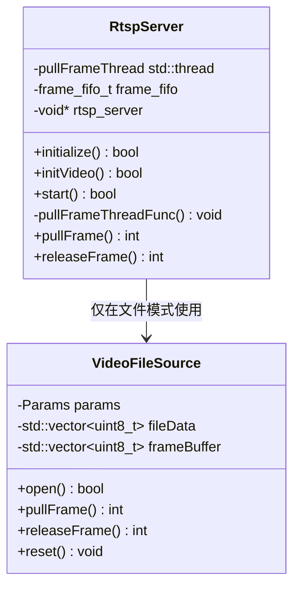

#### 2.2.2 真机Video数据流

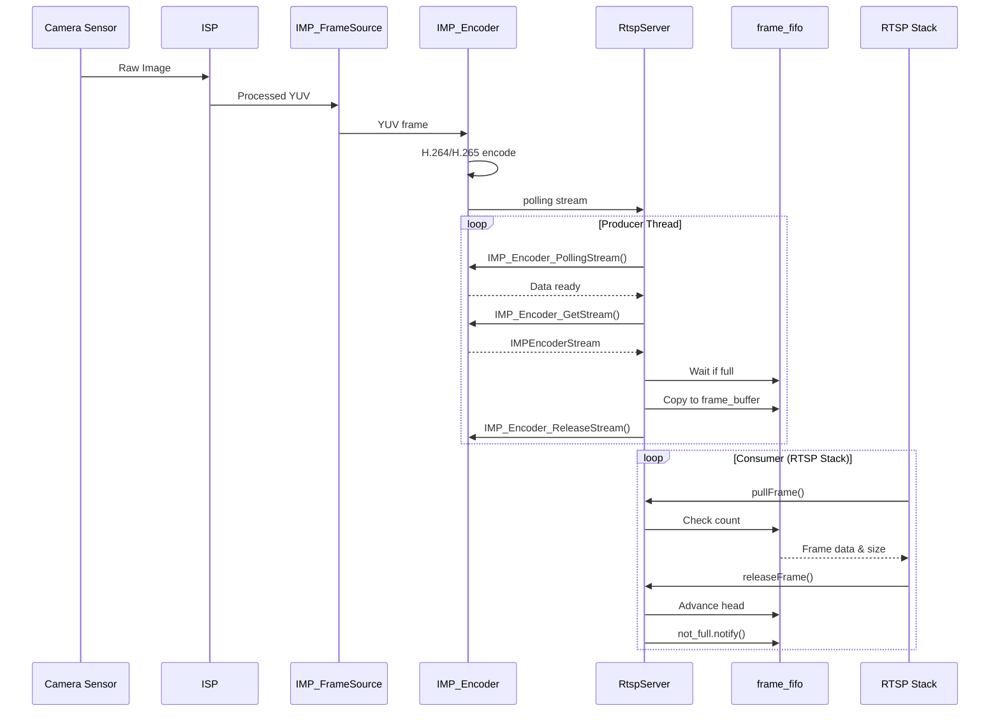

#### 2.2.3 文件模式Video数据流

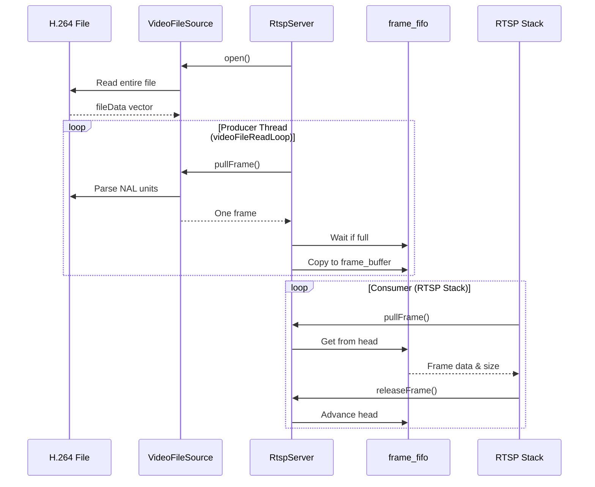

#### 2.2.4 真机Video在RtspServer中的实现

**初始化** (RtspServer.cpp:170-226):
```cpp
bool RtspServer::initialize() {
    // 1. System init
    ret = sample_system_init();
    
    // 2. FrameSource init
    ret = sample_framesource_init();
    
    // 3. Encoder init
    if (chn[RTSP_SENSOR_CHN_NUM].enable) {
        IMP_Encoder_CreateGroup(chn[RTSP_SENSOR_CHN_NUM].index);
    }
    
    // 4. Video encoder setup
    if (!initVideo()) return false;
    
    // 5. Bind FrameSource to Encoder
    IMP_System_Bind(&chn[RTSP_SENSOR_CHN_NUM].framesource_chn, 
                    &chn[RTSP_SENSOR_CHN_NUM].imp_encoder);
    
    return true;
}
```

**生产者线程** (RtspServer.cpp:1165-1305):
```cpp
while (this->pullFrameThreadRun) {
    // Polling
    ret = IMP_Encoder_PollingStream(chnNum, 1000);
    
    // Get stream
    ret = IMP_Encoder_GetStream(chnNum, &stream, 1);
    
    // Wait for FIFO space
    while (frame_fifo.count >= FIFO_MAX_FRAMES) {
        frame_fifo.not_full.wait_for(lock, ms(20));
    }
    
    // Copy to FIFO
    memcpy(frame_buffer, stream data, total_length);
    frame_fifo.tail = (frame_fifo.tail + 1) % FIFO_MAX_FRAMES;
    frame_fifo.count++;
    
    // Release stream
    IMP_Encoder_ReleaseStream(chnNum, &stream);
}
```

## 3. 架构对比分析

### 3.1 设计对比表

| 特性 | Audio Source | Video Source (真机) | Video Source (文件) |
|------|--------------|---------------------|---------------------|
| **基类/接口** | ✅ AudioSource基类 | ❌ 无基类，直接在RtspServer | ❌ VideoFileSource独立类 |
| **Live Source** | AudioLiveSource类 | ❌ 嵌入RtspServer | N/A |
| **File Source** | AudioFileSource类 | N/A | VideoFileSource类 |
| **独立线程** | ✅ captureThread | ✅ pullFrameThread | ✅ pullFrameThread |
| **内部队列** | ✅ frameQueue | ❌ 直接写入FIFO | ❌ 直接写入FIFO |
| **接口统一** | ✅ pullPacket/releasePacket | ✅ pullFrame/releaseFrame | ✅ pullFrame/releaseFrame |
| **硬件抽象** | 直接调用IMP_AI | 直接调用IMP_Encoder | 文件I/O |
| **与FIFO交互** | 内部队列 → FIFO | 直接写入FIFO | 直接写入FIFO |
| **生命周期管理** | 类内部管理 | RtspServer管理 | VideoFileSource + RtspServer |

### 3.2 数据流对比

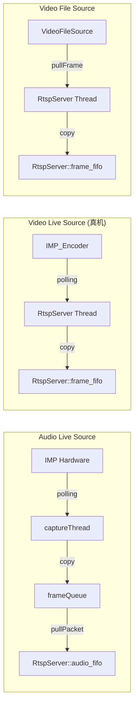

### 3.3 接口对比

#### 3.3.1 Audio Interface
```cpp
class AudioSource {
    virtual int pullPacket(void** data, size_t* size) = 0;
    virtual int releasePacket(void** data, size_t* size) = 0;
};
```

#### 3.3.2 Video Interface (真机 - 无类)
```cpp
// 在RtspServer中直接实现
static int pullFrame(void** data, size_t* size, uint64_t* timestamp);
static int releaseFrame(void** data, size_t* size, uint64_t* timestamp);
```

#### 3.3.3 Video Interface (文件)
```cpp
class VideoFileSource {
    int pullFrame(void** data, size_t* size);
    int releaseFrame(void** data, size_t* size);
};
```

## 4. 架构问题分析

### 4.1 不一致性问题

#### 问题1: Audio有清晰的OOP设计，Video没有
- **表现**: Audio有完整的继承体系，Video真机模式直接嵌入RtspServer
- **影响**: 代码可维护性差，难以扩展
- **根本原因**: Video是先实现的，Audio是后加的，没有统一设计

#### 问题2: 内部队列 vs 直接FIFO
- **AudioLiveSource**: 有内部的`frameQueue`，pull时才转移到`audio_fifo`
- **Video真机**: 直接写入`frame_fifo`，无中间缓冲
- **影响**: 性能和行为不一致

#### 问题3: 生命周期管理混乱
- **Audio**: AudioLiveSource自己管理线程和资源
- **Video**: RtspServer管理线程和资源
- **影响**: 代码职责不清

### 4.2 职责混乱问题

#### 问题4: RtspServer职责过重

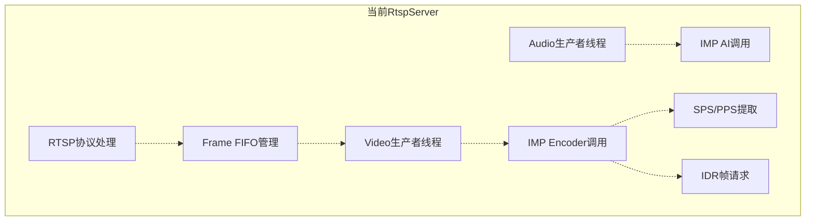

**问题**: RtspServer承担了太多职责，违反单一职责原则

### 4.3 扩展性问题

#### 问题5: 难以添加新的Video Source

如果要添加新的Video Source（如网络摄像头），需要：
1. 修改RtspServer的start()函数
2. 修改pullFrameThread逻辑
3. 确保FIFO接口兼容
4. 可能需要修改多处代码

#### 问题6: 难以单元测试

- **AudioLiveSource**: 可以独立测试
- **Video真机**: 无法独立测试，必须测试整个RtspServer
- **VideoFileSource**: 可以独立测试

### 4.4 性能问题

#### 问题7: Audio的双层缓冲浪费

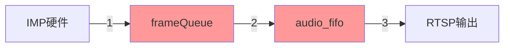

**问题**: Audio数据被拷贝两次，而Video只拷贝一次

#### 问题8: FIFO满时的处理不一致

- **AudioLiveSource**: 内部队列满时`pop_front()`丢弃旧帧
- **Video真机**: 等待FIFO空间，不主动丢弃
- **影响**: 不同的阻塞行为

## 5. 推荐的统一架构

### 5.1 总体架构设计

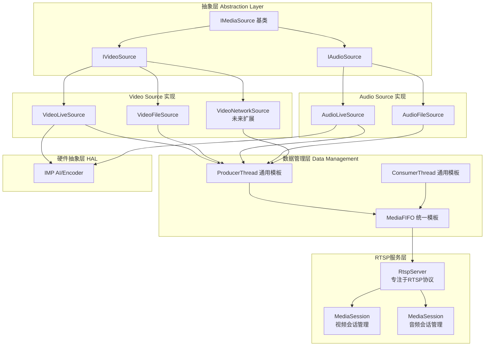

### 5.2 统一的Source接口

#### 5.2.1 IMediaSource 基类

```cpp
class IMediaSource {
public:
    virtual ~IMediaSource() = default;
    
    // 生命周期管理
    virtual bool open() = 0;
    virtual void close() = 0;
    virtual bool isOpen() const = 0;
    
    // 数据获取
    virtual int pullData(void** data, size_t* size) = 0;
    virtual int releaseData(void** data, size_t* size) = 0;
    
    // 重置和参数
    virtual void reset() {}
    virtual MediaType getMediaType() const = 0;  // VIDEO or AUDIO
    
    // 获取参数
    virtual MediaParams getParams() const = 0;
};
```

#### 5.2.2 IVideoSource 接口

```cpp
class IVideoSource : public IMediaSource {
public:
    virtual ~IVideoSource() = default;
    
    // 视频特有接口
    virtual int getWidth() const = 0;
    virtual int getHeight() const = 0;
    virtual int getFps() const = 0;
    virtual VideoCodec getCodec() const = 0;  // H264/H265
    
    // SPS/PPS
    virtual bool getSPS(std::vector<uint8_t>& sps) const = 0;
    virtual bool getPPS(std::vector<uint8_t>& pps) const = 0;
    
    MediaType getMediaType() const override { return MediaType::VIDEO; }
};
```

#### 5.2.3 IAudioSource 接口

```cpp
class IAudioSource : public IMediaSource {
public:
    virtual ~IAudioSource() = default;
    
    // 音频特有接口
    virtual int getSampleRate() const = 0;
    virtual int getChannels() const = 0;
    virtual int getBitsPerSample() const = 0;
    virtual int getSamplesPerPacket() const = 0;
    virtual AudioCodec getCodec() const = 0;  // PCMU/PCMA/L16
    
    MediaType getMediaType() const override { return MediaType::AUDIO; }
};
```

### 5.3 VideoLiveSource 设计

```cpp
class VideoLiveSource : public IVideoSource {
public:
    struct Params {
        int channelId = 0;
        int payloadType = PT_H264;  // or PT_H265
        int width = 2880;
        int height = 1620;
        int fps = 15;
    };
    
    explicit VideoLiveSource(const Params& params);
    ~VideoLiveSource() override;
    
    // IVideoSource 实现
    bool open() override;
    void close() override;
    bool isOpen() const override { return running; }
    
    int pullData(void** data, size_t* size) override;
    int releaseData(void** data, size_t* size) override;
    
    int getWidth() const override { return params.width; }
    int getHeight() const override { return params.height; }
    int getFps() const override { return params.fps; }
    VideoCodec getCodec() const override { 
        return (params.payloadType == PT_H264) ? VideoCodec::H264 : VideoCodec::H265;
    }
    
    bool getSPS(std::vector<uint8_t>& sps) const override;
    bool getPPS(std::vector<uint8_t>& pps) const override;
    
private:
    // 编码器初始化和销毁
    bool initEncoder();
    void deinitEncoder();
    
    // 生产者线程
    void producerLoop();
    
    // SPS/PPS 提取
    bool extractSpsPps(const uint8_t* data, size_t size);
    
    Params params;
    std::atomic<bool> running{false};
    std::thread producerThread;
    
    // 内部队列（可选，或直接暴露给FIFO）
    std::mutex queueMutex;
    std::condition_variable queueCv;
    std::deque<VideoFrame> frameQueue;
    size_t maxQueueSize = 20;
    
    VideoFrame currentFrame;  // 当前提供给consumer的帧
    
    // SPS/PPS缓存
    std::vector<uint8_t> sps;
    std::vector<uint8_t> pps;
    bool hasSpsPps = false;
};
```

#### VideoLiveSource 数据流

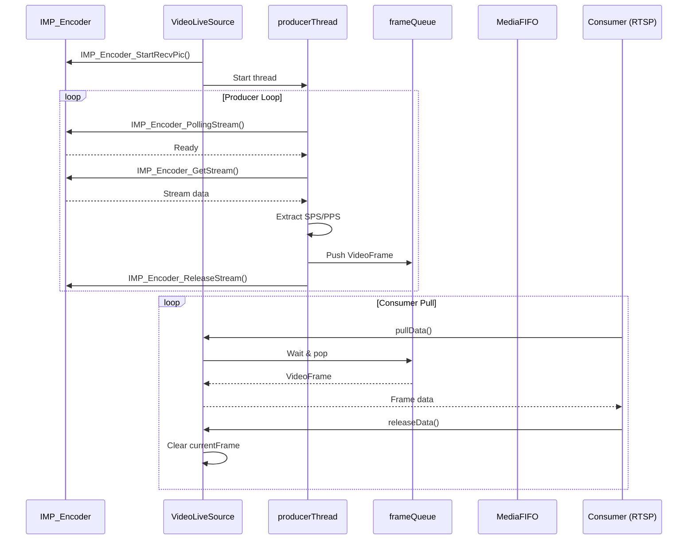

### 5.4 改进后的AudioLiveSource

```cpp
class AudioLiveSource : public IAudioSource {
public:
    struct Params {
        int devId = 1;
        int chnId = 0;
        int sampleRate = 16000;
        int channels = 1;
        int bitsPerSample = 16;
        int samplesPerPacket = 320;
        int volume = 60;
    };
    
    explicit AudioLiveSource(const Params& params);
    ~AudioLiveSource() override;
    
    // IAudioSource 实现
    bool open() override;
    void close() override;
    bool isOpen() const override { return running; }
    
    int pullData(void** data, size_t* size) override;
    int releaseData(void** data, size_t* size) override;
    
    int getSampleRate() const override { return params.sampleRate; }
    int getChannels() const override { return params.channels; }
    int getBitsPerSample() const override { return params.bitsPerSample; }
    int getSamplesPerPacket() const override { return params.samplesPerPacket; }
    AudioCodec getCodec() const override { return AudioCodec::L16; }
    
private:
    void producerLoop();
    
    Params params;
    std::atomic<bool> running{false};
    std::thread producerThread;
    
    // 移除内部队列，直接通过FIFO管理
    // std::deque<...> frameQueue;  // 删除
    
    AudioFrame currentFrame;
};
```

### 5.5 统一的MediaFIFO

```cpp
template<typename T>
class MediaFIFO {
public:
    struct Frame {
        void* data;
        size_t size;
        uint64_t timestamp_us;
    };
    
    MediaFIFO(size_t capacity);
    ~MediaFIFO();
    
    // 生产者接口
    bool push(void* data, size_t size, uint64_t timestamp);
    bool pushBlocking(void* data, size_t size, uint64_t timestamp, 
                   std::chrono::milliseconds timeout);
    
    // 消费者接口
    bool pop(Frame& frame);
    bool popBlocking(Frame& frame, std::chrono::milliseconds timeout);
    
    // 释放frame
    void release(const Frame& frame);
    
    // 状态查询
    size_t size() const;
    bool empty() const;
    bool full() const;
    
private:
    std::mutex mutex_;
    std::condition_variable not_empty_;
    std::condition_variable not_full_;
    
    std::vector<Frame> frames_;
    size_t capacity_;
    size_t head_ = 0;
    size_t tail_ = 0;
    size_t count_ = 0;
};
```

### 5.6 简化的RtspServer

```cpp
class RtspServer {
public:
    struct Params {
        // 视频源配置
        std::shared_ptr<IVideoSource> videoSource;
        bool enableVideo = true;
        
        // 音频源配置
        std::shared_ptr<IAudioSource> audioSource;
        bool enableAudio = false;
        
        // RTSP配置
        int port = 8554;
        std::string streamPath = "/live";
    };
    
    explicit RtspServer(const Params& params);
    ~RtspServer();
    
    bool start();
    bool stop();
    bool isRunning() const;
    
private:
    // RTSP会话管理
    bool initRtspServer();
    void deinitRtspServer();
    
    // 视频会话
    std::shared_ptr<MediaSession> videoSession_;
    std::shared_ptr<MediaFIFO<uint8_t>> videoFIFO_;
    
    // 音频会话
    std::shared_ptr<MediaSession> audioSession_;
    std::shared_ptr<MediaFIFO<uint8_t>> audioFIFO_;
    
    // RTSP底层
    void* rtsp_handle_;
    
    // 参数
    Params params_;
};
```

### 5.7 统一的MediaSession

```cpp
class MediaSession {
public:
    MediaSession(std::shared_ptr<IMediaSource> source, 
                size_t fifoSize);
    ~MediaSession();
    
    bool start();
    bool stop();
    
    // 注册到RTSP服务器的回调
    static int pullFrame(void** data, size_t* size, uint64_t* ts, void* user_data);
    static int releaseFrame(void** data, size_t* size, uint64_t* ts, void* user_data);
    
private:
    // 生产者线程
    void producerLoop();
    
    std::shared_ptr<IMediaSource> source_;
    std::shared_ptr<MediaFIFO<uint8_t>> fifo_;
    std::thread producerThread_;
    std::atomic<bool> running_{false};
};
```

## 6. 改进建议与实现步骤

### 6.1 实施策略

#### 阶段1: 基础设施搭建（优先级：高）

**目标**: 建立统一的基础框架

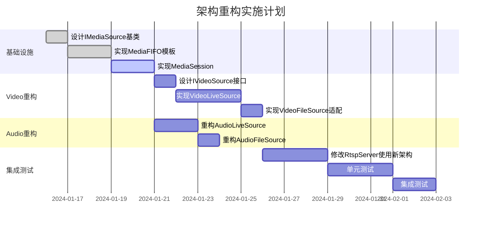

#### 阶段2: Video Live Source实现（优先级：高）

**步骤**:
1. 创建`VideoLiveSource`类，封装IMP_Encoder调用
2. 实现生产者线程，从IMP_Encoder获取数据
3. 提供统一的`pullData/releaseData`接口
4. 实现SPS/PPS提取和缓存

**关键代码结构**:
```cpp
// src/media/video/VideoLiveSource.h
namespace media {
    class VideoLiveSource : public IVideoSource {
        // 实现见上文
    };
}
```

#### 阶段3: Audio重构（优先级：中）

**步骤**:
1. 移除`AudioLiveSource`的内部队列
2. 改为直接通过`MediaFIFO`传递数据
3. 保持与旧接口兼容（过渡期）

#### 阶段4: RtspServer简化（优先级：中）

**步骤**:
1. 移除RtspServer中的生产者线程
2. 使用`MediaSession`管理视频和音频会话
3. 专注于RTSP协议处理

### 6.2 向后兼容策略

为了保证平滑迁移，采用渐进式重构：

#### 方案A: 适配器模式

```cpp
// 保持旧接口，新接口内部使用新架构
class RtspServer {
private:
    // 新架构（默认启用）
    std::unique_ptr<NewRtspServerImpl> newImpl_;
    
    // 旧架构（作为fallback）
    LegacyRtspServerImpl* legacyImpl_;
    
public:
    bool start() {
        if (useNewArchitecture()) {
            return newImpl_->start();
        } else {
            return legacyStart();  // 旧实现
        }
    }
};
```

#### 方案B: 编译时选项

```cpp
// 在编译时选择使用新旧架构
#ifdef USE_NEW_MEDIA_ARCH
    std::shared_ptr<IVideoSource> videoSource_;
#else
    // 旧实现
#endif
```

**推荐**: 方案A，可以在运行时动态切换

### 6.3 测试策略

#### 单元测试

```cpp
// tests/test_video_source.cpp
TEST(VideoLiveSource, OpenClose) {
    VideoLiveSource::Params params;
    params.channelId = 0;
    
    VideoLiveSource source(params);
    EXPECT_TRUE(source.open());
    EXPECT_TRUE(source.isOpen());
    source.close();
    EXPECT_FALSE(source.isOpen());
}

TEST(VideoLiveSource, PullFrame) {
    VideoLiveSource source(params);
    ASSERT_TRUE(source.open());
    
    void* data;
    size_t size;
    EXPECT_EQ(source.pullData(&data, &size), 0);
    EXPECT_NE(data, nullptr);
    EXPECT_GT(size, 0);
    
    source.releaseData(&data, &size);
}
```

#### 集成测试

```cpp
// tests/test_rtsp_integration.cpp
TEST(RtspServerIntegration, VideoStream) {
    // 创建VideoLiveSource
    auto videoSource = std::make_shared<VideoLiveSource>(videoParams);
    
    // 创建RtspServer
    RtspServer::Params params;
    params.videoSource = videoSource;
    RtspServer server(params);
    
    // 启动服务器
    ASSERT_TRUE(server.start());
    
    // 模拟RTSP客户端连接并接收流
    RtspClient client;
    client.connect("rtsp://localhost:8554/live");
    auto frames = client.receiveFrames(100);  // 接收100帧
    
    // 验证
    EXPECT_GT(frames.size(), 95);  // 允许少量丢帧
    
    server.stop();
}
```

## 7. 性能优化建议

### 7.1 减少内存拷贝

#### 当前问题
```
IMP Buffer → AudioLiveSource Queue → RtspServer FIFO → RTSP
   拷贝1            拷贝2                拷贝3
```

#### 优化方案
```
IMP Buffer → MediaFIFO → RTSP
   拷贝1        拷贝2
```

**实现**:
```cpp
// VideoLiveSource直接传递IMP buffer给FIFO
int VideoLiveSource::producerLoop() {
    IMPEncoderStream stream;
    IMP_Encoder_GetStream(chnNum, &stream, 1);
    
    // 直接传递IMP的虚拟地址，不拷贝
    fifo_->push(stream.pack[0].virAddr, stream.pack[0].length, timestamp);
    
    // 释放由FIFO负责（需要特殊的释放逻辑）
}
```

### 7.2 零拷贝FIFO

```cpp
template<typename T>
class ZeroCopyFIFO {
public:
    // 注册外部buffer
    void registerBuffer(void* buf, size_t size, size_t capacity);
    
    // 获取写入槽位
    void* acquireWriteSlot();
    
    // 提交写入
    void commitWrite(void* slot);
    
    // 获取读取槽位
    void* acquireReadSlot();
    
    // 释放读取
    void releaseRead(void* slot);
};
```

### 7.3 智能丢帧策略

```cpp
class SmartFrameDropper {
public:
    enum Strategy {
        DROP_OLD,       // 丢弃最旧的帧（当前Video）
        DROP_NEW,       // 丢弃最新的帧
        DROP_KEYFRAME,  // 优先保留关键帧
        ADAPTIVE        // 根据网络状况自适应
    };
    
    bool shouldDropFrame(const Frame& frame, Strategy strategy);
};
```

## 8. 风险评估与缓解

### 8.1 风险识别

| 风险 | 影响 | 概率 | 缓解措施 |
|------|------|------|---------|
| 重构引入新bug | 高 | 中 | 充分的单元测试 + 渐进式迁移 |
| 性能下降 | 中 | 低 | 性能基准测试 + 对比测试 |
| 延期交付 | 中 | 中 | 分阶段交付，优先实现核心功能 |
| 团队学习成本 | 低 | 中 | 详细的文档 + Code Review |

### 8.2 回滚计划

如果新架构出现问题，可以快速回滚到旧实现：

1. **编译时开关**: `#define USE_LEGACY_MEDIA_ARCH`
2. **运行时切换**: 环境变量或配置文件
3. **功能开关**: 在RtspServer中检测并切换

```cpp
// 在RtspServer构造函数中
if (getEnvBool("USE_LEGACY_MEDIA_ARCH", false)) {
    Logger::log(LogLevel::INFO, "Using legacy media architecture");
    return initLegacyMode();
} else {
    Logger::log(LogLevel::INFO, "Using new media architecture");
    return initNewMode();
}
```

## 9. 总结

### 9.1 当前架构的主要问题

1. **不一致性**: Audio和Video设计风格完全不同
2. **职责混乱**: RtspServer承担过多职责
3. **扩展性差**: 难以添加新的Source类型
4. **可测试性差**: Video真机无法独立测试
5. **性能损失**: Audio的双层缓冲造成额外拷贝

### 9.2 推荐架构的优势

1. **统一性**: Video和Audio使用相同的设计模式
2. **职责清晰**: Source负责数据获取，FIFO负责缓冲，RtspServer负责协议
3. **易扩展**: 添加新Source只需实现接口
4. **可测试**: 每个组件可以独立测试
5. **性能优化**: 减少不必要的拷贝，支持零拷贝

### 9.3 实施建议

**立即行动**:
1. 设计并实现`IMediaSource`基类
2. 实现`MediaFIFO`通用模板
3. 创建`VideoLiveSource`封装IMP_Encoder

**短期目标** (1-2周):
1. 重构`AudioLiveSource`移除内部队列
2. 实现`MediaSession`统一管理
3. 修改`RtspServer`使用新架构

**中期目标** (3-4周):
1. 完整的单元测试和集成测试
2. 性能基准测试
3. 文档完善

**长期目标** (持续):
1. 监控性能和稳定性
2. 根据反馈持续优化
3. 扩展支持更多Source类型

## 10. 附录

### 10.1 文件组织建议

```
src/
├── media/
│   ├── base/
│   │   ├── IMediaSource.h
│   │   ├── IVideoSource.h
│   │   ├── IAudioSource.h
│   │   ├── MediaParams.h
│   │   └── MediaFIFO.h
│   ├── video/
│   │   ├── VideoLiveSource.h
│   │   ├── VideoLiveSource.cpp
│   │   ├── VideoFileSource.h
│   │   ├── VideoFileSource.cpp
│   │   └── VideoLiveSource_test.cpp
│   ├── audio/
│   │   ├── AudioLiveSource.h
│   │   ├── AudioLiveSource.cpp
│   │   ├── AudioFileSource.h
│   │   ├── AudioFileSource.cpp
│   │   └── AudioLiveSource_test.cpp
│   ├── rtsp/
│   │   ├── RtspServer.h
│   │   ├── RtspServer.cpp
│   │   ├── MediaSession.h
│   │   └── MediaSession.cpp
│   └── fifo/
│       ├── MediaFIFO.h
│       └── MediaFIFO.cpp
└── tests/
    ├── test_media_source.cpp
    ├── test_video_source.cpp
    ├── test_audio_source.cpp
    └── test_rtsp_integration.cpp
```

### 10.2 配置文件示例

```ini
# config/media.ini
[video]
enable = 1
source_type = live  # live/file/network
channel_id = 0
codec = h264
width = 2880
height = 1620
fps = 15

[audio]
enable = 1
source_type = live  # live/file
dev_id = 1
chn_id = 0
sample_rate = 16000
channels = 1
samples_per_packet = 320

[rtsp]
port = 8554
stream_path = /live
enable_ipv6 = 0
```

### 10.3 代码检查清单

**新增Source类时必须**:
- [ ] 继承自对应的Source接口
- [ ] 实现所有纯虚函数
- [ ] 提供open/close生命周期管理
- [ ] 线程安全的数据访问
- [ ] 适当的错误处理和日志
- [ ] 单元测试覆盖

**修改FIFO时必须**:
- [ ] 保持线程安全
- [ ] 提供阻塞和非阻塞接口
- [ ] 正确处理满/空情况
- [ ] 避免内存泄漏
- [ ] 性能测试通过

**修改RtspServer时必须**:
- [ ] 不引入新的数据生产逻辑
- [ ] 保持协议处理职责清晰
- [ ] 向后兼容旧接口（过渡期）
- [ ] 更新相关文档
- [ ] 回归测试通过