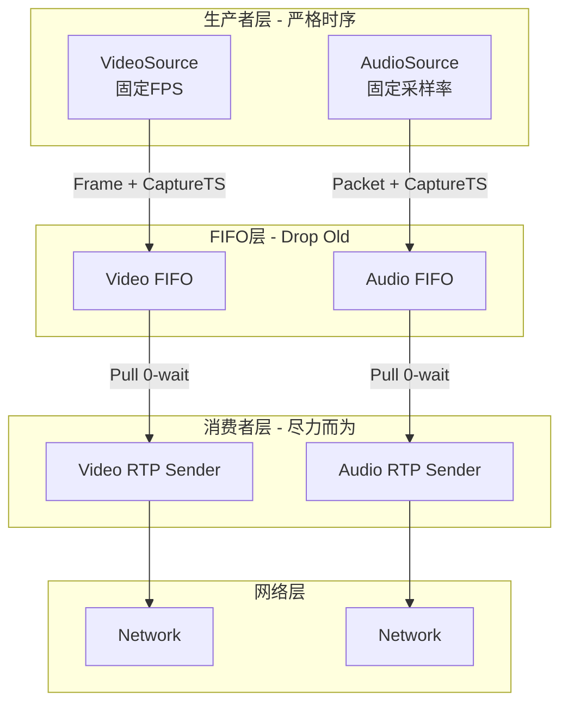

# A/V生产者行为规范

**文档版本**: 1.0
**创建日期**: 2026-01-18
**适用范围**: T32 RTSP Server媒体源架构

---

## 1. 概述

本规范定义了RTSP Server中Audio和Video生产者（Producer）的行为规范，确保PC仿真环境与真实硬件环境（T32）的行为一致。

### 1.1 核心原则

**"以采集时间为绝对真理"**

- 生产者必须按照固定的物理时间间隔产生数据
- 采集时间戳（Capture Timestamp）是唯一可靠的时间基准
- FIFO和RTSP Server不引入额外的时间偏差

### 1.2 适用场景

- **硬件环境（T32）**: VideoLiveSource, AudioLiveSource
- **仿真环境（PC）**: VideoFileSource, AudioFileSource

---

## 2. 生产者角色定义

### 2.1 职责

| 角色 | 职责 | 关键约束 |
|------|------|---------|
| **Producer** | 1. 产生数据<br>2. 打上采集时间戳<br>3. 按固定频率生产 | 固定时间间隔<br>不阻塞<br>硬件仿真行为 |
| **FIFO** | 1. 缓冲数据<br>2. 平滑抖动<br>3. 处理背压 | Drop Old策略<br>不阻塞生产者 |
| **Consumer** | 1. 读取数据<br>2. 转换时间戳<br>3. 发送RTP | 0-wait读取<br>尽力而为 |

### 2.2 数据流



---

## 3. 生产者行为规范

### 3.1 固定频率生产

#### 3.1.1 VideoSource

| 属性 | 硬件环境（T32） | 仿真环境（PC） |
|------|----------------|---------------|
| **生产方式** | 硬件中断 | `std::this_thread::sleep_until(next_time)` |
| **时间间隔** | 1/FPS (如1/30秒) | 1/FPS (如1/30秒) |
| **时间来源** | 硬件时钟 | `std::chrono::steady_clock` |
| **累积误差** | 无（硬件保证） | 累加模式消除误差 |

**实现要求**:

```cpp
// ✅ 正确实现：累加模式
auto next_time = steady_clock::now() + frame_interval;
while (running) {
    // 产生数据
    produce_frame();

    // 严格定时
    next_time += frame_interval;
    sleep_until(next_time);
}
```

```cpp
// ❌ 错误实现：每次sleep
while (running) {
    produce_frame();
    sleep_for(frame_interval);  // 累积误差！
}
```

**示例**:
- FPS = 30
- Frame interval = 33.33ms (33333us)
- 5秒预期生产: 150帧

#### 3.1.2 AudioSource

| 属性 | 硬件环境（T32） | 仿真环境（PC） |
|------|----------------|---------------|
| **生产方式** | 硬件ADC中断 | `std::this_thread::sleep_until(next_time)` |
| **时间间隔** | SamplesPerPacket / SampleRate | SamplesPerPacket / SampleRate |
| **时间来源** | 硬件时钟 | `std::chrono::steady_clock` |

**实现要求**:

```cpp
// ✅ 正确实现
int sample_rate = 16000;  // 16kHz
int samples_per_packet = 320;  // 20ms
auto packet_interval = microseconds(1000000 * samples_per_packet / sample_rate);
auto next_time = steady_clock::now() + packet_interval;

while (running) {
    // 产生音频包
    produce_packet();

    // 严格定时
    next_time += packet_interval;
    sleep_until(next_time);
}
```

**示例**:
- Sample Rate = 16000 Hz
- Samples Per Packet = 320
- Packet interval = 20ms (20000us)
- 5秒预期生产: 250包

### 3.2 采集时间戳规范

#### 3.2.1 时间戳格式

- **单位**: 微秒（microsecond, uint64_t）
- **类型**: 单调递增（Monotonic）
- **基准**: 采集时刻（Capture Time）

#### 3.2.2 硬件环境

```cpp
// 使用CLOCK_MONOTONIC获取高精度时间戳
struct timespec ts;
clock_gettime(CLOCK_MONOTONIC, &ts);
uint64_t capture_ts = ts.tv_sec * 1000000ULL + ts.tv_nsec / 1000ULL;
```

#### 3.2.3 仿真环境

```cpp
// 使用steady_clock（与硬件CLOCK_MONOTONIC等价）
auto now = std::chrono::steady_clock::now();
auto duration = now.time_since_epoch();
uint64_t capture_ts = std::chrono::duration_cast<std::chrono::microseconds>(duration).count();
```

#### 3.2.4 文件源特殊处理

对于FileSource，时间戳基于**帧计数**而非实时时间：

```cpp
// ✅ 正确：基于帧计数
uint64_t capture_ts = frame_count * 1000000 / fps;
frame_count++;
```

```cpp
// ❌ 错误：使用实时时间
uint64_t capture_ts = steady_clock::now().count();  // 违反AV Sync原则
```

**原因**:
- 保证AV同步：Audio和Video使用相同的计数逻辑
- 文件回放一致性：多次回放时间戳一致
- 符合RTP设计：RTP时间戳基于采集时间，而非发送时间

### 3.3 FIFO交互规范

#### 3.3.1 Drop Old策略（强制性）

**规则**: FIFO满时必须丢弃旧帧，为新帧让路。

**原因**:
- 模拟硬件行为：硬件寄存器覆盖旧数据
- 保证数据新鲜度：新帧优先于旧帧
- 不阻塞生产者：生产者不应该等待FIFO

**实现要求**:

```cpp
// ✅ 正确实现：Drop Old
if (fifo.is_full()) {
    fifo.drop_oldest();  // 丢弃最老的帧
    fifo.push(new_frame);  // 新帧进入
    log("FIFO full, dropped oldest frame");
} else {
    fifo.push(new_frame);
}
```

```cpp
// ❌ 错误实现：Drop Current / Wait
if (fifo.is_full()) {
    if (fifo.wait_for(100ms)) {  // 阻塞生产者！
        fifo.push(new_frame);
    } else {
        log("FIFO full, dropping current frame");  // 丢弃新帧！
        drop_current_frame();
    }
}
```

#### 3.3.2 不阻塞生产者（强制性）

**规则**: 生产者线程绝不能因为FIFO满而阻塞。

**原因**:
- 硬件中断不会被阻塞
- 保证生产频率稳定
- 避免时间漂移

**实现要求**:

```cpp
// ✅ 正确：非阻塞push
fifo.push_or_drop(frame);  // 立即返回，不等待
```

```cpp
// ❌ 错误：阻塞push
fifo.push_blocking(frame, timeout);  // 会等待！
```

---

## 4. Source类型行为规范

### 4.1 VideoLiveSource（硬件视频源）

| 属性 | 值/说明 |
|------|---------|
| **生产方式** | 硬件编码器中断 |
| **生产频率** | 硬件固定（25/30fps） |
| **时间戳来源** | IMP_Encoder_GetStream()返回的PTS |
| **速率控制** | 无需软件控制（硬件限制） |
| **FIFO交互** | `pushOrDrop` |

**实现要点**:
- 从IMP_Encoder_GetStream()获取数据
- 直接使用硬件返回的PTS时间戳
- 无需sleep，硬件中断保证频率

### 4.2 VideoFileSource（文件视频源）

| 属性 | 值/说明 |
|------|---------|
| **生产方式** | 软件读取H264文件 |
| **生产频率** | 软件控制（如30fps） |
| **时间戳来源** | 帧计数 × (1/FPS) |
| **速率控制** | 软件sleep_until控制 |
| **FIFO交互** | `pushOrDrop` |

**实现要点**:
- 解析H264 NAL单元，识别帧边界
- 使用`sleep_until(next_time)`控制速率
- 基于帧计数生成时间戳（monotonic）

### 4.3 AudioLiveSource（硬件音频源）

| 属性 | 值/说明 |
|------|---------|
| **生产方式** | 硬件ADC中断 |
| **生产频率** | 硬件固定（如16kHz） |
| **时间戳来源** | IMP_AI_GetFrame()返回的时间戳 |
| **速率控制** | 无需软件控制（硬件限制） |
| **FIFO交互** | `pushOrDrop` |

**实现要点**:
- 从IMP_AI_GetFrame()获取数据
- 直接使用硬件返回的时间戳
- 无需sleep，硬件中断保证频率

### 4.4 AudioFileSource（文件音频源）

| 属性 | 值/说明 |
|------|---------|
| **生产方式** | 软件读取PCM文件 |
| **生产频率** | 软件控制（如50包/秒） |
| **时间戳来源** | 包计数 × (SamplesPerPacket/SampleRate) |
| **速率控制** | 软件sleep_until控制 |
| **FIFO交互** | `pushOrDrop` |

**实现要点**:
- 按SamplesPerPacket读取PCM数据
- 使用`sleep_until(next_time)`控制速率
- 基于包计数生成时间戳（monotonic）

---

## 5. 实现检查清单

### 5.1 MediaSession::producerLoop

- [ ] 检测FileSource类型
- [ ] 计算正确的帧间隔（frame_interval）
- [ ] 使用`sleep_until(next_time)`而不是`sleep_for()`
- [ ] 使用累加模式：`next_time += interval`
- [ ] 调用`fifo->pushOrDrop()`而不是`pushBlocking()`
- [ ] 对于LiveSource，不添加速率控制

### 5.2 MediaFIFO

- [ ] 实现`pushOrDrop()`方法
- [ ] FIFO满时丢弃最老的帧（head）
- [ ] FIFO满时通知等待的消费者
- [ ] 不阻塞生产者（无condition_variable等待）
- [ ] 记录drop_count统计

### 5.3 VideoFileSource

- [ ] pullFrame立即返回，不sleep
- [ ] 基于帧计数生成时间戳
- [ ] 时间戳使用uint64_t，单位微秒
- [ ] 时间戳单调递增（循环时继续累加）

### 5.4 AudioFileSource

- [ ] pullPacket立即返回，不sleep
- [ ] 基于包计数生成时间戳
- [ ] 时间戳使用uint64_t，单位微秒
- [ ] 时间戳单调递增（循环时继续累加）

---

## 6. 验证方法

### 6.1 生产速率验证

**Video**:
```bash
# 运行5秒测试
timeout 5s ffplay -nodisp rtsp://localhost:8554/live

# 检查生产帧数
grep "Frames produced:" log | grep video
# 预期：150帧 (5秒×30fps)，误差<5%
```

**Audio**:
```bash
# 检查生产包数
grep "Frames produced:" log | grep audio
# 预期：250包 (5秒×50包/秒)，误差<5%
```

### 6.2 Drop Old验证

```bash
# 检查drop日志
grep "FIFO full, dropping oldest" log | wc -l
# 应该在FIFO满时出现，且新帧进入
```

### 6.3 时间戳验证

```bash
# 检查时间戳单调性
grep "timestamp=" log | awk '{print $NF}' | sort -n | uniq -c
# 应该全部单调递增，无重复
```

---

## 7. 常见错误

### 7.1 错误1：使用sleep_for

```cpp
// ❌ 错误
while (running) {
    produce_frame();
    sleep_for(frame_interval);  // 累积误差！
}
```

**问题**: `sleep_for`每次基于当前时间，误差会累积。

**修正**: 使用`sleep_until`，基于目标时间。

### 7.2 错误2：阻塞push

```cpp
// ❌ 错误
fifo.pushBlocking(data, size, timestamp, 100ms);
```

**问题**: 会阻塞生产者，破坏固定频率。

**修正**: 使用`pushOrDrop`，立即返回。

### 7.3 错误3：丢弃当前帧

```cpp
// ❌ 错误
if (fifo.full()) {
    drop_current_frame();  // 丢弃新帧！
}
```

**问题**: 违反Drop Old策略，FIFO中的数据不新鲜。

**修正**: 丢弃旧帧，新帧进入。

### 7.4 错误4：使用实时时间戳

```cpp
// ❌ 错误
timestamp = steady_clock::now().count();
```

**问题**: 不符合AV Sync原则，时间戳应基于采集时间。

**修正**: 基于帧/包计数生成时间戳。

---

## 8. 参考资料

### 8.1 设计文档

- `doc/av_sync_design.md` - 音画同步机制设计
- `doc/audio_video_source_architecture_analysis.md` - A/V源架构分析

### 8.2 代码文件

- `src/media/fifo/MediaFIFO.h` - FIFO接口定义
- `src/media/fifo/MediaFIFO.cpp` - FIFO实现
- `src/media/rtsp/MediaSession.h` - MediaSession接口
- `src/media/rtsp/MediaSession.cpp` - MediaSession实现

### 8.3 验证文档

- `doc/fifo_analysis_and_fix_report.md` - FIFO机制分析与修正报告

---

**文档版本**: 1.0
**创建日期**: 2026-01-18
**最后更新**: 2026-01-18
**状态**: ✅ 正式发布
