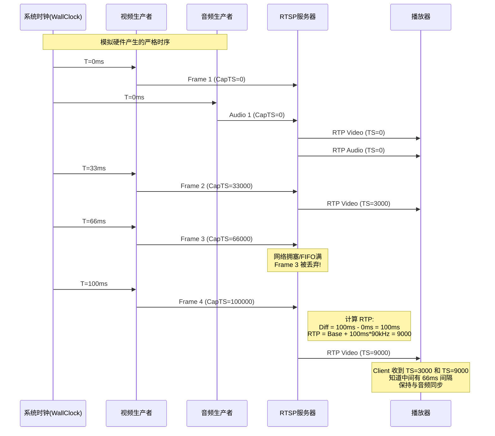

# 音画同步机制设计方案 (AVSync Design Proposal)

## 1. 核心理念

正如您所分析的，音画同步的核心在于**“以采集时间为绝对真理”**。

无论是真实硬件（Sensor/ADC）还是 PC 模拟（File Source），数据产生的时刻（Capture Time）决定了它在时间轴上的位置。RTSP/RTP 服务器的角色仅仅是**搬运工**和**翻译官**：
1.  **搬运**：将数据从生产者传递给消费者，不引入额外的时间偏差。
2.  **翻译**：将本地的“系统采集时间戳”翻译为标准的“RTP 时间戳”。

客户端（播放器）基于 RTP 时间戳重建时间轴。通常遵循 **"Audio Master"** 原则：音频按采样率连续播放，视频帧在对应的音频时间点渲染。

---

## 2. 系统架构 (System Architecture)

### 2.1 模块角色

| 角色 | 职责 | 关键行为 | 硬件环境 (Real) | 模拟环境 (Sim) |
| :--- | :--- | :--- | :--- | :--- |
| **Producer** | 数据源 | 产生数据 + 打上采集时间戳 | 硬件中断触发，读取 `CLOCK_MONOTONIC` | 线程 `sleep_until` 触发，读取 `steady_clock` |
| **FIFO** | 缓冲 | 缓冲数据，平滑抖动，处理背压 | 满则丢弃旧帧 (Drop Old)，不阻塞生产者 | 满则丢弃旧帧 (Drop Old)，不阻塞生产者 |
| **Consumer** | RTSP Server | 读取数据，计算 RTP 时间戳，发送 | 尽可能快地读取 (0-wait)，转换时间戳 | 尽可能快地读取 (0-wait)，转换时间戳 |

### 2.2 数据流图 (Data Flow)

```mermaid
graph LR
    subgraph Producer [生产者层 (严格时序)]
        direction TB
        VideoSrc[视频源<br>30FPS] --"Frame + CaptureTS"--> V_FIFO[视频 FIFO]
        AudioSrc[音频源<br>SampleRate] --"Packet + CaptureTS"--> A_FIFO[音频 FIFO]
    end

    subgraph Transport [传输层 (尽力而为)]
        direction TB
        V_FIFO --"Pull"--> RTP_V[RTP Video Sender]
        A_FIFO --"Pull"--> RTP_A[RTP Audio Sender]
    end

    subgraph Network [网络层]
        RTP_V --"UDP/TCP"--> Net_V
        RTP_A --"UDP/TCP"--> Net_A
    end

    subgraph Client [客户端 (同步回放)]
        Net_V --> Jitter_V[Jitter Buffer]
        Net_A --> Jitter_A[Jitter Buffer]
        Jitter_A --> DAC[扬声器]
        Jitter_V --> Render[屏幕]
        DAC -.->|Audio Clock| Render
    end
```

---

## 3. 详细设计 (Detailed Design)

### 3.1 生产者 (Producer): 固定频率与采集时间

**目标**：确保数据产生的时间间隔是物理固定的，不随系统负载漂移。

*   **硬件模式**：硬件中断天然保证了这一点。
*   **模拟模式**：
    *   使用 `std::this_thread::sleep_until(next_time)` 而非 `sleep_for`。
    *   `next_time += interval` 累加，消除累积误差。
    *   **关键点**：如果 FIFO 满，**丢弃旧帧 (Drop Old)**，绝对不要 `wait`。等待会导致下一次采集时间推迟，破坏“模拟硬件”的初衷。

```cpp
// 伪代码：模拟生产者的循环
auto next_time = steady_clock::now();
while (running) {
    // 1. 产生数据 (Simulate Capture)
    Data data = read_file();
    uint64_t capture_ts = steady_clock::now(); // 记录当前时刻作为采集时间

    // 2. 写入 FIFO (Non-blocking)
    if (fifo.is_full()) {
        fifo.drop_old(); // 丢弃旧帧，为新帧让路
        fifo.push(data, capture_ts);
    } else {
        fifo.push(data, capture_ts);
    }

    // 3. 严格定时
    next_time += interval;
    sleep_until(next_time);
}
```

### 3.2 消费者 (Consumer): RTP 时间戳计算

**目标**：将本地的 `capture_ts` (微秒) 转换为 RTP 协议的 `rtp_ts` (时钟单位)。

RTP 时间戳不是“当前时间”，而是“这帧数据应该在什么时候播放”。由于网络传输有延迟和抖动，我们不能用发送时的系统时间，而必须用**采集时间**来计算。

#### 公式推导

我们定义一个基准点 (Base)，通常是第一帧发送的时刻。

$$ RTP_{current} = RTP_{base} + \Delta T_{seconds} \times ClockRate $$

其中：
$$ \Delta T_{seconds} = (CaptureTS_{current} - CaptureTS_{base}) $$

展开为代码逻辑（微秒级）：

```c
// 1. 第一帧初始化
if (is_first_frame) {
    base_capture_ts = frame.capture_ts; // 记录第一帧的采集物理时间
    base_rtp_ts = random();             // RTP规范建议随机起始值
    current_rtp_ts = base_rtp_ts;
} 
// 2. 后续帧计算
else {
    int64_t diff_us = frame.capture_ts - base_capture_ts;
    // 视频通常 90000Hz, 音频通常 = 采样率 (e.g. 44100Hz)
    uint32_t diff_ticks = (uint32_t)(diff_us * clock_rate / 1000000);
    current_rtp_ts = base_rtp_ts + diff_ticks;
}
```

#### 为什么这个公式能抗丢帧？

假设视频 30FPS (间隔 33.3ms)，时钟率 90000。
*   Frame 1: Capture=0ms -> RTP=0
*   Frame 2: Capture=33ms -> RTP=3000
*   **Frame 3 (FIFO满被丢弃旧帧)**: Capture=66ms (从未发送)
*   Frame 4: Capture=100ms -> RTP=9000

客户端收到 Frame 1, 2, 4。
客户端看到 Frame 2 (RTP 3000) 和 Frame 4 (RTP 9000) 之间差了 6000 个单位 (66ms)。
播放器会知道中间缺了一帧，并准确地在 Frame 2 播放完 66ms 后才显示 Frame 4。
**结果：音画依然同步，只是画面跳过了一帧。**

如果使用“累加法”（每次 `timestamp += 3000`），丢掉 Frame 3 后，Frame 4 的时间戳就会变成 6000，导致后续所有画面都**提前**了 33ms，这就是音画不同步的根源。

### 3.3 音画同步 (AVSync) 逻辑图



---

## 4. 实施要点总结

1.  **生产者线程 (Producer Thread)**:
    *   **必须** 使用绝对时间 (`sleep_until`) 控制循环。
    *   **必须** 在产生数据时立即记录 `steady_clock`。
    *   **必须** 在 FIFO 满时丢弃旧帧 (Drop Old)，为新帧让路，保持低延迟，且**不等待**。

2.  **RTSP 发送逻辑 (Sender Logic)**:
    *   **禁止** 手动累加时间戳 (如 `ts += 3600`)。
    *   **必须** 使用 `RTP = BaseRTP + (CurrCap - BaseCap) * Rate` 公式。
    *   **建议** 消费者线程使用 `0-timeout` 轮询或事件驱动，尽可能快地清空 FIFO，减少内部延迟。

3.  **调试验证**:
    *   查看日志中是否存在 `Dropped OLD frame`，这是模拟高负载的正常现象。
    *   检查 RTP 包的 Timestamp 增量。正常帧间应为 3000 (90k/30fps)，若有丢帧，增量应为 3000 的整数倍 (如 6000, 9000)。
