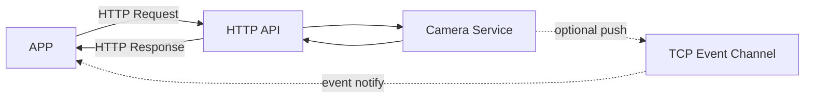
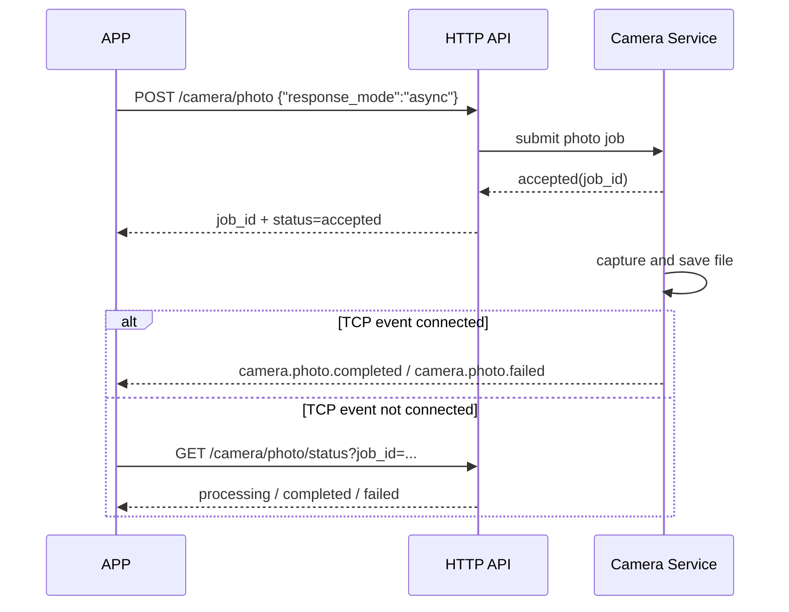

# 相机HTTP API设计文档

## 1. 概述

### 1.1 设计目标
基于CivetWeb HTTP Server，设计相机操作和属性管理的RESTful风格API接口。

### 1.2 设计原则
- 使用RESTful规范
- 限制使用GET和POST两种HTTP方法（简化客户端实现）
- 使用JSON格式进行数据交换
- 统一的响应格式
- 良好的错误处理
- 耗时操作支持同步/异步两种调用语义
- HTTP负责命令下发与状态查询，主动通知通过独立event通道承载

### 1.3 基础URL
```
http://<device_ip>:<port>/api/v1
```
- 默认端口：80

### 1.4 控制与通知通道

- HTTP API是主控制面，负责参数下发、任务受理、状态查询和结果拉取
- TCP event通道是可选通知面，用于相机主动向APP推送任务完成、失败等事件
- 当APP已建立TCP event连接时，推荐对耗时操作使用异步HTTP API，并通过event接收结果
- 当TCP event连接不存在或不可用时，APP仍可通过HTTP状态查询接口轮询任务结果
- 本文档只定义HTTP API对event通道的依赖点，不展开TCP event连接管理、报文封装和重连机制
- TCP Event 机制的完整设计见 `doc/design/tcp_event_design.md`



---

## 2. 统一响应格式

### 2.1 成功响应
```json
{
  "code": 0,
  "message": "success",
  "data": { ... }
}
```

### 2.2 错误响应
```json
{
  "code": <错误码>,
  "message": "错误描述",
  "data": null
}
```

### 2.3 错误码定义

| 错误码 | 说明 |
|--------|------|
| 0 | 成功 |
| 400 | 请求参数错误 |
| 404 | 资源不存在 |
| 405 | 方法不允许 |
| 500 | 服务器内部错误 |
| 1001 | 设备忙碌 |
| 1002 | 存储空间不足 |
| 1003 | 文件操作失败 |
| 1004 | 参数配置失败 |
| 1005 | 录像已启动 |
| 1006 | 录像未启动 |
| 1007 | 任务不存在 |
| 1008 | 任务执行失败 |

---

## 3. 拍照管理API

### 3.1 拍照（单次拍照，支持同步/异步）

**接口**：`POST /api/v1/camera/photo`

**描述**：立即拍照一次。支持同步返回文件信息，也支持异步受理后通过状态查询或event获取结果。

**请求参数**：
```json
{
  "channel": 0,        // 通道号（可选，默认0）
  "save": true,        // 是否保存到存储（可选，默认true）
  "format": "jpg",     // 图片格式（可选，默认jpg）
  "quality": 85,       // 图片质量（可选，默认85）
  "response_mode": "sync",      // 返回模式（可选，sync/async，默认sync）
  "client_request_id": "req_123456"  // 客户端请求ID（可选，用于HTTP与event结果关联）
}
```

**行为说明**：

- `response_mode=sync`
  服务端等待拍照、文件落盘和元数据准备完成后再返回
- `response_mode=async`
  服务端在任务受理后立即返回 `job_id`
- 若APP已建立TCP event连接，相机在异步任务完成后主动推送 `camera.photo.completed` 或 `camera.photo.failed`
- 若没有TCP event连接，APP通过 `GET /api/v1/camera/photo/status?job_id=...` 轮询结果
- 为兼容现有客户端，`response_mode` 默认值保持为 `sync`

**响应示例**（同步成功）：
```json
{
  "code": 0,
  "message": "success",
  "data": {
    "response_mode": "sync",
    "status": "completed",
    "photo_id": "photo_20250119_143520_001",
    "filename": "IMG_20250119_143520_001.jpg",
    "filepath": "/sdcard/media/photo/2025/01/19/IMG_20250119_143520_001.jpg",
    "url": "/media/photo/2025/01/19/IMG_20250119_143520_001.jpg",
    "thumbnail_url": "/media/photo/thumb/2025/01/19/IMG_20250119_143520_001_thumb.jpg",
    "size": 1024000,
    "width": 1920,
    "height": 1080,
    "timestamp": 1737276320
  }
}
```

**响应示例**（异步受理成功）：
```json
{
  "code": 0,
  "message": "success",
  "data": {
    "response_mode": "async",
    "status": "accepted",
    "job_id": "photo_job_20250119_143520_001",
    "client_request_id": "req_123456",
    "submitted_at": 1737276320,
    "result_query": "/api/v1/camera/photo/status?job_id=photo_job_20250119_143520_001",
    "event": {
      "enabled": true,
      "success_event": "camera.photo.completed",
      "failed_event": "camera.photo.failed"
    }
  }
}
```

**响应示例**（设备忙碌）：
```json
{
  "code": 1001,
  "message": "Device is busy",
  "data": null
}
```

**推荐用法**：

- 设备本地调试、命令行工具、对时延不敏感的调用使用同步模式
- APP前台交互、弱网场景、拍照耗时不可预测场景使用异步模式



**异步通知约定（预留）**：

- 成功事件名：`camera.photo.completed`
- 失败事件名：`camera.photo.failed`
- event消息至少应包含 `job_id`、`client_request_id`、`status`
- 成功事件应附带完整文件信息，字段集合与同步HTTP成功响应保持一致
- TCP event报文格式、鉴权、重连与订阅机制另行设计

---

### 3.2 连续拍照

**接口**：`POST /api/v1/camera/photo/burst`

**描述**：连续拍摄多张照片

**请求参数**：
```json
{
  "count": 3,          // 拍摄数量（必填，1-10）
  "interval": 1000,    // 拍摄间隔（毫秒，可选，默认1000）
  "channel": 0,        // 通道号（可选，默认0）
  "save": true         // 是否保存到存储（可选，默认true）
}
```

**响应示例**（成功）：
```json
{
  "code": 0,
  "message": "success",
  "data": {
    "job_id": "burst_job_20250119_143520_001",
    "status": "processing",
    "total_count": 3,
    "completed_count": 0,
    "photos": []
  }
}
```

---

### 3.3 获取拍照状态

**接口**：`GET /api/v1/camera/photo/status`

**描述**：获取拍照任务状态。适用于单次异步拍照、连续拍照、定时拍照等任务。

**请求参数**（Query String）：
```
?job_id=photo_job_20250119_143520_001  // 可选，任务ID；可用于单次异步拍照、连拍、定时拍照
```

- 不带 `job_id` 时，返回当前全局拍照状态或最近一次拍照结果
- 带 `job_id` 时，返回指定任务状态
- 当异步单拍任务完成后，结果中的 `photo` 字段应与同步拍照成功响应中的文件信息保持一致

**响应示例**（空闲状态）：
```json
{
  "code": 0,
  "message": "success",
  "data": {
    "status": "idle",
    "last_photo": {
      "photo_id": "photo_20250119_143520_001",
      "filename": "IMG_20250119_143520_001.jpg",
      "timestamp": 1737276320
    }
  }
}
```

**响应示例**（单次异步拍照处理中）：
```json
{
  "code": 0,
  "message": "success",
  "data": {
    "job_id": "photo_job_20250119_143520_001",
    "task_type": "single",
    "status": "processing",
    "progress": 60,
    "client_request_id": "req_123456",
    "submitted_at": 1737276320
  }
}
```

**响应示例**（单次异步拍照完成）：
```json
{
  "code": 0,
  "message": "success",
  "data": {
    "job_id": "photo_job_20250119_143520_001",
    "task_type": "single",
    "status": "completed",
    "client_request_id": "req_123456",
    "photo": {
      "photo_id": "photo_20250119_143520_001",
      "filename": "IMG_20250119_143520_001.jpg",
      "filepath": "/sdcard/media/photo/2025/01/19/IMG_20250119_143520_001.jpg",
      "url": "/media/photo/2025/01/19/IMG_20250119_143520_001.jpg",
      "thumbnail_url": "/media/photo/thumb/2025/01/19/IMG_20250119_143520_001_thumb.jpg",
      "size": 1024000,
      "width": 1920,
      "height": 1080,
      "timestamp": 1737276320
    }
  }
}
```

**响应示例**（连拍处理中）：
```json
{
  "code": 0,
  "message": "success",
  "data": {
    "job_id": "burst_job_20250119_143520_001",
    "status": "processing",
    "total_count": 3,
    "completed_count": 2,
    "photos": [
      {
        "photo_id": "photo_20250119_143520_001",
        "filename": "IMG_20250119_143520_001.jpg",
        "status": "completed"
      },
      {
        "photo_id": "photo_20250119_143520_002",
        "filename": "IMG_20250119_143520_002.jpg",
        "status": "completed"
      },
      {
        "photo_id": "photo_20250119_143520_003",
        "filename": "IMG_20250119_143520_003.jpg",
        "status": "capturing"
      }
    ]
  }
}
```

---

### 3.4 定时拍照

**接口**：`POST /api/v1/camera/photo/timer`

**描述**：启动/停止定时拍照

**请求参数**（启动定时）：
```json
{
  "action": "start",           // start/stop
  "interval": 60000,           // 拍照间隔（毫秒，必填）
  "count": 0,                  // 拍摄数量（0为无限，可选，默认0）
  "channel": 0                 // 通道号（可选，默认0）
}
```

**请求参数**（停止定时）：
```json
{
  "action": "stop"
}
```

**响应示例**（启动成功）：
```json
{
  "code": 0,
  "message": "success",
  "data": {
    "timer_id": "timer_20250119_143520_001",
    "status": "running",
    "interval": 60000,
    "total_count": 0,
    "completed_count": 0
  }
}
```

**响应示例**（停止成功）：
```json
{
  "code": 0,
  "message": "success",
  "data": {
    "timer_id": "timer_20250119_143520_001",
    "status": "stopped",
    "completed_count": 5
  }
}
```

---

## 4. 录像管理API

### 4.1 开始录像

**接口**：`POST /api/v1/camera/video/start`

**描述**：开始录像

**请求参数**：
```json
{
  "channel": 0,              // 通道号（可选，默认0）
  "duration": 0,             // 录像时长（秒，0为手动停止，可选，默认0）
  "audio": true,             // 是否录制音频（可选，默认true）
  "format": "mp4"            // 视频格式（可选，默认mp4）
}
```

**响应示例**（成功）：
```json
{
  "code": 0,
  "message": "success",
  "data": {
    "record_id": "video_20250119_143520_001",
    "status": "recording",
    "start_time": 1737276320,
    "channel": 0,
    "audio": true
  }
}
```

**响应示例**（录像已启动）：
```json
{
  "code": 1005,
  "message": "Recording already started",
  "data": {
    "record_id": "video_20250119_143500_001",
    "start_time": 1737276300
  }
}
```

---

### 4.2 停止录像

**接口**：`POST /api/v1/camera/video/stop`

**描述**：停止录像

**请求参数**：无（POST body可以为空或 `{}`）

**响应示例**（成功）：
```json
{
  "code": 0,
  "message": "success",
  "data": {
    "record_id": "video_20250119_143520_001",
    "status": "stopped",
    "filename": "VID_20250119_143520_001.mp4",
    "filepath": "/sdcard/media/video/2025/01/19/VID_20250119_143520_001.mp4",
    "url": "/media/video/2025/01/19/VID_20250119_143520_001.mp4",
    "thumbnail_url": "/media/video/thumb/2025/01/19/VID_20250119_143520_001_thumb.jpg",
    "size": 10485760,
    "duration": 30,
    "start_time": 1737276320,
    "end_time": 1737276350
  }
}
```

**响应示例**（录像未启动）：
```json
{
  "code": 1006,
  "message": "Recording not started",
  "data": null
}
```

---

### 4.3 获取录像状态

**接口**：`GET /api/v1/camera/video/status`

**描述**：获取当前录像状态

**请求参数**：无

**响应示例**（录像中）：
```json
{
  "code": 0,
  "message": "success",
  "data": {
    "status": "recording",
    "record_id": "video_20250119_143520_001",
    "start_time": 1737276320,
    "duration": 15,
    "channel": 0,
    "audio": true,
    "file_size": 5242880
  }
}
```

**响应示例**（空闲）：
```json
{
  "code": 0,
  "message": "success",
  "data": {
    "status": "idle",
    "last_video": {
      "record_id": "video_20250119_143000_001",
      "filename": "VID_20250119_143000_001.mp4",
      "duration": 30,
      "end_time": 1737276030
    }
  }
}
```

---

### 4.4 录像列表

**接口**：`GET /api/v1/camera/video/list`

**描述**：获取录像文件列表

**请求参数**（Query String）：
```
?date=2025-01-19       // 按日期筛选（可选）
&start_date=2025-01-01  // 起始日期（可选）
&end_date=2025-01-31    // 结束日期（可选）
&limit=20               // 返回数量限制（可选，默认20）
&offset=0               // 偏移量（可选，默认0）
```

**响应示例**：
```json
{
  "code": 0,
  "message": "success",
  "data": {
    "total": 100,
    "limit": 20,
    "offset": 0,
    "videos": [
      {
        "record_id": "video_20250119_143520_001",
        "filename": "VID_20250119_143520_001.mp4",
        "url": "/media/video/2025/01/19/VID_20250119_143520_001.mp4",
        "thumbnail_url": "/media/video/thumb/2025/01/19/VID_20250119_143520_001_thumb.jpg",
        "size": 10485760,
        "duration": 30,
        "timestamp": 1737276320,
        "width": 1920,
        "height": 1080,
        "fps": 25,
        "bitrate": 4096,
        "audio": true
      }
    ]
  }
}
```

---

## 5. 相机属性管理API

### 5.1 获取所有属性

**接口**：`GET /api/v1/camera/properties`

**描述**：获取相机所有属性配置

**请求参数**：无

**响应示例**：
```json
{
  "code": 0,
  "message": "success",
  "data": {
    "resolution": {
      "value": "1920x1080",
      "options": ["1280x720", "1920x1080", "2560x1440", "3840x2160"],
      "display_name": "分辨率"
    },
    "fps": {
      "value": 25,
      "options": [15, 20, 25, 30],
      "display_name": "帧率"
    },
    "bitrate": {
      "value": 4096,
      "min": 1024,
      "max": 16384,
      "step": 256,
      "unit": "kbps",
      "display_name": "码率"
    },
    "audio_enabled": {
      "value": true,
      "display_name": "音频"
    },
    "audio_sample_rate": {
      "value": 16000,
      "options": [8000, 16000, 44100, 48000],
      "unit": "Hz",
      "display_name": "音频采样率"
    },
    "audio_channels": {
      "value": 1,
      "options": [1, 2],
      "unit": "ch",
      "display_name": "音频声道"
    },
    "night_mode": {
      "value": false,
      "display_name": "夜间模式"
    },
    "motion_detection": {
      "value": true,
      "display_name": "移动侦测"
    },
    "pir_sensitivity": {
      "value": 2,
      "options": [1, 2, 3],
      "display_name": "PIR灵敏度"
    },
    "loop_recording": {
      "value": true,
      "display_name": "循环录像"
    },
    "max_record_duration": {
      "value": 300,
      "min": 10,
      "max": 3600,
      "step": 10,
      "unit": "s",
      "display_name": "最大录像时长"
    },
    "timestamp_overlay": {
      "value": true,
      "display_name": "时间戳叠加"
    },
    "exposure_mode": {
      "value": "auto",
      "options": ["auto", "manual", "shutter_priority", "aperture_priority"],
      "display_name": "曝光模式"
    },
    "white_balance": {
      "value": "auto",
      "options": ["auto", "daylight", "cloudy", "tungsten", "fluorescent"],
      "display_name": "白平衡"
    },
    "brightness": {
      "value": 50,
      "min": 0,
      "max": 100,
      "step": 1,
      "display_name": "亮度"
    },
    "contrast": {
      "value": 50,
      "min": 0,
      "max": 100,
      "step": 1,
      "display_name": "对比度"
    },
    "saturation": {
      "value": 50,
      "min": 0,
      "max": 100,
      "step": 1,
      "display_name": "饱和度"
    },
    "sharpness": {
      "value": 50,
      "min": 0,
      "max": 100,
      "step": 1,
      "display_name": "锐度"
    },
    "iso": {
      "value": 100,
      "options": [100, 200, 400, 800, 1600, 3200],
      "display_name": "ISO"
    },
    "shutter_speed": {
      "value": "1/30",
      "options": ["1/15", "1/30", "1/60", "1/120", "1/250", "1/500", "1/1000"],
      "display_name": "快门速度"
    }
  }
}
```

---

### 5.2 获取单个属性

**接口**：`GET /api/v1/camera/properties/{property_name}`

**描述**：获取指定属性的详细信息

**请求参数**（路径参数）：
- `property_name`: 属性名称（如 resolution, fps, bitrate等）

**示例**：`GET /api/v1/camera/properties/resolution`

**响应示例**：
```json
{
  "code": 0,
  "message": "success",
  "data": {
    "name": "resolution",
    "value": "1920x1080",
    "options": ["1280x720", "1920x1080", "2560x1440", "3840x2160"],
    "display_name": "分辨率",
    "type": "enum",
    "readonly": false
  }
}
```

**响应示例**（属性不存在）：
```json
{
  "code": 404,
  "message": "Property not found",
  "data": null
}
```

---

### 5.3 设置属性（单个）

**接口**：`POST /api/v1/camera/properties/{property_name}`

**描述**：设置指定属性的值

**请求参数**（路径参数）：
- `property_name`: 属性名称

**请求参数**（Body）：
```json
{
  "value": "2560x1440"
}
```

**示例**：`POST /api/v1/camera/properties/resolution`

**请求Body**：
```json
{
  "value": "2560x1440"
}
```

**响应示例**（成功）：
```json
{
  "code": 0,
  "message": "success",
  "data": {
    "name": "resolution",
    "value": "2560x1440",
    "updated": true
  }
}
```

**响应示例**（参数无效）：
```json
{
  "code": 400,
  "message": "Invalid value",
  "data": {
    "name": "resolution",
    "value": "9999x9999",
    "valid_options": ["1280x720", "1920x1080", "2560x1440", "3840x2160"]
  }
}
```

**响应示例**（属性只读）：
```json
{
  "code": 400,
  "message": "Property is readonly",
  "data": {
    "name": "resolution"
  }
}
```

---

### 5.4 设置属性（批量）

**接口**：`POST /api/v1/camera/properties`

**描述**：批量设置多个属性

**请求参数**（Body）：
```json
{
  "resolution": "2560x1440",
  "fps": 30,
  "bitrate": 8192,
  "audio_enabled": true,
  "night_mode": false
}
```

**响应示例**（全部成功）：
```json
{
  "code": 0,
  "message": "success",
  "data": {
    "total": 5,
    "success": 5,
    "failed": 0,
    "results": [
      {
        "name": "resolution",
        "value": "2560x1440",
        "status": "success"
      },
      {
        "name": "fps",
        "value": 30,
        "status": "success"
      },
      {
        "name": "bitrate",
        "value": 8192,
        "status": "success"
      },
      {
        "name": "audio_enabled",
        "value": true,
        "status": "success"
      },
      {
        "name": "night_mode",
        "value": false,
        "status": "success"
      }
    ]
  }
}
```

**响应示例**（部分失败）：
```json
{
  "code": 0,
  "message": "Partial success",
  "data": {
    "total": 5,
    "success": 4,
    "failed": 1,
    "results": [
      {
        "name": "resolution",
        "value": "2560x1440",
        "status": "success"
      },
      {
        "name": "fps",
        "value": 30,
        "status": "success"
      },
      {
        "name": "bitrate",
        "value": 8192,
        "status": "success"
      },
      {
        "name": "night_mode",
        "value": false,
        "status": "success"
      },
      {
        "name": "invalid_property",
        "value": "some_value",
        "status": "failed",
        "error": "Property not found"
      }
    ]
  }
}
```

---

### 5.5 重置属性

**接口**：`POST /api/v1/camera/properties/reset`

**描述**：重置所有属性到默认值

**请求参数**（Body）：
```json
{
  "properties": ["resolution", "fps"]  // 可选，指定要重置的属性，不传则重置所有
}
```

**响应示例**：
```json
{
  "code": 0,
  "message": "success",
  "data": {
    "reset_count": 2,
    "properties": {
      "resolution": "1920x1080",
      "fps": 25
    }
  }
}
```

---

## 6. 预设配置管理API

### 6.1 获取预设列表

**接口**：`GET /api/v1/camera/presets`

**描述**：获取相机预设配置列表

**响应示例**：
```json
{
  "code": 0,
  "message": "success",
  "data": {
    "presets": [
      {
        "id": "default",
        "name": "默认",
        "description": "标准配置",
        "properties": {
          "resolution": "1920x1080",
          "fps": 25,
          "bitrate": 4096
        }
      },
      {
        "id": "high_quality",
        "name": "高清",
        "description": "高质量配置",
        "properties": {
          "resolution": "2560x1440",
          "fps": 30,
          "bitrate": 8192
        }
      },
      {
        "id": "low_power",
        "name": "低功耗",
        "description": "低功耗配置",
        "properties": {
          "resolution": "1280x720",
          "fps": 15,
          "bitrate": 1024
        }
      }
    ]
  }
}
```

---

### 6.2 应用预设

**接口**：`POST /api/v1/camera/presets/{preset_id}`

**描述**：应用预设配置

**请求参数**（路径参数）：
- `preset_id`: 预设ID

**示例**：`POST /api/v1/camera/presets/high_quality`

**响应示例**：
```json
{
  "code": 0,
  "message": "success",
  "data": {
    "preset_id": "high_quality",
    "preset_name": "高清",
    "applied_properties": {
      "resolution": "2560x1440",
      "fps": 30,
      "bitrate": 8192
    }
  }
}
```

---

## 7. 文件管理API（扩展）

### 7.1 获取照片列表

**接口**：`GET /api/v1/camera/photos`

**描述**：获取照片文件列表

**请求参数**（Query String）：
```
?date=2025-01-19       // 按日期筛选（可选）
&start_date=2025-01-01  // 起始日期（可选）
&end_date=2025-01-31    // 结束日期（可选）
&limit=20               // 返回数量限制（可选，默认20）
&offset=0               // 偏移量（可选，默认0）
```

**响应示例**：
```json
{
  "code": 0,
  "message": "success",
  "data": {
    "total": 50,
    "limit": 20,
    "offset": 0,
    "photos": [
      {
        "photo_id": "photo_20250119_143520_001",
        "filename": "IMG_20250119_143520_001.jpg",
        "url": "/media/photo/2025/01/19/IMG_20250119_143520_001.jpg",
        "thumbnail_url": "/media/photo/thumb/2025/01/19/IMG_20250119_143520_001_thumb.jpg",
        "size": 1024000,
        "width": 1920,
        "height": 1080,
        "timestamp": 1737276320
      }
    ]
  }
}
```

---

### 7.2 删除文件

**接口**：`POST /api/v1/camera/files/delete`

**描述**：删除指定文件

**请求参数**（Body）：
```json
{
  "type": "photo",                    // photo/video
  "file_ids": [                       // 文件ID列表
    "photo_20250119_143520_001",
    "photo_20250119_143530_002"
  ]
}
```

**响应示例**：
```json
{
  "code": 0,
  "message": "success",
  "data": {
    "total": 2,
    "success": 2,
    "failed": 0,
    "results": [
      {
        "file_id": "photo_20250119_143520_001",
        "status": "success"
      },
      {
        "file_id": "photo_20250119_143530_002",
        "status": "success"
      }
    ]
  }
  }
}

---

### 7.3 获取媒体数据库 (DB Sync)

**接口**：`GET /api/v1/camera/database/media`

**描述**：下载媒体元数据数据库文件 (`media_file.db`)。
该接口用于客户端快速同步所有文件信息。客户端下载数据库后，可直接在本地通过SQL查询文件列表、筛选和排序，无需频繁调用列表接口。
参考 `database_selection_and_design.md` 中的分库设计。

**响应**：
- Content-Type: `application/x-sqlite3`
- Body: 数据库文件二进制流

---

### 7.4 获取缩略图数据库 (DB Sync)

**接口**：`GET /api/v1/camera/database/thumbnail`

**描述**：下载缩略图数据库文件 (`media_thumb.db`)。
该接口用于客户端批量获取缩略图数据，配合媒体数据库使用。

**响应**：
- Content-Type: `application/x-sqlite3`
- Body: 数据库文件二进制流

---

## 8. 实时预览API（扩展）

### 8.1 获取实时预览流

**接口**：`GET /api/v1/camera/preview`

**描述**：获取实时预览流（返回JPEG图片或MJPEG流）

**请求参数**（Query String）：
```
?channel=0              // 通道号（可选，默认0）
&width=1920             // 图片宽度（可选）
&height=1080            // 图片高度（可选）
&format=mjpeg           // 格式：jpeg/mjpeg（可选，默认jpeg）
```

**响应**：
- `format=jpeg`: 返回单张JPEG图片
- `format=mjpeg`: 返回MJPEG视频流

---

### 8.2 获取实时缩略图

**接口**：`GET /api/v1/camera/thumbnail`

**描述**：获取当前画面缩略图（小尺寸JPEG）

**请求参数**（Query String）：
```
?channel=0              // 通道号（可选，默认0）
&size=320               // 缩略图尺寸（可选，默认320）
```

**响应**：返回JPEG格式缩略图

---

## 9. API使用示例

### 9.1 拍照流程

```bash
# 1. 拍照
curl -X POST http://192.168.1.100:80/api/v1/camera/photo \
  -H "Content-Type: application/json" \
  -d '{"channel":0,"save":true,"format":"jpg","quality":85}'

# 2. 获取拍照状态
curl http://192.168.1.100:80/api/v1/camera/photo/status

# 3. 获取照片列表
curl http://192.168.1.100:80/api/v1/camera/photos?limit=10
```

---

### 9.2 录像流程

```bash
# 1. 开始录像
curl -X POST http://192.168.1.100:80/api/v1/camera/video/start \
  -H "Content-Type: application/json" \
  -d '{"channel":0,"duration":0,"audio":true}'

# 2. 获取录像状态
curl http://192.168.1.100:80/api/v1/camera/video/status

# 3. 停止录像
curl -X POST http://192.168.1.100:80/api/v1/camera/video/stop

# 4. 获取录像列表
curl http://192.168.1.100:80/api/v1/camera/video/list?limit=10
```

---

### 9.3 属性配置流程

```bash
# 1. 获取所有属性
curl http://192.168.1.100:80/api/v1/camera/properties

# 2. 获取单个属性
curl http://192.168.1.100:80/api/v1/camera/properties/resolution

# 3. 设置单个属性
curl -X POST http://192.168.1.100:80/api/v1/camera/properties/resolution \
  -H "Content-Type: application/json" \
  -d '{"value":"2560x1440"}'

# 4. 批量设置属性
curl -X POST http://192.168.1.100:80/api/v1/camera/properties \
  -H "Content-Type: application/json" \
  -d '{"resolution":"2560x1440","fps":30,"bitrate":8192}'

# 5. 应用预设
curl -X POST http://192.168.1.100:80/api/v1/camera/presets/high_quality

# 6. 重置属性
curl -X POST http://192.168.1.100:80/api/v1/camera/properties/reset
```

---

## 10. 与现有API的映射关系

### 10.1 现有API（需要保留或迁移）

| 现有API | 新API | 说明 |
|---------|-------|------|
| GET /api/params | GET /api/v1/camera/properties | 获取属性 |
| POST /api/params/set | POST /api/v1/camera/properties | 设置属性 |
| POST /api/params/reset | POST /api/v1/camera/properties/reset | 重置属性 |
| GET /api/record/status | GET /api/v1/camera/video/status | 获取录像状态 |
| POST /api/record/start | POST /api/v1/camera/video/start | 开始录像 |
| POST /api/record/stop | POST /api/v1/camera/video/stop | 停止录像 |
| GET /api/snapshot | POST /api/v1/camera/photo | 拍照 |

### 10.2 新增API

| API | 说明 |
|-----|------|
| POST /api/v1/camera/photo/burst | 连续拍照 |
| POST /api/v1/camera/photo/timer | 定时拍照 |
| GET /api/v1/camera/photo/status | 获取拍照状态 |
| GET /api/v1/camera/video/list | 录像列表 |
| GET /api/v1/camera/properties/{name} | 获取单个属性 |
| POST /api/v1/camera/properties/{name} | 设置单个属性 |
| GET /api/v1/camera/presets | 获取预设列表 |
| POST /api/v1/camera/presets/{id} | 应用预设 |
| GET /api/v1/camera/photos | 照片列表 |
| POST /api/v1/camera/files/delete | 删除文件 |
| GET /api/v1/camera/database/media | 获取媒体数据库 (Sync) |
| GET /api/v1/camera/database/thumbnail | 获取缩略图数据库 (Sync) |
| GET /api/v1/camera/preview | 实时预览 |
| GET /api/v1/camera/thumbnail | 缩略图 |

---

## 11. 版本策略

### 11.1 API版本控制
- URL路径中包含版本号：`/api/v1`
- 重大变更时升级主版本号：`/api/v2`
- 向后兼容的小变更不升级版本号

### 11.2 版本兼容性
- 旧版本API至少维护两个主版本周期
- 废弃API在响应头中添加：`Deprecated: true`
- 废弃API的响应中添加警告信息

---

## 12. 安全考虑

### 12.1 认证（后续实现）
- 支持API Key认证
- 支持Basic Auth认证
- 支持Token认证

### 12.2 HTTPS（后续实现）
- 支持SSL/TLS加密
- 支持证书管理

### 12.3 请求限流（后续实现）
- 防止API滥用
- 基于IP或用户的限流

---

## 13. 实施建议

### 13.1 分阶段实施

**Phase 1：基础API（1-2天）**
- [ ] POST /api/v1/camera/photo
- [ ] POST /api/v1/camera/video/start
- [ ] POST /api/v1/camera/video/stop
- [ ] GET /api/v1/camera/video/status
- [ ] GET /api/v1/camera/properties
- [ ] POST /api/v1/camera/properties

**Phase 2：扩展API（1-2天）**
- [ ] POST /api/v1/camera/photo/burst
- [ ] POST /api/v1/camera/photo/timer
- [ ] GET /api/v1/camera/photo/status
- [ ] GET /api/v1/camera/video/list
- [ ] GET /api/v1/camera/properties/{name}
- [ ] POST /api/v1/camera/properties/{name}
- [ ] GET /api/v1/camera/presets
- [ ] POST /api/v1/camera/presets/{id}

**Phase 3：文件和预览（1天）**
- [ ] GET /api/v1/camera/photos
- [ ] POST /api/v1/camera/files/delete
- [ ] GET /api/v1/camera/database/media
- [ ] GET /api/v1/camera/database/thumbnail
- [ ] GET /api/v1/camera/preview
- [ ] GET /api/v1/camera/thumbnail

**Phase 4：测试和优化（1天）**
- [ ] 单元测试
- [ ] 集成测试
- [ ] 性能优化
- [ ] 文档完善

### 13.2 代码结构建议

```
src/service/http_server/
├── http_server.c/h          # HTTP服务器核心
├── http_api_v1.cpp + http_api.h  # 版本化 API 路由注册
├── api/                     # API实现（新增）
│   ├── camera_api.c/h       # 相机操作API
│   ├── property_api.c/h     # 属性管理API
│   ├── file_api.c/h         # 文件管理API
│   └── preset_api.c/h       # 预设管理API
└── handlers/                # 请求处理器（新增）
    ├── photo_handler.c/h    # 拍照处理器
    ├── video_handler.c/h    # 录像处理器
    ├── property_handler.c/h # 属性处理器
    └── common_handler.c/h   # 通用处理器
```

---

## 14. 总结

### 14.1 设计特点
- RESTful风格，使用GET和POST两种方法
- 统一的JSON请求/响应格式
- 完整的错误处理机制
- 版本控制支持
- 易于扩展

### 14.2 优势
- API设计清晰，易于理解和使用
- 支持单个和批量操作
- 支持预设配置
- 完善的文件管理
- 良好的错误反馈

### 14.3 下一步
- 实施Phase 1基础API
- 与现有模块集成
- 编写单元测试
- 编写使用文档
- 完善错误处理
