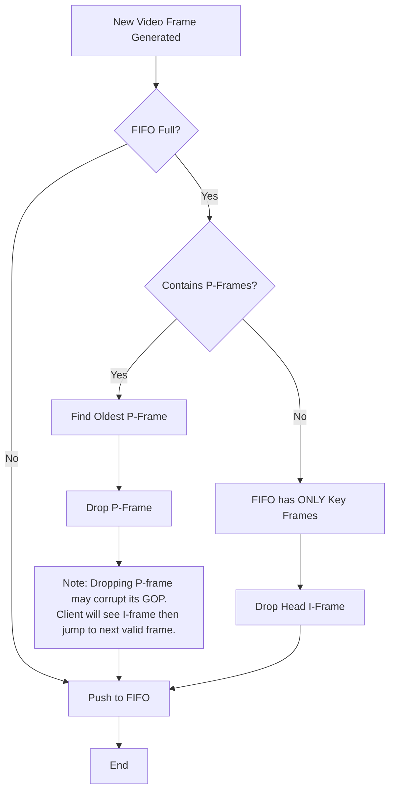
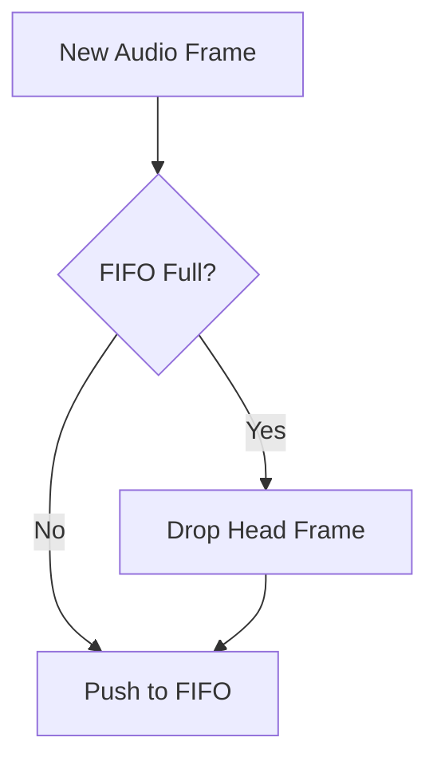

# Media FIFO Buffer Strategy Design

## Overview

This document outlines the buffering strategy for the MediaFIFO system, specifically designed to handle congestion in simulation mode where the producer generates frames at a fixed frequency (simulating hardware interrupts) and the consumer (RTSP server) may experience backpressure.

The core principle is: **New frames from the producer have strictly higher priority than old frames in the FIFO.**

## Video Frame Strategy (H.264)

The strategy aims to maintain video stream recoverability (Key Frames) while sacrificing smoothness (dropping P-frames) during congestion.

### Logic Flow

When the Producer generates a new video frame and the FIFO is **FULL**:

1.  **Priority 1: Drop P-Frames**
    *   Scan the FIFO from the **Head** (Oldest) to **Tail** (Newest).
    *   Find the first available **non-key frame (P-frame)**.
    *   **Drop Strategy**:
        *   Once a P-frame is identified for dropping, we must ensure stream consistency.
        *   Ideally, we drop a P-frame to make room.
        *   However, dropping a P-frame invalidates the rest of the GOP (Group of Pictures).
        *   **Refined Policy**: If the **Head** is a P-frame, drop it (and effectively the rest of that GOP will be dropped as they reach the Head). If the **Head** is an I-frame, we prefer to keep it. We look for a P-frame inside the buffer.
        *   *Implementation constraints*: If random access deletion is expensive, a simplified approach is acceptable if it aligns with the "Prefer dropping P" rule.
    *   **User Requirement**:
        *   "If FIFO is full, prioritize dropping old non-key frames."
        *   "If dropping a P-frame, drop the entire GOP of P-frames (until next I-frame)."
        *   "If FIFO contains ONLY Key frames, drop the oldest I-frame."

### Detailed Algorithm (Pseudo-code)

```cpp
void pushVideoFrame(Frame newFrame) {
    if (fifo.isFull()) {
        if (fifo.hasPFrame()) {
            // Case 1: FIFO contains P-frames
            // We need to drop P-frames.
            // Optimal visual experience: Drop P-frames to shrink GOPs to just I-frames.
            
            // Strategy:
            // 1. If Head is P-frame: Drop Head.
            //    (Result: Oldest GOP is being discarded).
            // 2. If Head is I-frame:
            //    Search for the first P-frame in the queue and remove it.
            //    (Result: An older GOP is shortened to just its I-frame, or I+some P).
            //    This effectively creates a "fast forward" effect (I-frame only) for that GOP.
            
            fifo.removeFirstPFrame();
        } else {
            // Case 2: FIFO contains ONLY Key frames (Extreme congestion)
            // We have no choice but to drop Key frames.
            // Drop the oldest one to maintain timeline continuity.
            
            fifo.dropHead(); // Drops Oldest I-Frame
        }
    }
    
    fifo.push(newFrame);
}
```

### Visual Flow



### GOP Drop Behavior Explanation

*   **Scenario A: Head is P-Frame**
    *   `FIFO: [P1, P2, I2, P3]` (Full)
    *   Action: Drop `P1`.
    *   Result: `[P2, I2, P3, NewFrame]`
    *   *Effect*: The GOP containing P1 was already partially sent or dropped. Dropping P1 continues the "flush" of this old GOP.

*   **Scenario B: Head is I-Frame**
    *   `FIFO: [I1, P1, P2, I2]` (Full)
    *   Action: Priority is to keep `I1` (Key Frame). Drop `P1`.
    *   Result: `[I1, P2, I2, NewFrame]`
    *   *Effect*: `I1` is sent. `P2` is sent but will likely fail to decode (missing `P1`). Client sees `I1`, then artifacts or skip, then `I2`. This is better than dropping `I1` (black screen).
    *   *Refinement*: If we drop `P1`, `P2` is useless. Ideally, we should drop `P1` AND `P2` if we could, but we only need space for 1 frame. Dropping `P1` is sufficient to enter new data.

## Audio Frame Strategy

Audio frames do not have inter-frame dependencies (like I/P frames). The strategy is simple.

### Logic Flow

1.  If FIFO is Full, drop the **Oldest** frame (Head).
2.  Push new frame.

### Visual Flow



## Implementation Requirements

To support the Video Strategy, the `MediaFIFO` class needs to be extended:

1.  **Frame Inspection**: Ability to identify I-frames vs P-frames.
2.  **Traversal/Random Removal**: Ability to scan the buffer and remove a specific frame (not just Head/Tail), OR a logical equivalent that doesn't require expensive memory moves (e.g., marking as "invalid/skipped" if using a Ring Buffer, or using `std::deque` / `std::list`).
    *   *Recommendation*: Given the relatively small size of the FIFO (e.g., 60 frames) and the "Simulation" context, using `std::vector::erase` (shifting elements) is acceptable for performance.
