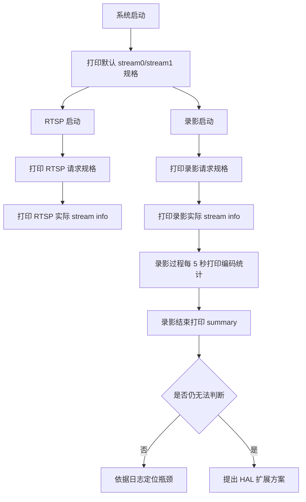

# 录影 FPS 可观测性增强设计

## 1. 背景

当前录影问题定位中，现场观测到实际录影只有约 `17fps`，与预期的 `30fps` 差距较大。为了快速判断瓶颈位于：

- sensor / ISP 采集侧
- FrameSource / Encoder 输出侧
- MP4 封装与写卡侧

需要在日志中统一输出以下信息：

- `stream0` / `stream1` 的规格
- 录影实际采用的分辨率 / 帧率 / 码率规格
- 录影过程中编码输出帧统计
- 录影过程中的时间戳统计与 wall clock 统计

## 2. 目标

### 2.1 第一阶段目标

在**不修改 `src/hal/**`** 的前提下，补齐足够的日志，让现场日志可以回答：

- 当前默认 `stream0` / `stream1` 规格是什么
- 当前 RTSP 使用的是哪条流、规格是什么
- 当前录影使用的是哪条流、请求规格是什么
- 编码输出是否真的接近 `30fps`
- 录影性能瓶颈更像是“上游供帧不足”还是“下游封装/写卡拖慢”

### 2.2 第二阶段目标

如果第一阶段仍无法确认问题，且必须拿到底层更接近 ISP/Encoder 内部状态的计数信息，再提出 `HAL` 扩展方案，由 PIC 确认后实施。

## 3. 非目标

- 本轮不修改 sensor 驱动默认 mode
- 本轮不修改录影策略、码率策略或写卡策略
- 本轮不直接优化 fps，只增强可观测性
- 本轮不在 `src/hal/**` 下直接改代码，除非 PIC 明确确认

## 4. 当前可用观测点

### 4.1 已有编码输出统计

`VideoRecorder` 当前已经具备以下统计：

- `record stats`
  - 编码输出帧数 `frames`
  - NAL 数 `nal`
  - 编码输出字节数 `bytes`
  - 基于 PTS 的 `observed_fps`
  - 帧间隔统计 `avg/min/max_delta_ms`
- `record wall`
  - 基于 wall clock 的 `wall_fps`
  - `avg_loop_ms`
  - `avg_poll_ms`
  - `avg_write_ms`
  - `avg_audio_ms`
- `record summary`
  - 汇总输出

这些日志已经足以回答“编码输出实际只有多少 fps”。

### 4.2 已有规格来源

- 录影流默认使用 `stream0`
- RTSP 默认使用 `stream1`
- RTSP 当前固定请求 `1280x720@30`
- 录影当前从 `CameraPropertyService` 读取配置

### 4.3 当前缺口

- 现有日志未在 `INFO` 级别统一打印 `stream0` / `stream1` 默认规格
- 现有日志未在录影开始时完整打印“请求规格 vs 实际 stream info”
- 现有日志未在 RTSP 启动时统一打印“请求规格 vs 实际 stream info”
- 当前没有“严格意义上的 ISP 输出帧计数”日志

## 5. 设计方案

### 5.1 方案总览

## 6. 第一阶段实现

### 6.1 启动时打印默认 stream 规格

在应用启动阶段增加一条“视频通道默认规格概览”日志，内容包括：

- `stream0`
  - 默认分辨率
  - 默认 fps
  - 是否启用
- `stream1`
  - 默认分辨率
  - 默认 fps
  - 是否启用
- 当前 sensor type

说明：

- 该日志只作为“编译时默认配置”基线
- 不代表运行时未被 RTSP 或录影重配

### 6.2 RTSP 启动日志增强

在 RTSP 初始化视频流时，增加 `INFO` 级别日志：

- RTSP 请求规格
  - sensor id
  - stream id
  - width / height
  - fps
  - codec
- RTSP 实际 stream info
  - output index
  - width / height
  - fps
  - enabled

说明：

- 用于确认 `stream1` 是否确实被配置成 `1280x720@30`
- 不依赖 HAL 改动

### 6.3 录影启动日志增强

在录影启动时，增加两类日志：

- 录影请求规格
  - record file
  - stream id
  - width / height
  - fps
  - bitrate
  - codec
  - rc mode
  - duration
- 录影实际 stream info
  - output index
  - width / height
  - fps
  - enabled

说明：

- 用于确认录影是否真的请求了 `stream0 2K@30`
- 用于区分“配置没下发”与“配置下发了但实际供帧不足”

### 6.4 录影过程统计保留并标准化关键字

保留现有统计日志，并统一推荐现场关注以下关键字：

- `record config`
- `record stream info`
- `record stats`
- `record wall`
- `record summary`
- `rtsp config`
- `rtsp stream info`
- `stream default profile`

这样日志抓取与 grep 会更稳定。

## 7. 第二阶段 HAL 扩展提案

### 7.1 触发条件

第一阶段日志仍不能回答以下问题时，才进入 HAL 扩展：

- sensor / ISP 是否真实按 `30fps` 在产出
- encoder 内部是否存在持续积压
- `leftPics` / `leftStreamFrames` 是否长期异常

### 7.2 拟扩展项

在 HAL 中增加只读状态采样接口，周期性打印：

- `IMP_Encoder_Query`
  - `leftPics`
  - `leftStreamFrames`
  - `leftStreamBytes`
  - `curPacks`
  - `work_done`
- `IMP_FrameSource_GetChnAttr`
  - `picWidth`
  - `picHeight`
  - `outFrmRateNum/Den`

### 7.3 边界说明

该部分涉及 `src/hal/**`，按协作规则必须先提交变更提案，待 PIC 确认后再实施。

## 8. 如何用日志判断问题

### 8.1 判断配置是否正确下发

若日志显示：

- `record config` 为 `2560x1440@30`
- `record stream info` 也为 `2560x1440@30`

则说明录影请求规格已经成功下发到流配置层。

### 8.2 判断是否是上游供帧不足

若：

- `record summary.requested_fps = 30`
- `record summary.observed_fps ≈ 17`
- `record wall.wall_fps ≈ 17`
- `avg_write_ms` 不高

则更像是上游真实供帧不足或编码输出不足。

### 8.3 判断是否是写卡/封装拖慢

若：

- `observed_fps` 接近 `30`
- `wall_fps` 明显偏低
- `avg_write_ms` 或 `avg_loop_ms` 持续偏高

则更像是封装或 TF 卡写入拖慢。

### 8.4 判断是否是 poll 超时

若反复出现：

- `stream_->polling(1000) timeout`

则说明编码输出等待已经超过 1 秒，通常不是简单的写卡问题，更像是上游供帧或编码链路异常。

## 9. 风险评估

### 9.1 第一阶段风险

- 风险低
- 仅增加日志，不改变业务行为
- 主要风险是日志量略有增加

### 9.2 第二阶段风险

- 风险中等
- 需改 `HAL`
- 可能引入额外日志频率和运行时开销
- 需要 PIC 审核

## 10. 验证计划

### 10.1 日志验证

验证启动后能看到：

- `stream default profile`
- `rtsp config`
- `rtsp stream info`
- `record config`
- `record stream info`
- `record stats`
- `record wall`
- `record summary`

### 10.2 问题定位验证

对一段 `10s` 或 `30s` 录影，检查：

- 请求 fps 是否为 `30`
- 实际 stream info fps 是否为 `30`
- `observed_fps` 是否接近 `30`
- `wall_fps` 是否接近 `30`
- `avg_write_ms` 是否异常偏高

## 11. 建议结论

建议先实施**第一阶段**：

- 不碰 `HAL`
- 直接增强 RTSP / 录影 / 默认 stream 规格日志
- 先用现有编码输出统计判断“17fps”问题大致落在上游还是下游

如果第一阶段仍无法回答“sensor / ISP 是否真的只产出 17fps 左右”，再发起第二阶段 `HAL` 扩展提案。
