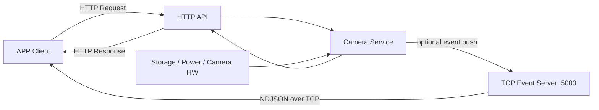
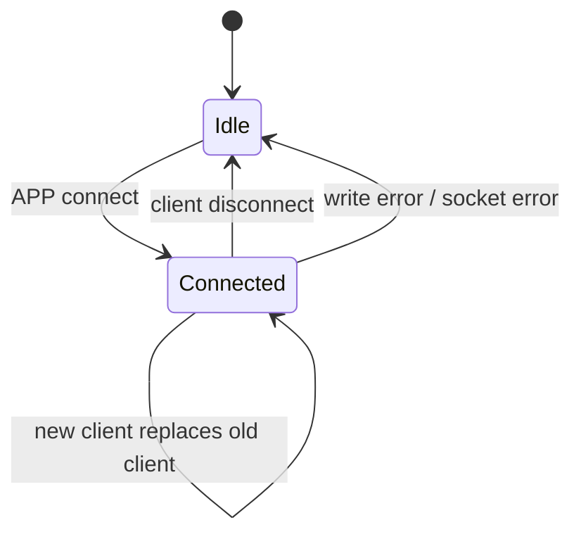
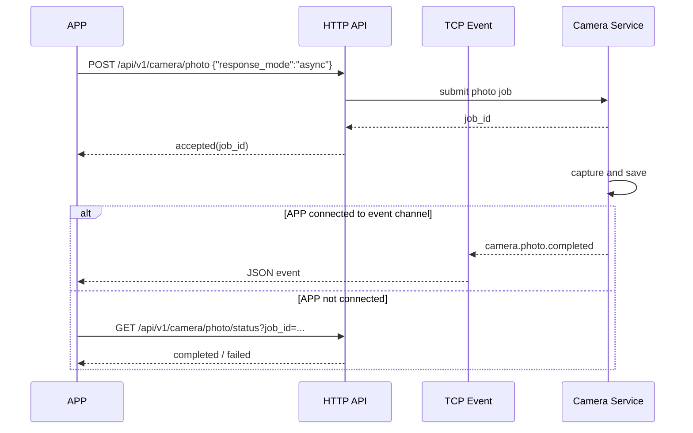

# TCP Event 机制设计文档

## 1. 背景与目标

### 1.1 背景

当前相机与 APP 的交互以 HTTP 控制接口为主。对于拍照、录像、格式化存储卡、低电量告警等“需要设备主动通知”的场景，仅靠 HTTP 轮询存在几个问题：

- APP 需要持续轮询，增加链路和功耗开销
- 耗时操作完成时机不可预测，前台交互体验较差
- 一些突发状态变化（如 SD 卡异常、即将关机）更适合由设备主动上报

因此需要引入一条独立的 TCP Event 通道，专门承担“相机主动通知 APP”的职责。

### 1.2 目标

- 为 APP 提供一个可选的事件接收通道
- 不影响现有 HTTP / RTSP / 本地业务流程
- 先覆盖核心状态事件，控制实现复杂度
- 定义统一 JSON 报文结构，便于 Android / iOS 统一解析
- 明确与 HTTP API 的协同关系，为后续异步接口落地提供基础

### 1.3 非目标

- 不通过 TCP Event 承载控制命令
- 首版不做 ACK / 重传 / 断线补发
- 首版不做订阅过滤
- 首版不做连接鉴权
- 首版不定义代码级类拆分、线程模型和具体实现文件

## 2. 设计原则

- TCP Event 是 option，APP 可以不连接
- APP 不连接时，设备保持静默，不缓存事件、不影响其他功能
- HTTP 仍是控制面，TCP Event 仅作为通知面
- 连接建立后只发送后续增量事件，不自动补当前状态快照
- 单条事件只表达一个事实，不混合多个状态变化
- 事件发送失败只记日志，不回传影响业务结果

## 3. 整体架构

### 3.1 通道关系



### 3.2 服务角色

- 相机：TCP server
- APP：TCP client
- 默认监听端口：`5000`

选择固定端口的原因：

- APP 侧实现最简单
- 与现有 `80` HTTP 控制口、`8554` RTSP 口职责清晰分离
- 当前工程没有现成 event port 配置项，固定端口更适合作为首版基线

后续建议：

- 在 HTTP 设备信息接口中补充 `event_port`
- 在 mDNS TXT Record 中补充 `event_port`

## 4. 连接模型

### 4.1 连接语义

- 设备同时只保留一个 event client 连接
- 新客户端连入时，替换旧连接
- 旧连接断开、网络异常或写失败后，设备回到“无 event client”状态
- 没有客户端连接时，所有事件直接丢弃，不做缓存

### 4.2 生命周期



### 4.3 首包行为

- TCP 建立成功后，服务端不发送欢迎报文
- 服务端不发送状态快照
- 服务端仅在后续真实事件发生时发送 JSON 消息

## 5. 传输与封帧

### 5.1 传输方式

- 传输协议：TCP
- 报文编码：UTF-8 JSON
- 封帧方式：NDJSON

即：

- 每条事件为一个完整 JSON 对象
- 每条 JSON 末尾追加换行符 `\n`
- 客户端按行读取并解析

### 5.2 示例

```text
{"version":1,"event_id":"evt_1737276320123_0001","category":"camera","type":"camera.photo.completed","timestamp":1737276320,"sequence":1,"level":"info","data":{"job_id":"photo_job_001","photo_id":"photo_001","filename":"IMG_001.jpg"}}\n
{"version":1,"event_id":"evt_1737276321123_0002","category":"power","type":"power.battery.low","timestamp":1737276321,"sequence":2,"level":"warn","data":{"battery_level":15,"battery_voltage_mv":3520,"external_power":false}}\n
```

## 6. 统一 JSON 结构

### 6.1 Envelope

```json
{
  "version": 1,
  "event_id": "evt_1737276320123_0001",
  "category": "camera",
  "type": "camera.photo.completed",
  "timestamp": 1737276320,
  "sequence": 1,
  "level": "info",
  "data": {}
}
```

### 6.2 字段定义

| 字段 | 类型 | 必填 | 说明 |
|---|---|---|---|
| `version` | int | 是 | 协议版本，首版固定为 `1` |
| `event_id` | string | 是 | 事件唯一 ID |
| `category` | string | 是 | 一级分类 |
| `type` | string | 是 | 完整事件名 |
| `timestamp` | int | 是 | Unix 时间戳，秒级 |
| `sequence` | int | 是 | 当前 TCP 连接内单调递增序号 |
| `level` | string | 是 | `info` / `warn` / `error` |
| `data` | object | 是 | 事件业务数据 |

### 6.3 命名规则

- `category` 取值：`storage`、`power`、`camera`、`device`
- `type` 使用点分命名法，例如：
  - `camera.photo.completed`
  - `storage.sdcard.space.low`
  - `power.shutdown.imminent`
- `data` 内字段统一采用 `snake_case`

## 7. 事件分类与载荷设计

## 7.1 首版覆盖范围

首版覆盖以下核心事件：

- 存储卡类
- 电池/供电类
- 拍照/录像状态类
- 设备关键状态类

不纳入首版的扩展事件：

- 网络状态变化
- 夜视/日夜模式变化
- 工作模式切换
- 参数配置变化
- 固件升级状态

### 7.2 存储卡类事件

#### 事件列表

- `storage.sdcard.mounted`
- `storage.sdcard.unmounted`
- `storage.sdcard.format.started`
- `storage.sdcard.format.completed`
- `storage.sdcard.format.failed`
- `storage.sdcard.space.low`
- `storage.sdcard.space.normal`
- `storage.sdcard.error`

#### 通用 `data` 字段

| 字段 | 类型 | 说明 |
|---|---|---|
| `mounted` | bool | 当前挂载状态 |
| `total_mb` | int | 总容量 |
| `used_mb` | int | 已使用容量 |
| `free_mb` | int | 剩余容量 |
| `threshold_mb` | int | 低空间阈值 |
| `error_code` | int | 错误码 |
| `error_message` | string | 错误描述 |

#### 示例

```json
{
  "version": 1,
  "event_id": "evt_1737276323000_0003",
  "category": "storage",
  "type": "storage.sdcard.space.low",
  "timestamp": 1737276323,
  "sequence": 3,
  "level": "warn",
  "data": {
    "mounted": true,
    "total_mb": 32768,
    "used_mb": 31980,
    "free_mb": 788,
    "threshold_mb": 1024
  }
}
```

### 7.3 电池/供电类事件

#### 事件列表

- `power.battery.level.changed`
- `power.battery.low`
- `power.battery.critical`
- `power.external.connected`
- `power.external.disconnected`
- `power.shutdown.imminent`

#### 通用 `data` 字段

| 字段 | 类型 | 说明 |
|---|---|---|
| `battery_level` | int | 电量百分比 |
| `battery_voltage_mv` | int | 电池电压，毫伏 |
| `battery_type` | int | 电池类型，沿用现有设备语义 |
| `external_power` | bool | 是否外接供电 |
| `reason` | string | 触发原因 |
| `deadline_sec` | int | 预计关机前剩余秒数 |

#### 示例

```json
{
  "version": 1,
  "event_id": "evt_1737276324000_0004",
  "category": "power",
  "type": "power.shutdown.imminent",
  "timestamp": 1737276324,
  "sequence": 4,
  "level": "error",
  "data": {
    "battery_level": 3,
    "battery_voltage_mv": 3320,
    "external_power": false,
    "reason": "battery_critical",
    "deadline_sec": 30
  }
}
```

### 7.4 拍照/录像状态类事件

#### 单拍事件

- `camera.photo.accepted`
- `camera.photo.started`
- `camera.photo.completed`
- `camera.photo.failed`

`data` 字段：

| 字段 | 类型 | 必填 | 说明 |
|---|---|---|---|
| `job_id` | string | 是 | 任务 ID |
| `channel` | int | 是 | 通道号 |
| `client_request_id` | string | 否 | 来自 HTTP 请求 |
| `photo_id` | string | 否 | 成功后返回 |
| `filename` | string | 否 | 成功后返回 |
| `filepath` | string | 否 | 成功后返回 |
| `size` | int | 否 | 成功后返回 |
| `width` | int | 否 | 成功后返回 |
| `height` | int | 否 | 成功后返回 |
| `error_code` | int | 否 | 失败时返回 |
| `error_message` | string | 否 | 失败时返回 |

#### 连拍/定时拍照事件

- `camera.burst.started`
- `camera.burst.completed`
- `camera.timer.started`
- `camera.timer.stopped`

`data` 字段建议复用：

- `job_id`
- `channel`
- `total_count`
- `completed_count`
- `interval_ms`

#### 录像事件

- `camera.video.started`
- `camera.video.completed`
- `camera.video.failed`
- `camera.video.stopped`

`data` 字段：

| 字段 | 类型 | 必填 | 说明 |
|---|---|---|---|
| `record_id` | string | 是 | 录像 ID |
| `channel` | int | 是 | 通道号 |
| `audio` | bool | 是 | 是否带音频 |
| `start_time` | int | 否 | 开始时间 |
| `end_time` | int | 否 | 结束时间 |
| `duration` | int | 否 | 录像时长 |
| `filename` | string | 否 | 文件名 |
| `filepath` | string | 否 | 文件路径 |
| `size` | int | 否 | 文件大小 |
| `error_code` | int | 否 | 失败时返回 |
| `error_message` | string | 否 | 失败时返回 |

#### 单拍完成事件示例

```json
{
  "version": 1,
  "event_id": "evt_1737276325000_0005",
  "category": "camera",
  "type": "camera.photo.completed",
  "timestamp": 1737276325,
  "sequence": 5,
  "level": "info",
  "data": {
    "job_id": "photo_job_20250119_143520_001",
    "channel": 0,
    "client_request_id": "req_123456",
    "photo_id": "photo_20250119_143520_001",
    "filename": "IMG_20250119_143520_001.jpg",
    "filepath": "/sdcard/DCIM/IMG_20250119_143520_001.jpg",
    "size": 1024000,
    "width": 1920,
    "height": 1080
  }
}
```

#### 录像失败事件示例

```json
{
  "version": 1,
  "event_id": "evt_1737276326000_0006",
  "category": "camera",
  "type": "camera.video.failed",
  "timestamp": 1737276326,
  "sequence": 6,
  "level": "error",
  "data": {
    "record_id": "video_20250119_143520_001",
    "channel": 0,
    "audio": true,
    "error_code": 1003,
    "error_message": "file_write_failed"
  }
}
```

### 7.5 设备关键状态类事件

#### 事件列表

- `device.error`
- `device.rebooting`
- `device.shutting_down`

#### `data` 字段

| 字段 | 类型 | 说明 |
|---|---|---|
| `reason` | string | 原因 |
| `error_code` | int | 错误码 |
| `error_message` | string | 错误描述 |

## 8. 与 HTTP API 的关系

### 8.1 职责边界

- HTTP：控制面
  - 下发命令
  - 查询状态
  - 获取结果
- TCP Event：通知面
  - 主动上报状态变化
  - 主动上报耗时任务结果

### 8.2 异步 HTTP 的协同方式

以 `POST /api/v1/camera/photo` 异步模式为例：

1. APP 通过 HTTP 发起异步拍照请求
2. HTTP 立即返回 `job_id`
3. 相机拍照完成后，通过 TCP Event 推送 `camera.photo.completed` 或 `camera.photo.failed`
4. 若 APP 未连接 event 通道，则继续通过 HTTP `photo/status` 轮询



### 8.3 字段对齐要求

为降低 APP 适配成本，以下要求固定：

- `camera.photo.completed.data` 中的文件信息字段，与 HTTP 同步拍照成功响应字段保持一致
- `camera.video.completed.data` 中的文件信息字段，与 HTTP 停止录像成功响应字段尽量对齐
- `job_id`、`client_request_id` 作为 HTTP 与 TCP Event 关联主键

## 9. 可靠性与错误处理

### 9.1 投递语义

首版采用 best effort：

- 连接存在时尽力发送
- 发送失败立即关闭当前连接
- 不缓存未发送事件
- 不做客户端 ACK
- 不做断线补发

### 9.2 失败处理

- 事件序列化失败：丢弃该条事件并记录日志
- socket 写失败：关闭当前 event client
- 客户端断开：切换到“无客户端”状态
- 所有这些失败都不改变原业务流程结果

### 9.3 为什么首版不做 ACK / 重发

- APP 仍可通过 HTTP 查询关键任务结果
- 低复杂度更适合首版验证
- 断线补偿逻辑会引入缓存、过期、重放窗口等额外决策

## 10. 安全与约束

### 10.1 首版约束

- 不做鉴权
- 不做订阅过滤
- 不做多客户端广播
- 不做状态快照
- 不做历史事件缓存

### 10.2 风险说明

- 任何能连接到该端口的客户端都能收到事件
- 断线期间的事件会丢失
- APP 必须把 HTTP 查询作为一致性兜底手段

## 11. 后续扩展建议

后续版本可按优先级逐步扩展：

1. 在 HTTP 设备信息和 mDNS TXT 中增加 `event_port`
2. 增加轻量 `hello` / 注册报文
3. 增加客户端订阅过滤
4. 增加状态快照请求
5. 增加 ACK 和有限重发窗口
6. 扩展运行状态类事件：
   - 网络状态
   - 日夜模式
   - 工作模式
   - 固件升级
   - 参数配置变更

## 12. 验收场景

- APP 未连接 event 通道时，HTTP 拍照、录像、状态查询行为与现状一致
- APP 建立 TCP 连接后，能够持续接收 NDJSON 事件流
- 第二个 APP 连入后，旧连接被替换
- 异步拍照完成后收到 `camera.photo.completed`
- 异步拍照失败后收到 `camera.photo.failed`
- 录像开始 / 停止 / 失败分别收到对应事件
- SD 卡空间不足时收到 `storage.sdcard.space.low`
- 电量进入低电和临界阈值时收到对应 `power` 事件
- 关机前收到 `power.shutdown.imminent` 或 `device.shutting_down`

## 13. 相关文档

- `doc/design/camera_http_api_design.md`
- `doc/spec/mdns-device-discovery-spec.md`
- `doc/solution/20260313-t32-mdns-integration-plan.md`
