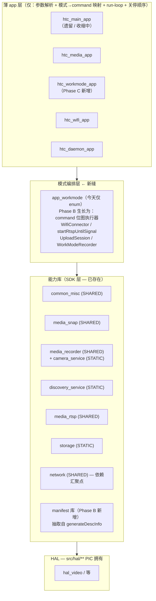

# 工作模式（`-wm`）SDK 分层架构方向文档

> Phase A 产出（T8）。仅设计文档，不含任何代码改动。所有 `file:line` 引用均已在
> `feature/new-workmode` 工作树核对（`main_app.cpp` 当前 1894 行）。详细能力清单见
> `doc/design/workmode-capability-inventory.md`。

## 1. 问题陈述

`htc_main_app` 是一个 1894 行的 god-binary，`-wm <mode>` 只是 `main()` 中的一个分支：

- 子模式 → `command` 位图的映射（`src/app/main_app.cpp:1167-1191`）；
- `command` 位按顺序顺序执行（约 `:1310-1840`），是一段 500+ 行的扁平块；
- 多个能力（mDNS 参数构建、RTSP 启停、NTP 等待、上传编排、JSON manifest 生成）以 `static`
  函数和内联代码的形式熔合在 `main_app.cpp` 里，跨 `-wm 1/2/3/4` 之间反复复制粘贴。

目标：把 `-wm` 从 god-binary 中抽离，落到一层可复用的「能力 API + 模式编排」之上，使
`-wm` 与各 user-mode（`-s/-u/-m/-rs`）都变成 app 层的薄编排器。

## 2. 论点校准（基于源码事实）

**用户论点：** 把 `-wm` 抽到一个共享的 SDK 能力层上，工作模式 / 用户模式退化为薄编排器。

**结论：基本同意，但有一个关键定性修正。**

用户设想的「SDK 层」**已经存在**——它就是现有的一组能力库。逐项核实如下（库类型取自各
`CMakeLists.txt`）：

| 能力 | 库 | 类型 | 是否已是干净 API |
|---|---|---|---|
| Network / WiFi / DHCP / NTP | `common_misc` | SHARED（`src/common/misc/CMakeLists.txt:20`） | 是 |
| 拍照 + 缩略图 | `media_snap` | SHARED（`src/media/snap/CMakeLists.txt:21`） | 基本是 |
| 录影 | `media_recorder` + `camera_service` | SHARED（`src/media/video/CMakeLists.txt:18`）+ STATIC（`src/service/camera/CMakeLists.txt:6`） | 基本是 |
| mDNS | `discovery_service` | STATIC（`src/service/discovery/CMakeLists.txt:6`） | 是，耦合最低 |
| RTSP server | `media_rtsp` | SHARED（`src/media/rtsp/CMakeLists.txt:33`） | 是，但 singleton 绑定 |
| SQLite 文件信息 | `storage` | **STATIC**（`build/src/storage/libstorage.a`，`src/storage/CMakeLists.txt:1` 无 SHARED 关键字，无 `BUILD_SHARED_LIBS`） | 最干净 |
| 上传 transport | `network` | SHARED（`src/network/CMakeLists.txt:3`） | 干净 |
| JSON manifest 内容 | （无独立库，app 内联） | — | **否**——`generateDescInfo` 熔在 `main_app.cpp:268` |

**所以真正的缺口不是「建一个 SDK」，而是「熔在 `main_app.cpp` 里的 app 内联编排」。** 两个
真正缺失的件：

1. **没有 JSON-manifest 能力库。** `generateDescInfo`（`main_app.cpp:268`）与
   `createDescInfoFile`（`:453`）是 `main_app.cpp` 内的 `static` 函数，熔合在三个 singleton
   （`Settings`、`MCU`、`DeviceConfig`）以及 `Disk`/`CRC`/`Timezone` 上。**这是最高价值的
   抽取目标。**
2. **没有模式编排缝（seam）。** 每模式的 `command` 位图分发（`main_app.cpp:1167-1191`）及其
   顺序执行（`:1310-1840`）是 `main()` 里的一个 500 行块。`app_workmode` 库已存在
   （`src/app/workmode/CMakeLists.txt:16`，SHARED），但**今天只持有 enum + `getWorkingMode()`
   读取器**（`src/app/workmode/WorkMode.h:5-29`）——它**不执行**模式。这个库是新增编排缝的
   天然归宿。

`htc_wifi_app`（`src/app/wifi_app.cpp` + `wifi_app_logic.cpp`）是已被验证的「薄 app」先例：
一个 `main()` 调 `Misc::connectWifi/startDHCP` 然后退出。未来的 workmode app 应是同样形状，
只是编排更丰富。

## 3. 目标分层

依赖方向：apps → 编排 → 能力 → HAL。`network` 是**依赖汇聚点**（见 §5 约束 4），永远停在
能力层，不许让编排层直接链硬件。

规则：

- apps 层只做参数解析、`-wm` → `command` 映射、run-loop、关停顺序。
- 编排层是纯编排：不碰 HAL，除了 config 之外不直接读 singleton。
- 能力层提供干净公开 API，对 HAL 透明（caps 3/4/6 必须保持 HAL 透明）。

## 4. 分阶段路线图

每一步都以「行为位一致」为闸门。

- **Phase A（本任务 T8）：** 仅两份设计文档，无代码。
- **Phase B：把 app 内联编排移入 SDK API，不改变任何 binary 行为。**
  - **B1：** 抽取 `generateDescInfo`/`createDescInfoFile` → 新 `manifest` 库（或 `storage`
    扩展）。`htc_main_app` 链接它；行为完全一致。
  - **B2：** 把 NTP 等待循环（`main_app.cpp:1418-1450`）上移到 `common_misc`；把
    `buildMdnsParams`（`:239`）上移到 `discovery_service`；把
    `startRtspUntilSignal` + mobile/rtsp 复制（`:1631-1657` vs `:1675-1687`）上移到
    `app_workmode`。
  - **B3：** 把上传编排（auth → desc-file → per-file → tag rewrite，
    `main_app.cpp:1690-1840`）上移为 `UploadSession`。
  - **B4：** 把 `app_workmode` 从「仅 enum」生长为 command 位图执行器（`main_app.cpp`
    `:1310-1840` 的函数体），仍由 `htc_main_app` 调用。
  - **闸门：** 每个 B 步骤保持 `htc_main_app -wm <n>` 行为位一致（golden：相同日志序列、相同
    产物文件、相同上传）。
- **Phase C：** 新增 `htc_workmode_app` 薄 binary 调用 `app_workmode` 执行器；把 spawn 点
  （`src/app/media_app.cpp:257`，`"htc_main_app -wm ..."`）改指向
  `"htc_workmode_app -wm ..."`。过渡期 `htc_main_app` 保留给非 `-wm` 的 user-mode 命令
  （`-s/-u/-m/-rs/...`），之后再退役。
- **范围外：** 动 `src/hal/**`；改 `htc_media_app` 的拍照职责；把单条共享 encoder 流水线拆到
  多进程。

## 5. 约束（必须满足）

1. **`src/hal/**` PIC 拥有**（`AGENTS.md`）。能力 3（拍照）、4（录影）、6（RTSP）对 HAL 透明；
   编排器绝不直接调 HAL。
2. **singleton 耦合：** `Settings::getInstance()`、`MCU::getInstance()`、
   `DeviceConfig::getInstance()` 是进程全局。manifest 库抽取（B1）必须以参数接收这些，而不是
   调它们，否则库继承同样的熔合。`DayNightSwitch` singleton（`main_app.cpp:1059`）同理。
3. **单一共享 encoder 流水线：** IMP encoder channel/group 是进程作用域；
   `RtspServer::shutdown()`（`src/media/rtsp/RtspServer.h:43`）的 HAL 释放（`main_app.cpp:1857`）
   正是因为下一次启动会卡在陈旧的 IMP 状态上。一个跨 RTSP + record 的 workmode app 必须拥有
   相同的关停顺序。**不要假设两个进程能共享 encoder。**
4. **`network` 是依赖汇聚点**（`src/network/CMakeLists.txt:37`）。任何需要上传的新编排库一旦链
   `network`，传递性地就把大半个树拉进来——编排层必须保持薄。
5. **`htc_main_app` 不是自包含可执行**——它动态链接 `build/lib/` 下所有 `.so`（项目
   CLAUDE.md）。新增 `htc_workmode_app` 继承相同的 `.so` 运行期要求；NFS 部署 +
   `LD_LIBRARY_PATH` 规则不变。
6. **命名：** `-wm`/`--work-mode` = 5 个硬件子模式（`src/app/workmode/WorkMode.h:5-12`）。
   `-w`/`--wifi`（`main_app.cpp` 一条 WiFi 命令）是 one-shot，**不是模式**。不要混淆。
7. **双平台：** 每次抽取都必须在 `BUILD_FOR_SIMULATION=ON` 和 T32（uClibc——无
   `std::to_string/stoi`，用 `snprintf`/`strtol`）下都能编译。现有分发已用
   `stoi_custom`/`to_string_custom`（`main_app.cpp:1163`、`media_app.cpp:257`）。

## 6. 未决问题

1. **拍照（cap 3）是否要从 `media_app` 移到 `workmode_app`？**
   建议：**不移**。今天 `-wm` 路径并不拍照——`processCmdSnap`（`main_app.cpp:555`）只搬移
   `htc_media_app -qs` 已产出的快照文件；真正的拍照在 `media_app`。把拍照搬进 workmode app
   会改变既有的 `media_app → main_app` 切分。Phase C 让 workmode app 只编排 post-capture
   （move + manifest + upload）。
2. **manifest 库住哪？** 独立 `manifest` 库 vs 折进 `storage`/`network`。倾向于独立库（它熔在
   `Settings/MCU/DeviceConfig` 三个 singleton 上，折进现有干净库会污染它们），B1 时最终决定。
3. **mobile 栈（`-m`/`-wm 3`）与 `-rs` 共享 RTSP 启停——抽到一个 helper 后，关停顺序在哪个
   app 的 exit path 拥有？** 建议：编排器负责 start/stop，进程级 `shutdown()` 留在 app exit
   path（见约束 3）。
