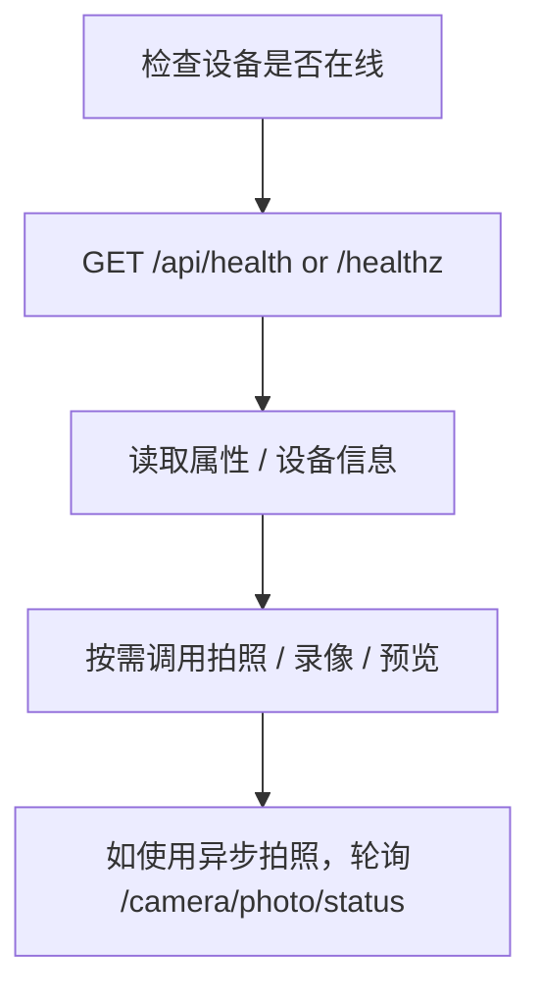

# t32_yb HTTP API 客户端精简手册

## 适用范围

本文档面向客户端开发，只保留调用时必须关注的信息。

- 基础地址：`http://<device_ip>:<ctrl_port>`
- 业务接口前缀：`/api/v1`
- 探针接口：`/api/health`、`/healthz`
- 仅支持 `GET`、`POST`

## 快速规则

### 1. 普通 JSON 接口统一返回

```json
{
  "code": 0,
  "message": "success",
  "data": {}
}
```

调用方判断成功的标准：

- HTTP 状态码为 `200`
- JSON 中 `code == 0`

### 2. 协议错误

参数缺失、方法错误、路径错误时，通常返回 HTTP `4xx`：

```json
{
  "code": 400,
  "message": "Missing xxx field",
  "data": null
}
```

### 3. 需要特别注意的接口

以下接口即使顶层 `code=0`，也仍可能包含部分失败项：

- `POST /api/v1/camera/properties`
- `POST /api/v1/camera/files/delete`

客户端必须继续检查：

- `results[].status`
- `failed`

### 4. 非 JSON 接口

以下接口直接返回文件或图片：

- `GET /api/v1/camera/database/media`
- `GET /api/v1/camera/database/thumbnail`
- `GET /api/v1/camera/preview`
- `GET /api/v1/camera/thumbnail`

## 路由速查

| 方法 | 路径 | 用途 |
|------|------|------|
| GET | `/api/health` | 存活探针 |
| GET | `/healthz` | 存活探针别名 |
| GET | `/api/v1/device/info` | 设备信息 |
| GET | `/api/v1/device/sensors` | 电池 / 传感器信息 |
| POST | `/api/v1/system/datetime` | 设置时间 |
| POST | `/api/v1/system/workmode` | 请求切换工作模式 |
| GET | `/api/v1/storage/info` | 存储信息 |
| POST | `/api/v1/storage/format` | 请求格式化存储 |
| POST | `/api/v1/camera/photo` | 单次拍照 |
| POST | `/api/v1/camera/photo/burst` | 连拍 |
| POST | `/api/v1/camera/photo/timer` | 定时拍照启动 / 停止 |
| GET | `/api/v1/camera/photo/status` | 拍照任务状态 |
| POST | `/api/v1/camera/video/start` | 开始录像 |
| POST | `/api/v1/camera/video/stop` | 停止录像 |
| GET | `/api/v1/camera/video/status` | 录像状态 |
| GET | `/api/v1/camera/video/list` | 录像列表 |
| GET | `/api/v1/camera/properties` | 获取全部属性 |
| POST | `/api/v1/camera/properties` | 批量设置属性 |
| GET | `/api/v1/camera/properties/{name}` | 获取单个属性 |
| POST | `/api/v1/camera/properties/{name}` | 设置单个属性 |
| POST | `/api/v1/camera/properties/reset` | 重置属性 |
| POST | `/api/v1/camera/properties/factory-reset` | 按 CPS 默认值恢复出厂属性 |
| GET | `/api/v1/camera/presets` | 获取预设列表 |
| POST | `/api/v1/camera/presets/{id}` | 应用预设 |
| GET | `/api/v1/camera/photos` | 照片列表 |
| POST | `/api/v1/camera/files/delete` | 删除文件 |
| GET | `/api/v1/camera/database/media` | 下载媒体数据库 |
| GET | `/api/v1/camera/database/thumbnail` | 下载缩略图数据库 |
| GET | `/api/v1/camera/preview` | 获取预览图 |
| GET | `/api/v1/camera/thumbnail` | 获取缩略图 |

## 推荐调用流程



## 探针

### GET `/api/health`

### GET `/healthz`

响应：

```json
{
  "status": "ok"
}
```

## Device

### GET `/api/v1/device/info`

返回字段：

| 字段 | 说明 |
|------|------|
| `pid` | 设备标识 |
| `camera_ver` | 相机版本 |
| `camera_model` | 机型 |
| `camera_build` | 构建版本 |
| `mcu_ver` | MCU 版本 |

示例：

```json
{
  "code": 0,
  "data": {
    "camera_build": "2025-01-06",
    "camera_model": "T32",
    "camera_ver": "1.0.0",
    "mcu_ver": "MCU-1.0.0",
    "pid": "T32-CAM-001"
  },
  "message": "success"
}
```

### GET `/api/v1/device/sensors`

常用字段：

- `battery`
- `battery_level`
- `battery_type`
- `ext_power`
- `sdcard_capacity`
- `sdcard_used`
- `cds`
- `temp`
- `press`
- `rh`
- `datetime`

## System

### POST `/api/v1/system/datetime`

请求：

```json
{
  "datetime": "2026-03-05T09:30:00"
}
```

成功响应：

```json
{
  "code": 0,
  "data": {
    "accepted": true,
    "datetime": "2026-03-05T09:30:00"
  },
  "message": "success"
}
```

### POST `/api/v1/system/workmode`

请求：

```json
{
  "mode": 1
}
```

成功响应：

```json
{
  "code": 0,
  "data": {
    "accepted": true,
    "mode": 1
  },
  "message": "success"
}
```

## Storage

### GET `/api/v1/storage/info`

示例：

```json
{
  "code": 0,
  "data": {
    "free": 24000,
    "total": 32000,
    "used": 8000
  },
  "message": "success"
}
```

### POST `/api/v1/storage/format`

请求：

```json
{}
```

响应：

```json
{
  "code": 0,
  "data": {
    "accepted": true,
    "status": "scheduled"
  },
  "message": "success"
}
```

## Camera

### POST `/api/v1/camera/photo`

用途：单次拍照。

请求：

```json
{
  "channel": 0,
  "save": true,
  "format": "jpg",
  "quality": 85,
  "response_mode": "sync"
}
```

关键字段：

| 字段 | 说明 |
|------|------|
| `channel` | 默认 `0` |
| `save` | 默认 `true` |
| `format` | 默认 `jpg` |
| `quality` | 默认 `85` |
| `response_mode` | `sync` 或 `async`，默认 `sync` |
| `client_request_id` | 异步链路可选 |

同步成功示例：

```json
{
  "code": 0,
  "data": {
    "filename": "IMG_20260324_030825.jpg",
    "filepath": "./sim_sdcard/DCIM/IMG_20260324_030825.jpg",
    "photo_id": "photo_1774321705",
    "response_mode": "sync",
    "size": 49184,
    "status": "completed",
    "timestamp": 1774321705
  },
  "message": "success"
}
```

异步受理示例：

```json
{
  "code": 0,
  "data": {
    "job_id": "photo_job_1774321705_1",
    "response_mode": "async",
    "result_query": "/api/v1/camera/photo/status?job_id=photo_job_1774321705_1",
    "status": "accepted",
    "submitted_at": 1774321705
  },
  "message": "success"
}
```

客户端建议：

- 需要即时文件结果时用 `sync`
- 需要非阻塞调用时用 `async`

### GET `/api/v1/camera/photo/status`

用途：查询异步拍照任务结果。

查询参数：

| 参数 | 说明 |
|------|------|
| `job_id` | 异步拍照接口返回的任务 ID |

完成态示例：

```json
{
  "code": 0,
  "data": {
    "job_id": "photo_job_1774321705_1",
    "photo": {
      "filename": "IMG_20260324_030825.jpg",
      "filepath": "./sim_sdcard/DCIM/IMG_20260324_030825.jpg",
      "photo_id": "photo_1774321705",
      "size": 49184,
      "timestamp": 1774321705
    },
    "progress": 100,
    "status": "completed"
  },
  "message": "success"
}
```

### POST `/api/v1/camera/photo/burst`

请求：

```json
{
  "count": 3,
  "interval": 1000
}
```

### POST `/api/v1/camera/photo/timer`

启动请求：

```json
{
  "action": "start",
  "interval": 1000,
  "count": 2,
  "channel": 0
}
```

停止请求：

```json
{
  "action": "stop"
}
```

### POST `/api/v1/camera/video/start`

请求：

```json
{
  "channel": 0,
  "duration": 3,
  "audio": true
}
```

### POST `/api/v1/camera/video/stop`

请求：

```json
{}
```

### GET `/api/v1/camera/video/status`

核心字段：

- `status`
- `duration`
- `filepath`（存在时返回）

### GET `/api/v1/camera/video/list`

查询参数：

| 参数 | 默认值 |
|------|--------|
| `offset` | `0` |
| `limit` | `20` |

### GET `/api/v1/camera/photos`

查询参数：

| 参数 | 默认值 |
|------|--------|
| `offset` | `0` |
| `limit` | `20` |

### GET `/api/v1/camera/properties`

用途：获取全部属性定义和当前值。

CPS grouped 响应中，`properties` 是按规格顺序排列的数组，不应依赖 object key 顺序。

当前常见属性：

- `resolution`
- `fps`
- `bitrate`
- `pir_enabled`
- `pir_sensitivity`
- `loop_recording`
- `max_record_duration`
- `timestamp_overlay`

### GET `/api/v1/camera/properties/{name}`

示例：

- `GET /api/v1/camera/properties/resolution`

### POST `/api/v1/camera/properties`

请求示例：

```json
{
  "fps": 60,
  "bitrate": 8192,
  "timestamp_overlay": false
}
```

返回时重点检查：

- `success`
- `failed`
- `results[].status`

### POST `/api/v1/camera/properties/{name}`

请求示例：

```json
{
  "value": 60
}
```

### POST `/api/v1/camera/properties/reset`

请求示例：

```json
{
  "properties": ["fps", "bitrate", "timestamp_overlay"]
}
```

说明：

- 若不传 `properties`，当前实现会重置全部可重置属性

### POST `/api/v1/camera/properties/factory-reset`

请求示例：

```json
{
  "names": ["CAM_Mode", "CAM_ Ffixed_Shutter"]
}
```

说明：

- 不传 `names`/`properties` 时，按 CPS 规格组顺序尝试重置全部 registry 属性
- 传 `group` 可重置单个组，例如 `{"group":"Camera_Setting"}`
- 响应包含 `applied`、`skipped`、`failed` 和逐字段 `results`
- 暂未接入存储的字段会返回 `status:"skipped"`，不会导致整次请求失败

### GET `/api/v1/camera/presets`

当前可用预设：

- `default`
- `high_quality`
- `low_power`

### POST `/api/v1/camera/presets/{id}`

示例：

- `POST /api/v1/camera/presets/high_quality`

### POST `/api/v1/camera/files/delete`

请求示例：

```json
{
  "file_ids": [
    "./sim_sdcard/DCIM/IMG_001.jpg"
  ]
}
```

返回时重点检查：

- `success`
- `failed`
- `results[].status`

### GET `/api/v1/camera/database/media`

返回媒体数据库文件。

### GET `/api/v1/camera/database/thumbnail`

返回缩略图数据库文件。

### GET `/api/v1/camera/preview`

查询参数：

| 参数 | 默认值 |
|------|--------|
| `channel` | `0` |
| `width` | `1920` |
| `height` | `1080` |
| `format` | `jpeg` |

### GET `/api/v1/camera/thumbnail`

调用方式：

1. `file_path` 模式：按文件路径读数据库缩略图
2. 实时帧模式：使用 `channel` 和 `size`

## 已废弃路径

以下旧路径不要再调用：

- `/api/device/info`
- `/api/sensor/data`
- `/api/system/datetime`
- `/api/system/workmode`
- `/api/storage/info`
- `/api/storage/format`
- `/api/params`
- `/api/params/set`
- `/api/params/reset`
- `/api/record/status`
- `/api/record/start`
- `/api/record/stop`
- `/api/snapshot`

访问这些路径时，当前返回：

```json
{
  "error": "Not Found",
  "path": "/api/xxx"
}
```

## 相关文档

- 完整版手册：`doc/reference/20260324-http-api-reference.md`
- 测试入口说明：`doc/reference/20260305-http-simu-test-usage.md`
