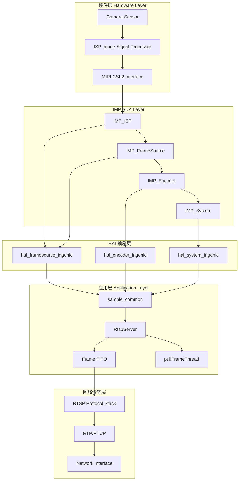
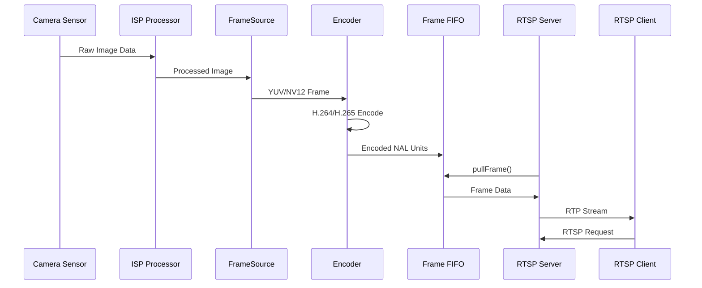

# T32 真机 Video Source 架构流程文档

## 1. 概述

本文档详细描述T32真机环境下Video Source架构的完整流程，包括从硬件Sensor到RTSP Server的数据流过程。该流程已经在真机验证OK，是后续PC simulation和架构重构的基础参考。

## 2. 整体架构概览



## 3. 核心组件详细说明

### 3.1 硬件层

#### 3.1.1 Camera Sensor
- **文件位置**: `src/media/common/sample-common.h:31-137`
- **支持传感器**: 
  - 主传感器: GC5613 (2880x1620 @ 15fps)
  - 副传感器: GC2063S1 (1920x1080 @ 15fps)
  - 第三传感器: GC2063S2 (1920x1080 @ 15fps)
  - 第四传感器: GC2063S3 (1920x1080 @ 15fps)
- **接口类型**: MIPI CSI-2
- **配置参数**: I2C地址、GPIO控制、时钟源等

#### 3.1.2 ISP (Image Signal Processor)
- **功能**: 图像信号处理，包括去噪、白平衡、色彩校正等
- **配置**: 通过`IMP_ISP_*`系列函数配置

### 3.2 IMP SDK层

#### 3.2.1 系统初始化流程
```c
// sample_system_init() - src/media/common/sample-common.c:430
1. 设置OSD缓冲区大小
2. 配置JPEG编码器参数
3. 初始化传感器配置信息
4. 打开ISP: IMP_ISP_Open()
5. 设置相机输入模式: IMP_ISP_SetCameraInputMode()
6. 添加传感器: IMP_ISP_AddSensor()
7. 使能传感器: IMP_ISP_EnableSensor()
```

#### 3.2.2 FrameSource初始化
```c
// sample_framesource_init() - src/media/common/sample-common.c:774
for each enabled channel:
1. 创建通道: IMP_FrameSource_CreateChn(chn_id, &fs_chn_attr)
2. 设置通道属性: IMP_FrameSource_SetChnAttr(chn_id, &fs_chn_attr)
```

#### 3.2.3 通道配置结构
```c
// chn_conf结构 - src/media/common/sample-common.h:257-264
struct chn_conf {
    unsigned int index;              // 通道索引
    unsigned int enable;             // 是否使能
    IMPPayloadType payloadType;      // 编码类型 (H264/H265)
    IMPFSChnAttr fs_chn_attr;        // FrameSource属性
    IMPCell framesource_chn;         // FrameSource单元
    IMPCell imp_encoder;             // 编码器单元
};
```

### 3.3 RtspServer架构

#### 3.3.1 初始化序列
```cpp
// RtspServer::initialize() - src/media/rtsp/RtspServer.cpp:170
1. sample_system_init()           // 系统初始化
2. sample_framesource_init()      // FrameSource初始化  
3. IMP_Encoder_CreateGroup()      // 创建编码器组
4. initVideo()                    // 视频编码器初始化
5. IMP_System_Bind()              // 绑定FrameSource和Encoder
```

#### 3.3.2 编码器初始化
```cpp
// RtspServer::initVideo() - src/media/rtsp/RtspServer.cpp:1374
1. 配置编码器属性 (分辨率、码率、GOP等)
2. IMP_Encoder_CreateChn()       // 创建编码通道
3. IMP_Encoder_RegisterChn()     // 注册到编码器组
4. IMP_Encoder_StartRecvPic()    // 开始接收图像
```

#### 3.3.3 数据流转过程


## 4. 关键数据流分析

### 4.1 视频数据产生流程

#### 4.1.1 pullFrameThread主循环
```cpp
// RtspServer::start() - src/media/rtsp/RtspServer.cpp:1165
while (this->pullFrameThreadRun) {
    // 1. 轮询编码流
    IMP_Encoder_PollingStream(chnNum, 1000);
    
    // 2. 获取编码数据
    IMP_Encoder_GetStream(chnNum, &stream, 1);
    
    // 3. 检查FIFO空间，必要时等待
    if (frame_fifo.count >= FIFO_MAX_FRAMES) {
        wait_for_not_full();
    }
    
    // 4. 复制数据到FIFO
    copy_to_frame_fifo(&stream);
    
    // 5. 释放编码流
    IMP_Encoder_ReleaseStream(chnNum, &stream);
    
    // 6. 通知消费者
    frame_fifo.not_empty.notify_one();
}
```

#### 4.1.2 Frame FIFO管理
```cpp
// frame_fifo_t结构 - src/media/rtsp/RtspServer.h:35-43
typedef struct {
    frame_buffer_t frames[FIFO_MAX_FRAMES];  // 20帧缓冲
    int head;                                // 读指针
    int tail;                                // 写指针
    int count;                               // 当前帧数
    std::mutex mutex;                        // 互斥锁
    std::condition_variable not_full;        // 非满条件
    std::condition_variable not_empty;       // 非空条件
} frame_fifo_t;
```

### 4.2 RTSP数据消费流程

#### 4.2.1 客户端拉取接口
```cpp
// RtspServer::pullFrame() - src/media/rtsp/RtspServer.cpp:422
int pullFrame(void **data, size_t *size, uint64_t *timestamp) {
    // 1. 检查FIFO是否为空
    if (frame_fifo.count == 0) {
        return -1;  // 无数据可消费
    }
    
    // 2. 从head位置获取帧
    frame_buffer_t *frame = &frame_fifo.frames[frame_fifo.head];
    *data = frame->buffer;
    *size = frame->used_size;
    *timestamp = frame->timestamp_us;
    
    // 3. 生产者节奏控制
    if (g_needRequestIdr) {
        IMP_Encoder_RequestIDR(chn[RTSP_SENSOR_CHN_NUM].index);
        g_needRequestIdr = false;
    }
    
    return 0;
}
```

#### 4.2.2 释放机制
```cpp
// RtspServer::releaseFrame() - src/media/rtsp/RtspServer.cpp:482
int releaseFrame(void **data, size_t *size, uint64_t *timestamp) {
    std::unique_lock<std::mutex> lock(frame_fifo.mutex);
    frame_fifo.head = (frame_fifo.head + 1) % FIFO_MAX_FRAMES;
    frame_fifo.count--;
    frame_fifo.not_full.notify_one();  // 通知生产者
    return 0;
}
```

## 5. 平台差异处理

### 5.1 编译时条件判断
```cpp
#ifdef SIMULATION_MODE
    // PC模拟环境 - 使用HAL层模拟
    hal_enc_polling_stream(chnNum, 1000);
    hal_enc_get_stream(chnNum, &stream, true);
    hal_enc_release_stream(chnNum, &stream);
#else
    // T32真机环境 - 直接使用IMP SDK
    IMP_Encoder_PollingStream(chnNum, 1000);
    IMP_Encoder_GetStream(chnNum, &stream, 1);
    IMP_Encoder_ReleaseStream(chnNum, &stream);
#endif
```

### 5.2 硬件抽象层映射

#### 5.2.1 FrameSource HAL映射
```cpp
// hal_framesource_ingenic.cpp
hal_fs_create_channel() -> IMP_FrameSource_CreateChn()
hal_fs_enable_channel() -> IMP_FrameSource_EnableChn()
hal_fs_destroy_channel() -> IMP_FrameSource_DestroyChn()
```

#### 5.2.2 Encoder HAL映射  
```cpp
// hal_encoder_ingenic.cpp
hal_enc_create_group() -> IMP_Encoder_CreateGroup()
hal_enc_start_recv_pic() -> IMP_Encoder_StartRecvPic()
hal_enc_polling_stream() -> IMP_Encoder_PollingStream()
hal_enc_get_stream() -> IMP_Encoder_GetStream()
```

## 6. 关键配置参数

### 6.1 通道配置表 (sample-common.c:31-358)
```c
// 主通道 (CHN0) - 用于RTSP
{
    .index = CHN0_INDEX (0),
    .enable = CHN0_EN (1),
    .payloadType = PT_H265,           // 或 PT_H264
    .fs_chn_attr = {
        .pixFmt = PIX_FMT_NV12,
        .outFrmRateNum = 15,          // 帧率分子
        .outFrmRateDen = 1,           // 帧率分母
        .picWidth = FIRST_SENSOR_WIDTH,   // 2880
        .picHeight = FIRST_SENSOR_HEIGHT, // 1620
        .crop.enable = FIRST_CROP_EN (0),
        .scaler.enable = 1,
        .scaler.outwidth = 2880,
        .scaler.outheight = 1620,
    }
}
```

### 6.2 编码器参数
```cpp
// 分辨率对应的缓冲区大小计算
if ((s32picHeight > 1920) || (s32picHeight == 1920)) {
    enc_attr->bufSize = s32picWidth * s32picHeight * 3 / 2;
} else if ((s32picHeight > 1520) || (s32picHeight == 1520)) {
    enc_attr->bufSize = s32picWidth * s32picHeight * 3 / 8;
} else if ((s32picHeight > 1080) || (s32picHeight == 1080)) {
    enc_attr->bufSize = s32picWidth * s32picHeight / 2;
} else {
    enc_attr->bufSize = s32picWidth * s32picHeight * 3 / 4;
}
```

### 6.3 FIFO配置
```cpp
#define FIFO_MAX_FRAMES 20                    // 最大20帧缓冲
#define DEFAULT_FRAME_BUFFER_SIZE 300 * 1024  // 300KB默认缓冲
```

## 7. 错误处理和异常机制

### 7.1 初始化失败处理
```cpp
// RtspServer::initialize()错误处理
if (ret < 0) {
    // 1. 记录错误日志
    Logger::log(LogLevel::ERROR, "System init failed");
    
    // 2. 回滚已初始化的资源
    if (chn[RTSP_SENSOR_CHN_NUM].enable) {
        IMP_Encoder_DestroyGroup(chn[RTSP_SENSOR_CHN_NUM].index);
    }
    sample_framesource_exit();
    sample_system_exit();
    
    // 3. 返回失败状态
    return false;
}
```

### 7.2 运行时异常处理
```cpp
// 编码流获取失败处理
if (ret < 0) {
    Logger::log(LogLevel::ERROR, "IMP_Encoder_GetStream(%d) failed", chnNum);
    continue;  // 继续下一轮，不中断线程
}
```

### 7.3 资源清理
```cpp
// RtspServer::~RtspServer()析构函数
1. 停止工作线程
2. 关闭文件源
3. 释放FIFO缓冲区
4. 停止FrameSource
5. 销毁RTSP服务器
6. 解绑系统组件
7. 停止编码器
8. 销毁FrameSource
9. 退出系统
```

## 8. 性能优化点

### 8.1 内存管理优化
- **预分配策略**: FIFO缓冲区在初始化时预分配，避免运行时动态分配
- **动态调整**: 帧大小超过缓冲区时，使用realloc动态扩展

### 8.2 线程同步优化  
- **生产者-消费者模式**: 使用条件变量进行高效线程同步
- **水印监控**: 当FIFO接近满时记录警告，防止阻塞

### 8.3 网络传输优化
- **SPS/PPS缓存**: 首次解析后缓存，避免重复解析
- **IDR帧请求**: 客户端连接时主动请求IDR帧，确保快速解码

## 9. 与PC Simulation的差异

| 特性 | T32真机 | PC Simulation |
|------|---------|---------------|
| 数据源 | 硬件Sensor + ISP | H.264文件 |
| 编码器 | 硬件H.264/H.265编码器 | 无(直接读取) |
| 帧率控制 | 硬件自动控制 | 软件sleep控制 |
| 时钟源 | 硬件时钟 | 系统时钟 |
| 内存模型 | 共享内存 + DMA | malloc/free |

## 10. 调试和维护

### 10.1 关键日志点
- 系统初始化: `sample_system_init()`
- 通道创建: `IMP_FrameSource_CreateChn()`
- 编码器状态: `IMP_Encoder_StartRecvPic()`
- FIFO水位: `frame_fifo.count`监控
- 数据流: `pullFrame()`调用频率

### 10.2 性能监控指标
- **帧率**: 实际帧率 vs 配置帧率
- **延迟**: 从Sensor到RTSP输出的总延迟
- **丢帧率**: FIFO满时丢弃的帧数
- **内存使用**: FIFO缓冲区占用情况

## 11. 总结

T32真机Video Source架构是一个成熟的、经过验证的解决方案，具有以下特点：

1. **稳定的硬件基础**: 基于Ingenic IMP SDK，充分利用硬件编码能力
2. **高效的数据流**: 生产者-消费者模式保证实时性
3. **良好的封装性**: HAL抽象层便于后续扩展和维护
4. **完整的错误处理**: 全面的异常处理和资源清理机制

该架构为PC Simulation提供了明确的参考标准，也是后续架构重构的重要基础。在进行任何架构调整时，都应以此为基准，确保功能完整性和性能稳定性。