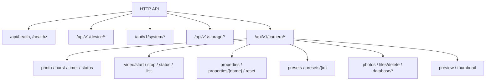
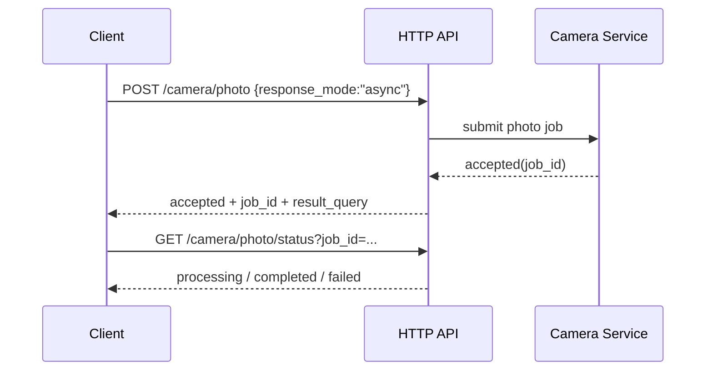

# t32_yb HTTP API 参考手册

## 来源 / 版本

| 项 | 说明 |
|----|------|
| 文档日期 | 2026-03-24 |
| 代码基线 | `src/service/http_server/http_server.c` + `src/service/http_server/http_api_v1.cpp` |
| 覆盖范围 | 当前代码中实际注册并可访问的 HTTP 路由 |
| 基础地址 | `http://<device_ip>:<ctrl_port>` |
| 端口来源 | 运行时 `CtrlPort` 配置；SIMU 测试程序默认端口为 `8080` |

## 核心内容摘要

- 当前业务接口统一使用 `/api/v1/*`
- 基础探针保留为 `/api/health` 和 `/healthz`
- legacy 业务路径已全部退役，不应再被客户端使用
- 当前只支持 `GET` 和 `POST`
- 大多数业务接口返回统一 JSON 包装：`code / message / data`
- 二进制接口不使用 JSON 包装，直接返回文件或图片流

## 路由总览



## 通用约定

### 1. 成功响应

除探针和二进制接口外，成功响应统一为：

```json
{
  "code": 0,
  "message": "success",
  "data": {}
}
```

### 2. 错误响应

存在两类错误：

- 协议错误：路径不存在、方法不允许、参数缺失、JSON 非法
- 业务错误：任务不存在、设备忙、参数设置失败等

协议错误通常返回 HTTP `4xx`，同时 JSON 结构为：

```json
{
  "code": 400,
  "message": "Missing xxx field",
  "data": null
}
```

业务错误通常仍返回 HTTP `200`，但 `code != 0`，例如：

```json
{
  "code": 1007,
  "message": "Photo job not found",
  "data": null
}
```

### 3. 探针接口例外

`/api/health` 和 `/healthz` 不使用统一包装，返回：

```json
{
  "status": "ok"
}
```

### 4. 二进制接口例外

以下接口直接返回二进制内容，不使用 JSON 包装：

- `GET /api/v1/camera/database/media`
- `GET /api/v1/camera/database/thumbnail`
- `GET /api/v1/camera/preview`
- `GET /api/v1/camera/thumbnail`

### 5. 客户端实现建议

- 不要只看 HTTP 状态码，要同时检查 JSON 中的 `code`
- 对批量接口要检查 `results` 数组，不要只看顶层 `code`
- 不要再调用任何 legacy 业务路径

## 速查表

| 方法 | 路径 | 说明 |
|------|------|------|
| GET | `/api/health` | 基础探针 |
| GET | `/healthz` | 基础探针别名 |
| GET | `/api/v1/device/info` | 设备信息 |
| GET | `/api/v1/device/sensors` | 传感器信息 |
| POST | `/api/v1/system/datetime` | 设置时间 |
| POST | `/api/v1/system/workmode` | 请求切换工作模式 |
| GET | `/api/v1/storage/info` | 存储信息 |
| POST | `/api/v1/storage/format` | 请求格式化存储 |
| POST | `/api/v1/camera/photo` | 单次拍照，同步或异步 |
| POST | `/api/v1/camera/photo/burst` | 连拍 |
| POST | `/api/v1/camera/photo/timer` | 定时拍照启动 / 停止 |
| GET | `/api/v1/camera/photo/status` | 拍照状态或任务结果 |
| POST | `/api/v1/camera/video/start` | 开始录像 |
| POST | `/api/v1/camera/video/stop` | 停止录像 |
| GET | `/api/v1/camera/video/status` | 录像状态 |
| GET | `/api/v1/camera/video/list` | 录像列表 |
| GET | `/api/v1/camera/video/playback` | 视频在线播放 / Range 拉流 |
| GET | `/api/v1/camera/properties` | 获取全部属性 |
| POST | `/api/v1/camera/properties` | 批量设置属性 |
| GET | `/api/v1/camera/properties/{name}` | 获取单个属性 |
| POST | `/api/v1/camera/properties/{name}` | 设置单个属性 |
| POST | `/api/v1/camera/properties/reset` | 重置属性 |
| GET | `/api/v1/camera/presets` | 获取预设 |
| POST | `/api/v1/camera/presets/{id}` | 应用预设 |
| GET | `/api/v1/camera/photos` | 照片列表 |
| GET | `/api/v1/camera/files/download` | 下载照片原图或视频原文件 |
| POST | `/api/v1/camera/files/delete` | 删除文件 |
| GET | `/api/v1/camera/database/media` | 下载媒体数据库 |
| GET | `/api/v1/camera/database/thumbnail` | 下载缩略图数据库 |
| GET | `/api/v1/camera/preview` | 实时预览 |
| GET | `/api/v1/camera/thumbnail` | 缩略图 |

## 媒体下载与播放

### GET `/api/v1/camera/video/playback`

用途：给播放器直接打开的视频播放 URL，支持普通 `GET`、`HEAD` 和 `Range` 请求。

请求参数：

- `id=<media_id>` 或 `token=<playback_token>`

约束：

- 只允许视频记录
- `playback_capable=true`
- `container_type` 必须为 `fmp4` 或 `mp4`
- 不接受 raw path

成功响应：

- HTTP `200`：整文件返回
- HTTP `206`：Range 返回
- `Content-Type: video/mp4`

错误：

- HTTP `400`：缺少 `id/token` 或参数非法
- HTTP `404`：记录不存在或不是视频
- HTTP `415`：视频当前不可播放或容器不支持
- HTTP `403`：文件越界、symlink、非 regular file

说明：

- 这是播放器使用的 URL，不是单纯“下载附件”语义
- 当前实现会在 `GET /api/v1/camera/video/list` 的每条可播放视频里返回 `playback_url`

### GET `/api/v1/camera/files/download`

用途：单纯下载媒体原文件，支持照片原图和视频原文件。

请求参数：

- `id=<media_id>` 或 `token=<playback_token>`

约束：

- 只允许照片或视频记录
- 不接受 raw path
- 仍然会做 canonical path / media root / regular file / symlink 校验

成功响应：

- 照片：`Content-Type: image/jpeg`
- 视频：`Content-Type: video/mp4`
- 附带 `Content-Disposition: attachment; filename="..."`

错误：

- HTTP `400`：缺少 `id/token` 或参数非法
- HTTP `404`：记录不存在
- HTTP `403`：文件越界、symlink、非 regular file

说明：

- 这是下载器使用的 URL
- 当前实现会在 `GET /api/v1/camera/photos` 和 `GET /api/v1/camera/video/list` 的条目里返回 `download_url`

## 基础探针

### GET `/api/health`

用途：基础存活探针。

响应：

```json
{
  "status": "ok"
}
```

### GET `/healthz`

用途：与 `/api/health` 等价，更适合作为运维探针路径。

响应：

```json
{
  "status": "ok"
}
```

## Device 域

### GET `/api/v1/device/info`

用途：获取设备基本信息。

当前示例响应：

```json
{
  "code": 0,
  "data": {
    "camera_build": "2025-01-06",
    "camera_model": "T32",
    "camera_ver": "1.0.0",
    "mcu_ver": "MCU-1.0.0",
    "pid": "T32-CAM-001"
  },
  "message": "success"
}
```

说明：

- 当前实现为最小占位数据
- 字段名已经稳定，后续可继续接真实模块

### GET `/api/v1/device/sensors`

用途：获取传感器与电源信息。

当前示例响应：

```json
{
  "code": 0,
  "data": {
    "battery": 3700,
    "battery_level": 85,
    "battery_type": 1,
    "cds": 500,
    "datetime": "2026-03-24T03:08:01.000",
    "ext_power": 12000,
    "press": "1013",
    "rh": "60",
    "sdcard_capacity": 32000,
    "sdcard_used": 8000,
    "temp": "25"
  },
  "message": "success"
}
```

说明：

- 当前实现同样是最小占位数据
- `datetime` 为服务端当前时间

## System 域

### POST `/api/v1/system/datetime`

用途：请求设置设备时间。

请求体：

```json
{
  "datetime": "2026-03-05T09:30:00"
}
```

成功响应：

```json
{
  "code": 0,
  "data": {
    "accepted": true,
    "datetime": "2026-03-05T09:30:00"
  },
  "message": "success"
}
```

错误：

- 缺少 `datetime` 字段会返回 HTTP `400`

说明：

- 当前接口表示“请求已接收”
- 真实时间下发链路仍可继续补强

### POST `/api/v1/system/workmode`

用途：请求切换工作模式。

请求体：

```json
{
  "mode": 1
}
```

成功响应：

```json
{
  "code": 0,
  "data": {
    "accepted": true,
    "mode": 1
  },
  "message": "success"
}
```

错误：

- 缺少 `mode` 字段会返回 HTTP `400`

说明：

- 当前接口表示“模式切换请求已接收”

## Storage 域

### GET `/api/v1/storage/info`

用途：获取存储容量信息。

当前示例响应：

```json
{
  "code": 0,
  "data": {
    "free": 24000,
    "total": 32000,
    "used": 8000
  },
  "message": "success"
}
```

### POST `/api/v1/storage/format`

用途：请求格式化存储。

请求体：

```json
{}
```

成功响应：

```json
{
  "code": 0,
  "data": {
    "accepted": true,
    "status": "scheduled"
  },
  "message": "success"
}
```

说明：

- 当前实现表示“格式化请求已调度”

## Camera 域

### 异步拍照流程



### POST `/api/v1/camera/photo`

用途：单次拍照，支持同步和异步两种调用语义。

请求体：

```json
{
  "channel": 0,
  "save": true,
  "format": "jpg",
  "quality": 85,
  "response_mode": "sync",
  "client_request_id": "req-001"
}
```

字段说明：

| 字段 | 类型 | 必填 | 说明 |
|------|------|------|------|
| `channel` | int | 否 | 默认 `0` |
| `save` | bool | 否 | 默认 `true` |
| `format` | string | 否 | 默认 `jpg` |
| `quality` | int | 否 | 默认 `85` |
| `response_mode` | string | 否 | `sync` 或 `async`，默认 `sync` |
| `client_request_id` | string | 否 | 客户端自定义请求 ID，仅异步链路有意义 |

同步成功示例：

```json
{
  "code": 0,
  "data": {
    "filename": "IMG_20260324_030825.jpg",
    "filepath": "./sim_sdcard/DCIM/IMG_20260324_030825.jpg",
    "photo_id": "photo_1774321705",
    "response_mode": "sync",
    "size": 49184,
    "status": "completed",
    "timestamp": 1774321705
  },
  "message": "success"
}
```

异步受理成功示例：

```json
{
  "code": 0,
  "data": {
    "client_request_id": "doc-sample",
    "event": {
      "connected": false,
      "enabled": false,
      "failed_event": "camera.photo.failed",
      "success_event": "camera.photo.completed"
    },
    "job_id": "photo_job_1774321705_1",
    "response_mode": "async",
    "result_query": "/api/v1/camera/photo/status?job_id=photo_job_1774321705_1",
    "status": "accepted",
    "submitted_at": 1774321705
  },
  "message": "success"
}
```

错误：

- `response_mode` 非法会返回 HTTP `400`
- 任务受理失败会返回 HTTP `200`，`code=1001`

### POST `/api/v1/camera/photo/burst`

用途：请求连拍。

请求体：

```json
{
  "count": 3,
  "interval": 1000
}
```

当前成功示例：

```json
{
  "code": 0,
  "data": {
    "job_id": "burst_1774321754",
    "status": "processing",
    "total_count": 3
  },
  "message": "success"
}
```

说明：

- 当前代码实际使用的字段只有 `count` 和 `interval`

### POST `/api/v1/camera/photo/timer`

用途：启动或停止定时拍照。

启动请求：

```json
{
  "action": "start",
  "interval": 1000,
  "count": 2,
  "channel": 0
}
```

启动成功示例：

```json
{
  "code": 0,
  "data": {
    "channel": 0,
    "completed_count": 0,
    "interval": 1000,
    "status": "running",
    "timer_id": "timer_1774321754",
    "total_count": 2
  },
  "message": "success"
}
```

停止请求：

```json
{
  "action": "stop"
}
```

停止成功示例：

```json
{
  "code": 0,
  "data": {
    "completed_count": 0,
    "status": "stopped",
    "timer_id": "timer_1774321754"
  },
  "message": "success"
}
```

错误：

- `action=start` 时，`interval <= 0` 会返回 HTTP `400`
- `action=start` 时，`count < 0` 会返回 HTTP `400`
- 未支持的 `action` 会返回 HTTP `400`

### GET `/api/v1/camera/photo/status`

用途：查询异步拍照任务状态，或查询当前拍照状态。

查询参数：

| 参数 | 必填 | 说明 |
|------|------|------|
| `job_id` | 否 | 异步拍照任务 ID |

有 `job_id` 的完成态示例：

```json
{
  "code": 0,
  "data": {
    "client_request_id": "doc-sample",
    "job_id": "photo_job_1774321705_1",
    "photo": {
      "filename": "IMG_20260324_030825.jpg",
      "filepath": "./sim_sdcard/DCIM/IMG_20260324_030825.jpg",
      "photo_id": "photo_1774321705",
      "size": 49184,
      "timestamp": 1774321705
    },
    "progress": 100,
    "status": "completed",
    "submitted_at": 1774321705,
    "task_type": "single",
    "updated_at": 1774321705
  },
  "message": "success"
}
```

无 `job_id` 时的行为：

- 若存在最近任务，返回最近任务快照
- 若不存在任务，返回当前实时状态，字段通常为 `status` 和 `progress`

错误：

- `job_id` 不存在时返回 HTTP `200`，`code=1007`

### POST `/api/v1/camera/video/start`

用途：开始录像。

请求体：

```json
{
  "channel": 0,
  "duration": 3,
  "audio": true
}
```

成功响应：

```json
{
  "code": 0,
  "data": {
    "channel": 0,
    "status": "recording"
  },
  "message": "success"
}
```

错误：

- 录像已在进行或启动失败时返回 HTTP `200`，`code=1005`

### POST `/api/v1/camera/video/stop`

用途：停止录像。

请求体：

```json
{}
```

成功响应：

```json
{
  "code": 0,
  "data": {
    "status": "stopped"
  },
  "message": "success"
}
```

错误：

- 停止失败时返回 HTTP `200`，`code=1006`

### GET `/api/v1/camera/video/status`

用途：查询录像状态。

成功响应字段：

| 字段 | 说明 |
|------|------|
| `status` | `recording` 或 `idle` |
| `duration` | 当前已录制时长 |
| `filepath` | 存在录制文件路径时返回 |

说明：

- 该接口状态语义受底层实现影响
- 在不同运行环境中，状态刷新可能存在差异

### GET `/api/v1/camera/video/list`

用途：查询录像列表。

查询参数：

| 参数 | 必填 | 默认值 |
|------|------|--------|
| `offset` | 否 | `0` |
| `limit` | 否 | `20` |

当前成功示例：

```json
{
  "code": 0,
  "data": {
    "limit": 2,
    "offset": 0,
    "total": 0,
    "videos": []
  },
  "message": "success"
}
```

### GET `/api/v1/camera/photos`

用途：查询照片列表。

查询参数：

| 参数 | 必填 | 默认值 |
|------|------|--------|
| `offset` | 否 | `0` |
| `limit` | 否 | `20` |

当前成功示例：

```json
{
  "code": 0,
  "data": {
    "limit": 2,
    "offset": 0,
    "photos": [
      {
        "duration": 0,
        "height": 1080,
        "id": 1,
        "path": "./sim_sdcard/DCIM/IMG_001.jpg",
        "size": 0,
        "timestamp": 1774321681,
        "type": 1,
        "width": 1920
      }
    ],
    "total": 1
  },
  "message": "success"
}
```

### GET `/api/v1/camera/properties`

用途：获取全部相机属性定义和当前值。

当前常见属性名：

- `resolution`
- `fps`
- `bitrate`
- `pir_enabled`
- `pir_sensitivity`
- `loop_recording`
- `max_record_duration`
- `timestamp_overlay`

当前示例响应中的单项结构：

```json
{
  "default_value": "1920x1080",
  "display_name": "分辨率",
  "name": "resolution",
  "options": ["1280x720", "1920x1080", "2560x1440", "3840x2160"],
  "persistent": true,
  "readonly": false,
  "type": "enum",
  "value": "1920x1080"
}
```

说明：

- 不同属性会出现 `options`、`min`、`max`、`step`、`unit` 等附加字段

### GET `/api/v1/camera/properties/{name}`

用途：获取单个属性定义和当前值。

示例：

`GET /api/v1/camera/properties/resolution`

当前成功示例：

```json
{
  "code": 0,
  "data": {
    "default_value": "1920x1080",
    "display_name": "分辨率",
    "name": "resolution",
    "options": ["1280x720", "1920x1080", "2560x1440", "3840x2160"],
    "persistent": true,
    "readonly": false,
    "type": "enum",
    "value": "1920x1080"
  },
  "message": "success"
}
```

错误：

- 属性不存在时返回 HTTP `404`

### POST `/api/v1/camera/properties`

用途：批量设置属性。

请求体示例：

```json
{
  "fps": 60,
  "bitrate": 8192,
  "timestamp_overlay": false
}
```

当前成功示例：

```json
{
  "code": 0,
  "data": {
    "failed": 0,
    "results": [
      {"applied_value": 60, "name": "fps", "status": "success", "value": 60},
      {"applied_value": 8192, "name": "bitrate", "status": "success", "value": 8192},
      {"applied_value": false, "name": "timestamp_overlay", "status": "success", "value": false}
    ],
    "success": 3,
    "total": 3
  },
  "message": "success"
}
```

说明：

- 该接口即使部分属性失败，也会返回 HTTP `200`
- 客户端必须检查 `results[].status`

### POST `/api/v1/camera/properties/{name}`

用途：设置单个属性。

请求体：

```json
{
  "value": 60
}
```

成功响应：

```json
{
  "code": 0,
  "data": {
    "name": "fps",
    "updated": true,
    "value": 60
  },
  "message": "success"
}
```

错误行为：

- 缺少 `value` 字段时返回 HTTP `400`
- 值非法时，当前实现返回 HTTP `200`，但 `code=400`
- 错误 `data` 中可能附带 `valid_options`、`min`、`max`、`step`

### POST `/api/v1/camera/properties/reset`

用途：将指定属性重置为默认值。

请求体：

```json
{
  "properties": ["fps", "bitrate", "timestamp_overlay"]
}
```

成功响应：

```json
{
  "code": 0,
  "data": {
    "properties": {
      "bitrate": 16384,
      "fps": 30,
      "timestamp_overlay": true
    },
    "reset_count": 3
  },
  "message": "success"
}
```

说明：

- 若 `properties` 为空，当前实现会重置全部可重置属性

### GET `/api/v1/camera/presets`

用途：获取预设列表。

当前成功示例：

```json
{
  "code": 0,
  "data": {
    "presets": [
      {
        "description": "Standard profile",
        "id": "default",
        "name": "Default",
        "properties": {"bitrate": 16384, "fps": 30, "resolution": "1920x1080"}
      },
      {
        "description": "High quality profile",
        "id": "high_quality",
        "name": "High Quality",
        "properties": {"bitrate": 16384, "fps": 30, "resolution": "2560x1440"}
      },
      {
        "description": "Low power profile",
        "id": "low_power",
        "name": "Low Power",
        "properties": {"bitrate": 8192, "fps": 30, "resolution": "1280x720"}
      }
    ]
  },
  "message": "success"
}
```

### POST `/api/v1/camera/presets/{id}`

用途：应用预设。

当前可用预设 ID：

- `default`
- `high_quality`
- `low_power`

成功响应字段：

| 字段 | 说明 |
|------|------|
| `preset_id` | 预设 ID |
| `preset_name` | 预设名称 |
| `applied_properties` | 实际应用后的属性键值 |

错误：

- 预设不存在时返回 HTTP `404`

### GET `/api/v1/camera/database/media`

用途：下载媒体数据库文件。

返回：

- 二进制文件下载
- 不使用 JSON 包装

### GET `/api/v1/camera/database/thumbnail`

用途：下载缩略图数据库文件。

返回：

- 二进制文件下载
- 不使用 JSON 包装

### POST `/api/v1/camera/files/delete`

用途：按文件 ID / 路径批量删除文件。

请求体：

```json
{
  "file_ids": [
    "./sim_sdcard/DCIM/NOT_EXISTS.jpg"
  ]
}
```

当前失败示例：

```json
{
  "code": 0,
  "data": {
    "failed": 1,
    "results": [
      {
        "file_id": "./sim_sdcard/DCIM/NOT_EXISTS.jpg",
        "status": "failed"
      }
    ],
    "success": 0,
    "total": 1
  },
  "message": "success"
}
```

说明：

- 即使存在失败项，顶层也可能仍是 `code=0`
- 客户端必须检查 `results`

### GET `/api/v1/camera/preview`

用途：获取实时预览帧。

查询参数：

| 参数 | 必填 | 默认值 | 说明 |
|------|------|--------|------|
| `channel` | 否 | `0` | 通道 |
| `width` | 否 | `1920` | 宽度 |
| `height` | 否 | `1080` | 高度 |
| `format` | 否 | `jpeg` | `jpeg` 或 `mjpeg` |

返回：

- `format=jpeg` 时返回单张 JPEG，`Content-Type: image/jpeg`
- `format=mjpeg` 时返回 MJPEG 流

错误：

- 不支持的 `format` 返回 HTTP `400`

### GET `/api/v1/camera/thumbnail`

用途：获取缩略图。

两种调用方式：

1. 根据文件路径从数据库读取缩略图
2. 根据实时帧生成缩略图

查询参数：

| 参数 | 必填 | 默认值 | 说明 |
|------|------|--------|------|
| `file_path` | 否 | - | 指定文件路径时，从数据库读取缩略图 |
| `channel` | 否 | `0` | 未指定 `file_path` 时使用 |
| `size` | 否 | `320` | 未指定 `file_path` 时使用 |

返回：

- 成功时返回 JPEG 图片

错误：

- 指定 `file_path` 但数据库中不存在时返回 HTTP `404`

## 已退役旧路径

以下 legacy 业务路径已退役，客户端不要再使用：

- `/api/device/info`
- `/api/sensor/data`
- `/api/system/datetime`
- `/api/system/workmode`
- `/api/storage/info`
- `/api/storage/format`
- `/api/params`
- `/api/params/set`
- `/api/params/reset`
- `/api/record/status`
- `/api/record/start`
- `/api/record/stop`
- `/api/snapshot`

当前访问这些路径会得到：

```json
{
  "error": "Not Found",
  "path": "/api/xxx"
}
```

## 相关文档

- 客户端精简版：`doc/reference/20260324-http-api-client-quick-reference.md`
- `doc/reference/20260305-http-simu-test-usage.md`
- `doc/analysis/20260324-http-api-legacy-vs-v1-assessment.md`
- `doc/roadmap/20260324-http-api-legacy-removal-minimal-checklist.md`
- `doc/design/camera_http_api_design.md`
