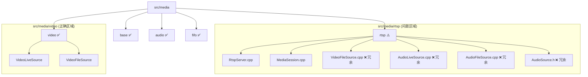
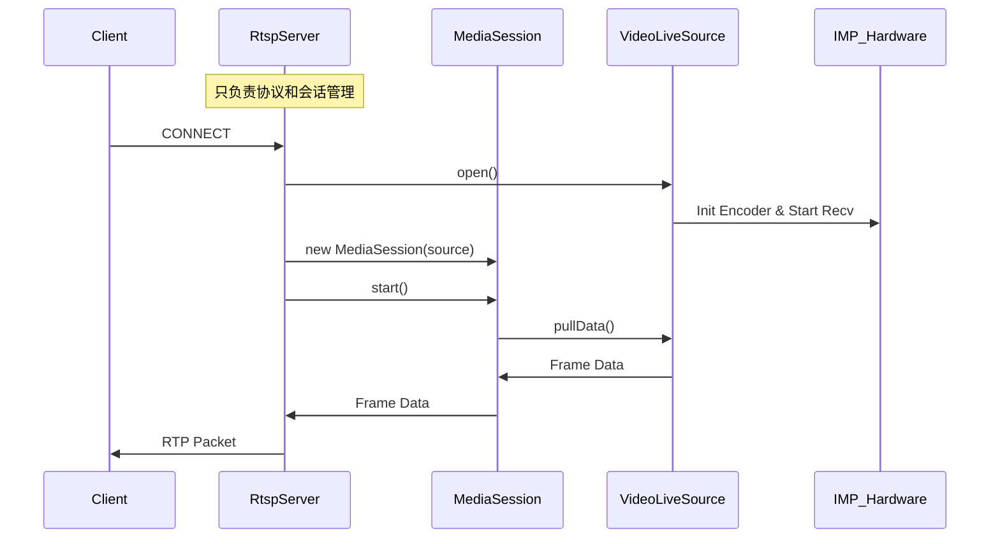
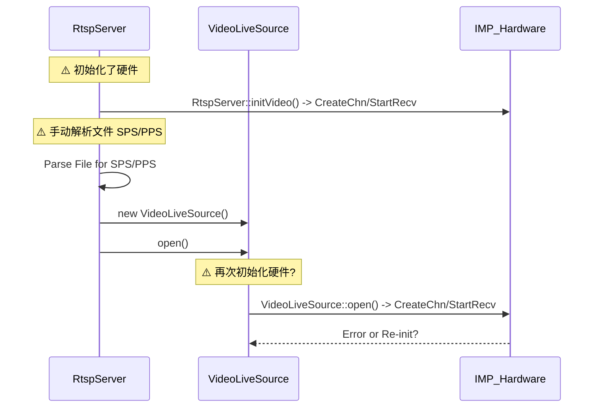

# RTSP Server 重构代码审查报告

**审查日期**: 2026-01-18  
**审查对象**: RTSP Server (htc_main_app) 架构重构  
**依据文档**: `doc/refactoring_implementation_plan.md`

## 1. 总体评估

经过对 `src/media` 目录及核心类 `RtspServer`, `VideoLiveSource`, `MediaSession` 的深度代码审查，总体结论如下：

*   **架构一致性**: ✅ 基本达标。新的目录结构和类层次结构（`IMediaSource`, `MediaSession`, `MediaFIFO`）已经建立，并且符合设计模式。
*   **功能完整性**: ✅ 关键功能模块（VideoLiveSource, AudioLiveSource）已按照新架构实现。
*   **代码整洁度**: ⚠️ 需改进。虽然引入了新架构，但旧代码清理不彻底，存在大量冗余和潜在冲突。
*   **风险等级**: 🟠 中。存在 IMP Encoder 重复初始化和 SPS/PPS 重复解析的逻辑，可能导致运行时不稳定或资源泄漏。

---

## 2. 目录结构审查

### 2.1 现状与计划对比

计划中的结构已成功建立，但在 `src/media/rtsp/` 目录下发现了未清理的旧文件，造成了混淆。

### 2.2 发现的问题

1.  **文件残留**: `src/media/rtsp/` 下残留了旧版的 `VideoFileSource`, `AudioLiveSource` 等文件。经比对，`src/media/video/VideoFileSource.cpp` 是更新后的版本（使用了 `elog` 和新的接口），而 `rtsp/` 下的是旧版本。这会导致编译混淆或维护困惑。

---

## 3. 类设计与代码质量审查

### 3.1 RtspServer 类 (核心问题)

`RtspServer` 本应被简化为只负责 RTSP 协议交互和 Session 管理，但目前它仍然承担了过多的底层职责。

*   **冗余的硬件初始化**:
    *   `RtspServer::initialize` 调用了 `RtspServer::initVideo`。
    *   `RtspServer::initVideo` (L684-996) 包含了完整的 IMP Encoder 初始化代码（CreateGroup, CreateChn, StartRecvPic 等）。
    *   **冲突**: `VideoLiveSource::open` (L23-93) **也**包含了相同的初始化代码。
    *   **后果**: 如果 `RtspServer` 先初始化了 Encoder，`VideoLiveSource` 再尝试初始化可能会失败（返回 `IMP_Encoder_ERR_CHANNEL_BUSY` 或类似错误），或者导致资源状态不一致。

*   **冗余的 SPS/PPS 解析**:
    *   `RtspServer::extractSpsPps` (L47-138) 依然存在。
    *   `VideoLiveSource::extractSpsPps` (L223-315) 也实现了相同逻辑。
    *   `RtspServer` 目前仅用它来处理静态变量 `g_sps`/`g_pps`，这是旧架构的遗留模式。

*   **文件解析逻辑泄漏**:
    *   在 `RtspServer::start` (L324-396) 中，有一段长达 70 行的代码用于手动打开视频文件并解析 SPS/PPS。
    *   **违背设计**: 这部分逻辑应完全封装在 `VideoFileSource` 内部。`RtspServer` 不应直接操作文件流。

### 3.2 MediaSession 类

*   **设计良好**: `MediaSession` 正确地充当了 `RtspServer` 和 `IMediaSource` 之间的桥梁。它管理了 `producerThread` 和 `MediaFIFO`，使得 `RtspServer` 不需要关心数据是如何产生的。

### 3.3 Source 类 (Video/Audio)

*   **接口规范**: `VideoLiveSource` 和 `VideoFileSource` 都正确实现了 `IVideoSource` 接口。
*   **功能封装**: `VideoLiveSource` 封装了 IMP 细节，这是正确的方向。
*   **改进点**: `VideoFileSource` 需要提供获取 SPS/PPS 的公共接口，以避免外部手动解析文件。

---

## 4. 架构图解

### 4.1 理想的调用层级 (Refactored)

### 4.2 当前实际的调用层级 (Current Implementation)

---

## 5. 改进建议

为了达到文档中定义的"代码干净整洁"和"层次结构清晰"，建议立即执行以下清理工作：

1.  **清理文件**:
    *   删除 `src/media/rtsp/` 下所有非 `RtspServer` 和 `MediaSession` 的源文件 (`VideoFileSource.*`, `AudioSource.*` 等)。确保 CMakeLists.txt 指向 `src/media/video` 和 `src/media/audio` 下的新文件。

2.  **瘦身 RtspServer**:
    *   **删除** `RtspServer::initVideo` 和 `RtspServer::uninitVideo`。IMP 的初始化完全移交 `VideoLiveSource` 管理。
    *   **删除** `RtspServer::extractSpsPps` 及其相关的静态变量 (`g_sps`, `g_pps`, `g_foundSps` 等)。
    *   **重构** `RtspServer::start` 中的文件处理逻辑。在 `VideoFileSource` 中添加 `getSps()` 和 `getPps()` 方法，或者在 `open()` 后通过 `getParams()` 获取 ExtraData。

3.  **完善 VideoFileSource**:
    *   将 `RtspServer::start` 中解析文件 SPS/PPS 的逻辑移动到 `VideoFileSource` 的构造函数或 `open` 方法中。

4.  **验证**:
    *   清理后，重新编译并运行，重点测试 `VideoLiveSource` 的初始化流程，确保没有因为移除 `RtspServer` 的初始化而导致参数配置缺失。

## 6. 结论

重构的大方向是正确的，核心架构（Interface/Session/Source）已经建立。目前的状况属于"重构未完成"状态——新代码已就位，但旧代码尚未移除。**必须进行清理**才能算作重构完成，否则留下的技术债务（重复初始化、文件冗余）将严重影响后续维护。
