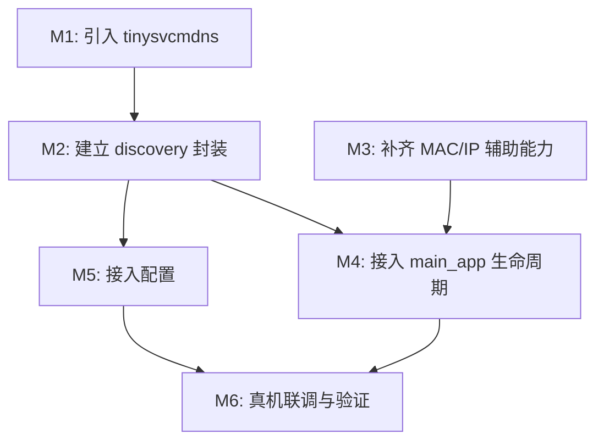

# T32 端 mDNS 接入目标与实施路线图

## 1. 目标与范围

### 1.1 总体目标

基于 `t32_yb/doc/spec/mdns-device-discovery-spec.md`，在 T32 端落地一版可用的 mDNS/DNS-SD 设备发现能力，使手机端在同一局域网内可发现设备，并拿到后续接管所需的基础信息。

### 1.2 V1 目标

V1 只解决“能稳定发布并被发现”的主链路，不一次性做成完整网络状态管理系统。

V1 完成后应满足：

1. T32 在网络就绪后能注册 `_t32cam._tcp.local` 服务。
2. 服务实例可携带基础 TXT Record：
   `model`、`sn`、`fw_ver`、`rtsp_port`、`ctrl_port`、`mac`、`status`。
3. mDNS 生命周期与 `htc_main_app` 中的 HTTP/RTSP 服务绑定。
4. 退出应用或服务停止时，mDNS 能正常停止。
5. 代码结构符合既定落点：
   - 第三方库在 `third_party/tinysvcmdns/`
   - 自有实现在 `src/service/discovery/`
6. V1 真机主功能路径为 `CMD_MOBILE`。
7. V1 Simu 测试也走 `CMD_MOBILE`，但在 `BUILD_FOR_SIMULATION` 下跳过真实 WiFi / DHCP 动作。
8. `sn` 字段 V1 使用 `PID`，`status` 字段 V1 固定为 `ready`。

### 1.3 非目标

本轮不做以下内容：

1. 独立 mDNS daemon 进程。
2. 多协议发现并存（如 SSDP + mDNS）。
3. 复杂网络状态订阅框架。
4. Android/iOS 端联调代码改造。
5. AP/STA 双接口并发发布优化。
6. V1 内不把网卡 MAC 当作主设备序列号。

---

## 2. 交付物定义

本次实施完成后，应交付以下内容：

1. `third_party/tinysvcmdns/` 三方源码和 CMake 接入。
2. `src/service/discovery/` 自有封装模块。
3. `src/app/main_app.cpp` 中的启动与停止编排。
4. `src/common/misc/` 中的网卡/IP/MAC 辅助能力补齐。
5. `res/config.ini` 和真机配置文件中的 `[MDNS]` 配置段。
6. 一份验证记录文档或验证结论。

---

## 3. 里程碑与时间节点

建议按 5 个阶段实施，先完成可编译、再完成可运行、最后补验证。

| 里程碑 | 目标 | 预计工作量 | 完成标志 |
|---|---|---:|---|
| M1 | 三方库落仓并接入构建 | 0.5 天 | `tinysvcmdns` 可被工程链接 |
| M2 | 自有 `MdnsService` 模块完成 | 1 天 | 封装接口稳定，能独立编译 |
| M3 | 接入 `main_app` 生命周期 | 0.5 天 | `CMD_MOBILE` 路径可启动/停止 mDNS |
| M4 | 配置与设备信息映射完成 | 0.5 天 | TXT 字段来源明确，配置可控 |
| M5 | 联调与验证闭环 | 0.5-1 天 | 真机可被发现，退出可下线 |

总计建议工作量：**3-3.5 天**。

---

## 4. 实施步骤

### Step 1: 引入第三方库

目标：

- 将 tinysvcmdns 作为独立三方库纳入工程，不把 upstream 代码混入业务目录。

实施内容：

1. 新增 `third_party/tinysvcmdns/`
2. 增加该目录的 `CMakeLists.txt`
3. 在 `third_party/CMakeLists.txt` 中追加 `add_subdirectory(tinysvcmdns)`
4. 编译成静态库 `tinysvcmdns`
5. 确认真机与模拟编译都不会被破坏

完成标准：

1. `cmake` 配置通过
2. `htc_main_app` 可链接 `tinysvcmdns`
3. 不要求这一阶段已真正发包

### Step 2: 建立自有封装模块

目标：

- 用我们自己的模块隔离第三方 API，避免上层直接依赖 tinysvcmdns 细节。

实施内容：

1. 新增 `src/service/discovery/`
2. 增加 `MdnsService.h/.cpp`
3. 增加 `MdnsTxtRecord.h/.cpp`
4. 在 `src/service/CMakeLists.txt` 中新增 `add_subdirectory(discovery)`
5. 定义对上层稳定接口：
   - `start(...)`
   - `stop()`
   - `refresh(...)`
   - `updateStatus(...)`

完成标准：

1. discovery 模块可单独被 `htc_main_app` 链接
2. 上层无需感知 `mdnsd_*` 细节
3. TXT Record 拼装逻辑不散落在 `main_app.cpp`

### Step 3: 补齐网络辅助能力

目标：

- 为 mDNS 模块提供必要的接口名、IP、MAC 获取能力。

实施内容：

1. 复用 `Misc::getNetworkInterfaceName()`
2. 复用 `Misc::getIPAddress()`
3. 在 `src/common/misc/` 中新增 MAC 获取函数
4. 约束 hostname / instance name 生成规则，避免空格和非法字符问题

完成标准：

1. `MdnsService` 可拿到完整注册参数
2. `mac` 字段可稳定生成
3. 对同一网卡重复读取结果一致

### Step 4: 接入应用启动链路

目标：

- 将 mDNS 的启停挂到正确的运行链路上。

实施内容：

1. 优先在 `CMD_MOBILE` 路径接入
2. 网络就绪后读取本机 IP
3. HTTP Server 启动后准备控制端口
4. RTSP Server 启动后准备媒体端口
5. 调用 `MdnsService::start(...)`
6. 在退出流程中调用 `MdnsService::stop()`

Simu 特殊要求：

1. `BUILD_FOR_SIMULATION` 下不执行真实 `connectWifi()` / `startDHCP()`
2. 直接使用本地测试网卡作为已就绪接口
3. 仍复用同一套 HTTP / RTSP / mDNS 启动顺序

完成标准：

1. `CMD_MOBILE` 运行时可见 mDNS 服务
2. 进程退出后服务下线
3. 不影响现有 HTTP/RTSP 功能

### Step 5: 接入配置

目标：

- 把 mDNS 相关行为做成配置驱动，避免后续继续写死在代码里。

实施内容：

1. 在 `res/config.ini` 增加 `[MDNS]`
2. 增加配置键：
   - `Enable`
   - `ServiceType`
   - `InstanceName`
   - `HostName`
   - `CtrlPort`
   - `RtspPort`
3. 在 `Common.h` 中增加对应键名常量
4. 给 discovery 模块提供默认值和降级策略

完成标准：

1. mDNS 可通过配置开关启停
2. 服务名和端口不再完全硬编码
3. 配置缺失时有合理默认值

### Step 6: 联调与验证

目标：

- 验证 T32 端不仅能编译，而且在局域网内真正可被发现。

实施内容：

1. 真机运行 `CMD_MOBILE`
2. 使用手机端或局域网工具确认服务可见
3. 检查 PTR / SRV / TXT / A 记录是否符合预期
4. 检查退出或断开场景下是否停止广播
5. 记录验证结果

完成标准：

1. Android / iOS 或桌面 Bonjour 工具可发现设备
2. TXT 字段内容正确
3. 退出应用后设备不再残留可发现状态

---

## 5. 任务依赖关系

依赖说明：

1. `M1` 是基础，没有三方库就无法开始封装。
2. `M2` 和 `M3` 可以并行，但都必须先于 `M4`。
3. `M5` 可在 `M2` 完成后推进，不必等 `M4` 结束。
4. `M6` 只能在接入和配置完成后做。

---

## 6. 资源与协作依赖

### 6.1 代码依赖

需要改动或新增的目录：

1. `third_party/tinysvcmdns/`
2. `third_party/CMakeLists.txt`
3. `src/service/discovery/`
4. `src/service/CMakeLists.txt`
5. `src/app/main_app.cpp`
6. `src/common/misc/`
7. `src/common/Common.h`
8. `res/config.ini`

### 6.2 环境依赖

实施和验证时需要：

1. 可编译的 T32 交叉构建环境
2. 一台真机设备
3. 同一局域网下的手机或桌面发现工具
4. WiFi 组播能力正常的网络环境

### 6.3 外部协作依赖

如需联调，建议提前确认：

1. Android / iOS 端服务类型固定使用 `_t32cam._tcp`
2. APP 对 TXT 字段的必填项要求
3. 如后续存在独立出厂 SN，确认是否需要替换当前 `PID -> sn` 映射

---

## 7. 验收标准

确认可以进入实施前，建议先对齐以下验收口径。

### 7.1 代码结构验收

1. mDNS 第三方代码只在 `third_party/tinysvcmdns/`
2. 自有逻辑只在 `src/service/discovery/`
3. `main_app.cpp` 只保留编排，不堆积 TXT 拼装细节

### 7.2 功能验收

1. `CMD_MOBILE` 路径可稳定发布 mDNS
2. 服务类型为 `_t32cam._tcp.local`
3. TXT 字段完整且值正确
4. 应用退出后 mDNS 停止

### 7.3 回归验收

1. HTTP Server 仍可正常启动
2. RTSP Server 仍可正常推流
3. 不影响原有非 `CMD_MOBILE` 功能路径

---

## 8. 风险与回滚策略

### 8.1 主要风险

1. WiFi 驱动组播支持不完整，导致 mDNS 发包异常。
2. mDNS 注册与 IP 获取时序不对，导致注册到错误地址。
3. TXT 字段过长或格式不规范，导致客户端解析异常。
4. 第三方库线程模型或 socket 行为与当前系统环境不完全兼容。
5. Simu 若误走真机网络初始化命令，会导致测试流程失真或直接失败。

### 8.2 降级策略

如实施中出现问题，按以下顺序降级：

1. 保留 `Enable=0` 配置开关，先确保主程序不受影响。
2. V1 只在 `CMD_MOBILE` 路径启用，不扩散到其他运行模式。
3. 先固定 `status=ready`，暂不做动态状态切换。
4. 如 MAC 获取不稳定，先允许 TXT 中临时不带 `mac`，但接口要预留。

### 8.3 回滚策略

若上线前或联调中发现问题，可按最小影响回滚：

1. 配置层关闭 `[MDNS].Enable`
2. 保留代码但不进入启动路径
3. 如有必要，移除 `discovery` 链接但保留三方库目录

---

## 9. 建议的实施顺序

为降低风险，建议严格按下面顺序执行：

1. 先落三方库和 CMake，不碰业务逻辑。
2. 再实现 `MdnsService` 封装，先把接口做对。
3. 再补 `Misc` 的 MAC/IP 辅助。
4. 再接入 `main_app.cpp` 生命周期。
5. 最后接配置和联调验证。

这样可以把问题分层定位：

1. 编不过，是构建问题。
2. 编得过但发不出，是封装或环境问题。
3. 发得出但发现不到，是组播/记录内容/客户端兼容问题。

---

## 10. 已确认实施口径

当前已确认以下实施口径：

1. V1 真机主功能路径只覆盖 `CMD_MOBILE`。
2. V1 Simu 测试也复用 `CMD_MOBILE`，但需在 `BUILD_FOR_SIMULATION` 下跳过真实 WiFi / DHCP。
3. `sn` 字段 V1 使用 `PID`。
4. 网卡 MAC 单独作为 `mac` 字段，不作为主设备序列号。
5. `status` 字段 V1 固定为 `ready`。

基于这 5 点，路线图已经可以直接进入实施阶段。
