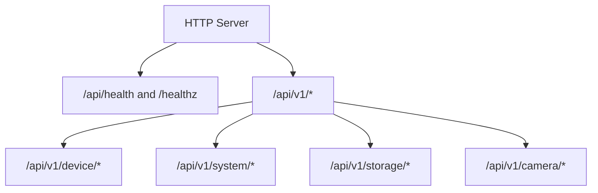
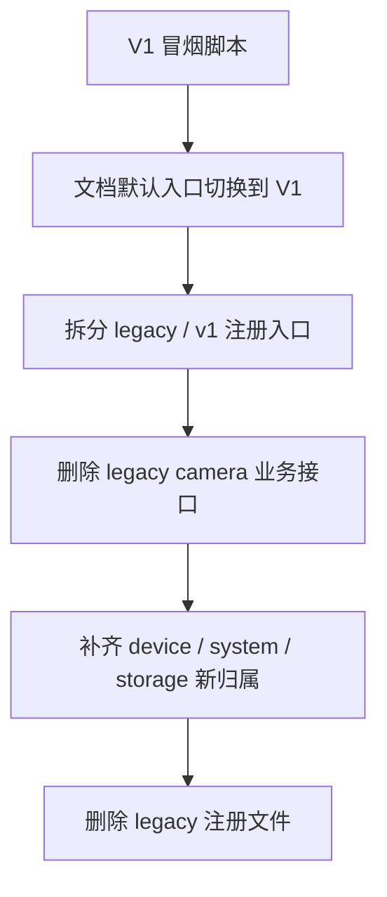

# HTTP Legacy 删除最小实施清单

## 目标与范围

目标是在不考虑产品兼容与客户支持的前提下，从纯技术角度以最小变更面删除 HTTP legacy 业务接口。

这里的 “legacy” 指原先挂在 `/api/*` 下、由 `src/service/http_server/http_api.c` 承担的业务端点。

本清单追求的是：

- 停止维护 legacy 业务路径
- 将全部业务能力收敛到 `/api/v1/*`
- 将 `health` 沉淀为独立基础探针
- 删除 legacy 注册文件和其构建引用

## 当前结果

截至 2026-03-24，最小删除目标已完成：

- `camera` 业务已全部收敛到 `/api/v1/camera/*`
- `device/system/storage` 已补齐到 `/api/v1/*`
- `health` 已从业务 API 层下沉到 server 基础层
- `src/service/http_server/http_api.c` 已删除
- legacy 业务路径当前统一返回 `404`

## 最终落地形态



## 迁移结果

### 已退役的 legacy 业务路径

- `GET /api/device/info`
- `GET /api/sensor/data`
- `POST /api/system/datetime`
- `POST /api/system/workmode`
- `GET /api/storage/info`
- `POST /api/storage/format`
- `GET /api/params`
- `POST /api/params/set`
- `POST /api/params/reset`
- `GET /api/record/status`
- `POST /api/record/start`
- `POST /api/record/stop`
- `GET /api/snapshot`

### 当前有效的新归属

- `GET /api/v1/device/info`
- `GET /api/v1/device/sensors`
- `POST /api/v1/system/datetime`
- `POST /api/v1/system/workmode`
- `GET /api/v1/storage/info`
- `POST /api/v1/storage/format`
- `GET /api/health`
- `GET /healthz`
- `GET/POST /api/v1/camera/*`

## 最小实施步骤

### Phase 1：建立 V1 冒烟测试替代物

状态：已完成

- 新增 `script/test_http_api_v1_simu.sh`
- 用 V1 脚本替代 legacy `camera` 路径验证

### Phase 2：从文档和默认入口中摘除 legacy `camera`

状态：已完成

- `doc/reference/20260305-http-simu-test-usage.md` 已切换为 V1 主入口
- legacy 脚本不再承担正向 `camera` 验证

### Phase 3：拆分注册入口

状态：已完成

- 先前已完成 legacy/v1 注册入口解耦
- 为后续整包删除 legacy 文件创造了最小改动面

### Phase 4：删除 legacy `camera` 业务接口

状态：已完成

- `/api/params*`
- `/api/record*`
- `/api/snapshot`

### Phase 5：补齐非 `camera` 域的新归属

状态：已完成

- `/api/v1/device/info`
- `/api/v1/device/sensors`
- `/api/v1/system/datetime`
- `/api/v1/system/workmode`
- `/api/v1/storage/info`
- `/api/v1/storage/format`
- `health` 下沉到 `/api/health` 与 `/healthz`

### Phase 6：完全删除 legacy 注册层

状态：已完成

- 删除 `src/service/http_server/http_api.c`
- 清理 header、server 注册逻辑和 CMake 构建引用
- 保留基础探针与 V1 业务路由

## 依赖关系



## 完成标准

以下条件现已同时满足：

- 业务接口只保留 `/api/v1/*`
- 基础探针由 server 独立承载
- legacy 业务路径均返回 `404`
- SIMU 下有正向 V1 冒烟验证
- SIMU 下有 legacy 退役负向验证

## 验证方式

执行：

```bash
cmake --build build_sim -j --target test_http_server
./script/test_http_api_v1_simu.sh
./script/test_http_api_simu.sh
```

预期：

- `test_http_api_v1_simu.sh` 全通过
- `test_http_api_simu.sh` 验证 legacy 业务路径全部 `404`

## 剩余非阻塞工作

legacy 删除已经完成。后续还可以继续做，但它们不再是删除 legacy 的前置条件：

- 将 `device/system/storage` 的占位实现接入真实模块
- 继续补强 T32 下 `video/status` 等半成品能力
- 补更多集成级回归，而不是继续保留旧路径
