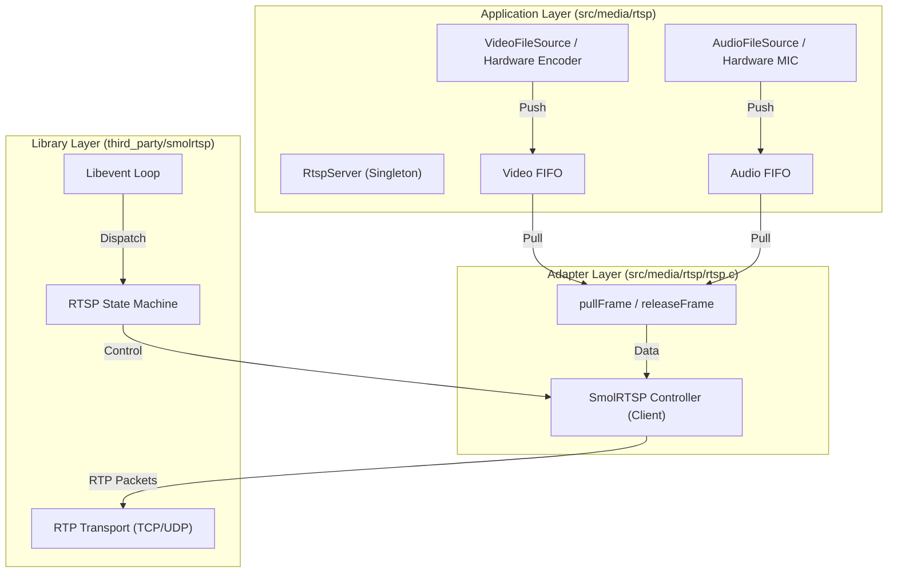

# RTSP Server 架构分析文档

本文档基于 `third_party/smolrtsp` 和 `src/media/rtsp` 源码，分析 RTSP Server 的架构、流程、流控机制及音画同步问题。

## 1. 架构与关系

### 1.1 总体架构

项目采用分层架构，底层依赖 `smolrtsp` 库处理 RTSP 协议交互，上层通过 `RtspServer` 单例类进行业务封装和媒体数据生产。



### 1.2 组件关系

*   **`third_party/smolrtsp`**: 
    *   **定位**: 一个轻量级、基于 C 语言的 RTSP 1.0 服务器库。
    *   **职责**: 处理 RTSP 握手 (OPTIONS, DESCRIBE, SETUP, PLAY, TEARDOWN)、SDP 生成、RTP 包封装与发送。
    *   **特点**: 设计为"无主见" (Unopinionated)，只负责协议解析和状态机，网络 I/O 通常配合 `libevent` 使用。
    *   **不足**: 
        *   **无 RTCP 支持**: 只有 RTP，缺乏 RTCP (Sender Report/Receiver Report)，这意味着无法进行基于 NTP 时间的精确音画同步，也无法进行基于网络质量的拥塞控制反馈。
        *   **时间戳管理简单**: 示例代码和适配层通常只根据采样率简单递增时间戳，不反映真实采集时间。

*   **`src/media/rtsp`**:
    *   **定位**: 项目的具体实现层，桥接业务逻辑与 RTSP 库。
    *   **`RtspServer` 类**: 核心管理类，负责初始化系统资源（编码器、文件源）、启动线程、管理 FIFO 缓冲区。
    *   **`rtsp.c`**: 适配层，实现了 `smolrtsp` 的回调接口，定义了具体的 `VideoCtx` 和 `AudioCtx`，以及数据拉取 (`pull_frame`) 和发送 (`send_video_packet_cb`) 逻辑。

## 2. 核心流程与功能

### 2.1 媒体数据流向

1.  **生产端 (Producer)**:
    *   **视频**: `RtspServer::videoFileReadLoop` (文件模式) 或 硬件编码回调。以固定帧率 (如 25FPS) 产生数据。
    *   **音频**: `RtspServer::audioFileReadLoop`。
    *   **缓冲**: 数据被推入 `frame_fifo` (视频, 深度20) 和 `audio_fifo` (音频, 深度40)。
    *   **流控**: 当 FIFO 满时，生产者线程会阻塞等待 (`wait_for`)，若超时则**丢弃旧帧** (Drop Oldest) 以腾出空间。

2.  **消费端 (Consumer)**:
    *   **驱动**: `smolrtsp` 基于 `libevent` 的事件循环。
    *   **视频**: `send_video_packet_cb` 定时触发 (根据 FPS 计算间隔)。
    *   **音频**: `send_audio_packet_cb` 定时触发。
    *   **动作**: 调用 `RtspServer::pullFrame` 从 FIFO 获取数据，封装成 NALU/RTP 包发送。

### 2.2 流控机制 (Flow Control)

**现状**:
目前存在一个基于 **FIFO + 丢帧** 的流控机制。

*   **机制**: 
    *   生产者 (Source) 和 消费者 (Network) 之间通过固定大小的 Ring Buffer 解耦。
    *   **速率不匹配处理**:
        *   **网速 > 码率**: FIFO 为空，发送端等待（打印 "FIFO empty" 警告），客户端可能看到画面停顿。
        *   **网速 < 码率** (常见): FIFO 积压。当 `count >= FIFO_MAX_FRAMES` 时，`videoFileReadLoop` 会尝试等待消费者消费。
        *   **丢帧策略**: 如果等待超时 (约 100ms)，生产者会**主动丢弃 FIFO 头部的旧帧** (`head` 前移)，并将新帧写入尾部。

*   **合理性分析**:
    *   **策略合理**: 在直播场景中，"丢弃旧帧、保留新帧"是正确的策略，能保证客户端看到的画面尽可能接近实时，减少累积延迟。
    *   **缺陷**: 丢帧行为虽然解决了缓冲区溢出，但**破坏了时间戳的连续性**，直接导致了音画同步问题（见下文）。

## 3. 音画同步问题分析

**当前现象**: 测试中发现音画同步有问题。

**根本原因分析**:
**时间戳生成机制与丢帧行为不兼容。**

### 3.1 时间戳生成逻辑 (代码证据)

在 `src/media/rtsp/rtsp.c` 中：

**视频时间戳**:
```c
// send_h264_nalu 函数
if (unit_type == ... || unit_type == SMOLRTSP_H264_NAL_UNIT_CODED_SLICE_IDR) {
    // 每次发送一帧，时间戳固定增加 (1/FPS)
    ctx->timestamp += ctx->sample_rate / ctx->fps; 
    au_found = true;
}
```

**音频时间戳**:
```c
// send_audio_packet_cb 函数
// 时间戳完全基于发送的包序号 (i)
const SmolRTSP_RtpTimestamp ts = SmolRTSP_RtpTimestamp_Raw(ctx->i * ctx->samples_per_packet);
```

### 3.2 问题推演

1.  **理想情况**: 生产 100 帧，发送 100 帧。时间戳线性增加，音画完美同步。
2.  **网络拥塞 (实际情况)**:
    *   假设视频源产生了第 1~10 帧 (0ms ~ 400ms)。
    *   网络阻塞，发送端只发出了第 1 帧。FIFO 变满。
    *   **流控触发**: 生产者为了写入第 11 帧，**丢弃了 FIFO 中的第 2 帧**。
    *   网络恢复，消费者从 FIFO 读取。它读到的是第 3 帧（因为第 2 帧被丢了）。
    *   **关键错误**: 消费者 (`rtsp.c`) 并不知道发生了丢帧。它只是简单地认为"这是下一帧"，于是将时间戳设为 `Timestamp(Frame 1) + 40ms`。
    *   **结果**: 
        *   实际画面内容是 80ms 处的图像。
        *   RTP 时间戳标记却是 40ms。
        *   **视频时间轴被"压缩"了**。视频播放速度变慢（相对于真实时间），导致视频画面**滞后于**音频（如果音频丢包较少或处理机制不同）。

### 3.3 改进建议

要解决音画同步问题，必须改变时间戳的生成方式：

1.  **携带真实时间戳**: 
    *   在 `VideoFileSource` 读取文件或硬件编码时，记录**采集时刻 (Capture Time)** (使用 `gettimeofday` 或 `CLOCK_MONOTONIC`)。
    *   将这个时间戳随数据一起存入 `frame_fifo`。
2.  **透传时间戳**:
    *   `RtspServer::pullFrame` 接口需要修改，不仅返回数据指针，还要返回该数据的采集时间戳。
3.  **基于时间差计算 RTP TS**:
    *   在 `rtsp.c` 中，记录第一帧的采集时间 `Base_Wall_Time` 和 RTP 时间 `Base_RTP_TS`。
    *   后续每一帧的 RTP 时间戳计算公式：
        `Current_RTP_TS = Base_RTP_TS + (Current_Wall_Time - Base_Wall_Time) * (ClockRate / 1000)`
    *   **效果**: 即使中间丢了 10 帧，第 11 帧的 RTP 时间戳也会正确反映它是 400ms 后的图像，播放器会正确地跳过中间的时间，保持与音频（同样基于真实时间戳）同步。

## 4. 总结

*   **架构**: `smolrtsp` (协议) + `RtspServer` (业务/缓冲)。
*   **功能**: 支持 H.264/H.265/G.711，支持文件模拟和硬件编码，具备基础的 FIFO 缓冲和丢帧流控。
*   **不足**: 
    *   缺少 RTCP。
    *   **致命缺陷**: RTP 时间戳生成逻辑是"合成"的（基于计数），不具备抗丢帧能力。
*   **解决同步建议**: 修改 FIFO 结构以携带采集时间戳，并在 RTP 发送层使用采集时间差来计算 RTP 时间戳，而非简单的累加。

## 5. 关键问题解答 (Q&A)

### 5.1 SmolRTSP 的 max_buffer 和 is_full 机制

在 `smolrtsp` 中增加的 `max_buffer` 和 `is_full` 接口主要用于**网络层反压 (Backpressure)**，防止发送缓冲区无限膨胀。

*   **机制原理**:
    *   **`max_buffer`**: 在初始化 TCP Transport 时传入（代码中目前设为 512KB）。
    *   **`is_full`**: 这是一个检查接口。`SmolRTSP_TcpTransport` 会调用底层 Writer 的 `filled` 方法（对应 `evbuffer_get_length`），检查当前待发送字节数是否超过 `max_buffer`。
*   **上层匹配**:
    *   虽然库提供了这个机制，但目前的 `rtsp.c` 业务逻辑**尚未完全利用它**。理想情况下，`send_video_packet_cb` 在发送前应该调用 `transport->is_full()`。如果返回 true，应该**跳过本次发送**（主动丢包），而不是继续往拥塞的 socket 里塞数据，这样能更早地触发丢帧逻辑，减少延迟。

### 5.2 Libevent 的角色与风险

*   **角色**: `libevent` 是整个 RTSP Server 的心脏，负责**网络 IO 事件**和**定时器事件**的分发。
*   **共用机制**: 
    *   **是的**，Audio 和 Video 共享同一个 `event_base`，并且在同一个线程（`event_loop_thread`）中运行。
*   **风险**:
    *   **阻塞扩散**: 因为是单线程模型，如果 Video 的处理函数（如 `send_video_packet_cb`）因为内存拷贝或打印日志阻塞了 10ms，那么 Audio 的发送也会延迟 10ms。
    *   **高负载抖动**: 在高码率或多客户端连接时，单线程可能成为瓶颈，导致音视频发送微小的抖动（Jitter）。但对于嵌入式 IPCam 场景（通常 1-2 路流），这种模型通常足够高效且简单。

### 5.3 Lock 机制的作用

项目中存在两层 Lock 机制：

1.  **业务层 Lock (`RtspServer` 中的 mutex)**:
    *   **作用**: 保护 FIFO Ring Buffer。
    *   **解决问题**: 解决**生产者线程**（视频采集/文件读取）和**消费者线程**（Libevent 网络发送）之间的并发竞争，确保数据写入和读取的原子性。
2.  **库层 Lock (`SmolRTSP_Writer` 中的 lock/unlock)**:
    *   **作用**: 保护底层的 socket 写入操作。
    *   **解决问题**: 在 RTP over TCP (Interleaved) 模式下，一个 RTP 包由 "4字节头 + 负载" 组成。必须保证这 N 个字节是**原子写入**的。虽然目前是单线程，但库的设计预留了线程安全能力，防止未来多线程调用导致数据交错（例如：线程A写了头，线程B插进来写了数据，导致客户端解析失败）。

### 5.4 TCP/UDP 支持现状
*   **当前状态**:
    *   代码中已经包含完整的 TCP 和 UDP Setup 逻辑 (`setup_transport` 函数中 switch-case 处理 `SmolRTSP_LowerTransport_TCP` 和 `UDP`)。
    *   **默认行为**: 标准 RTSP 播放器（如 VLC）通常默认尝试 UDP，如果失败则回退到 TCP (Interleaved)。
    *   **服务器支持**:
        *   **TCP**: 支持 (Interleaved 模式, RTP over RTSP)。
        *   **UDP**: 代码中有 `setup_udp`，但需确认 `start_udp_listener` 等底层 UDP 端口绑定逻辑是否已完整实现并测试通过。目前看 `rtsp.c` 中有相关逻辑。

### 5.5 max_buffer (KB) 与 Audio/Video FIFO (帧数) 的关系
*   **定义区别**:
    *   **FIFO (应用层缓冲)**:
        *   **单位**: 帧数 (Video: 20帧, Audio: 40包)。
        *   **位置**: `RtspServer` 类中，位于音视频源（文件/编码器）和 RTSP 发送逻辑之间。
        *   **作用**: 平滑生产（编码）和消费（发送）的速度抖动；在网络拥塞时，通过"丢弃旧帧"策略保证实时性。
    *   **max_buffer (网络层缓冲)**:
        *   **单位**: 字节 (目前设为 512KB)。
        *   **位置**: `libevent` 的 TCP socket 发送缓冲区 (`evbuffer`)。
        *   **作用**: 防止在网络极差时，TCP 发送队列无限膨胀导致内存耗尽。

*   **数量级换算 (估算)**:
    *   **视频**: 假设 1080p 码率 4Mbps -> 500KB/s -> 25fps -> 每帧平均 20KB。
        *   20帧 FIFO ≈ 400KB 数据。
        *   I帧可能很大 (100KB+)，P帧很小 (5-10KB)。
        *   **结论**: 视频 FIFO (20帧) 的总数据量通常在 200KB - 1MB 之间，与 `max_buffer` (512KB) 处于同一数量级。
    *   **音频**: AAC 包通常很小 (几百字节)。
        *   40包 FIFO ≈ 10KB - 20KB 数据。
        *   **结论**: 音频 FIFO 远小于 `max_buffer`，不会触发网络层限流。

*   **相互关系 (松耦合)**:
    *   目前两者**独立工作**。
    *   **理想流程 (联动)**:
        1.  网络变慢，TCP 发送不出去 -> `libevent` 缓冲区积压。
        2.  积压超过 512KB -> `is_full()` 返回 true。
        3.  应用层 (`RtspServer`) 检测到 `is_full` -> **停止从 FIFO 取数据** (让 FIFO 自然填满) 或 **主动丢帧**。
        4.  FIFO 填满 (达到 20 帧) -> 应用层触发 "Drop old frame" 逻辑。
    *   **现状**:
        *   `RtspServer` 发送循环尚未检测 `is_full`。如果网络堵塞，数据可能会堆积在网络库内部，直到触发底层写错误或内存极限。
        *   **建议**: 在 `pullFrame` 循环中增加对 `transport->is_full()` 的检查，实现端到端的反压 (Backpressure) 控制。

### 5.6 发送频率与触发机制
*   **发送模式**: **基于定时器的拉取模式 (Timer-Driven Pull Model)**。
*   **频率控制**:
    *   并不是收到 Producer 数据就立即发送，也不是靠 Client 请求。
    *   **机制**: `rtsp.c` 中为每个流（Audio/Video）注册了一个 `libevent` 定时器。
    *   **频率**: 定时器触发频率严格等于 FPS (如 25FPS -> 40ms 间隔)。
*   **流程**:
    1.  定时器到期触发回调 (`send_video_packet_cb`)。
    2.  回调函数主动去 FIFO 拉取 (`pullFrame`) 一帧数据。
    3.  如果有数据则发送；如果无数据（FIFO空）则轮空等待下一次定时器。

### 5.7 Libevent 的详细角色
`libevent` 在本项目中不仅仅是网络库，它是**核心调度引擎**，扮演三个角色：
1.  **精密节拍器 (Timer Scheduler)**:
    *   维护音视频发送的"心跳"。确保数据按 FPS 平稳发送，而不是一股脑倾泻给客户端 (Traffic Shaping)。
2.  **非阻塞 I/O 管理者 (Non-blocking I/O Manager)**:
    *   负责底层的 Socket 读写。当缓冲区满或网络阻塞时，处理 EAGAIN 等状态，保证服务器不被卡死。
3.  **单线程并发中心 (Event Loop)**:
    *   整个 RTSP Server 运行在一个单线程循环中。它串行处理 RTSP 信令、数据发送、连接管理。
    *   **优点**: 无锁设计（大部分情况），无上下文切换开销，适合嵌入式。
    *   **缺点**: 任何一个回调阻塞都会导致所有流卡顿。
