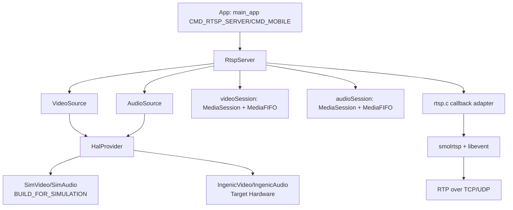
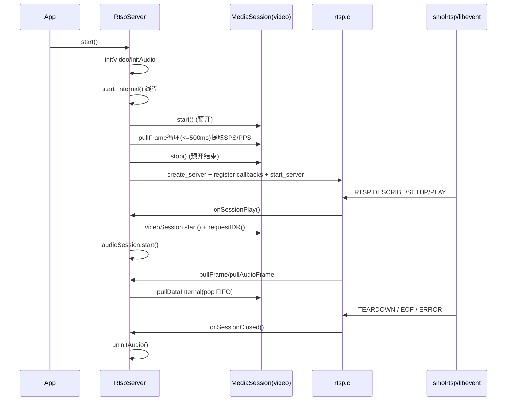
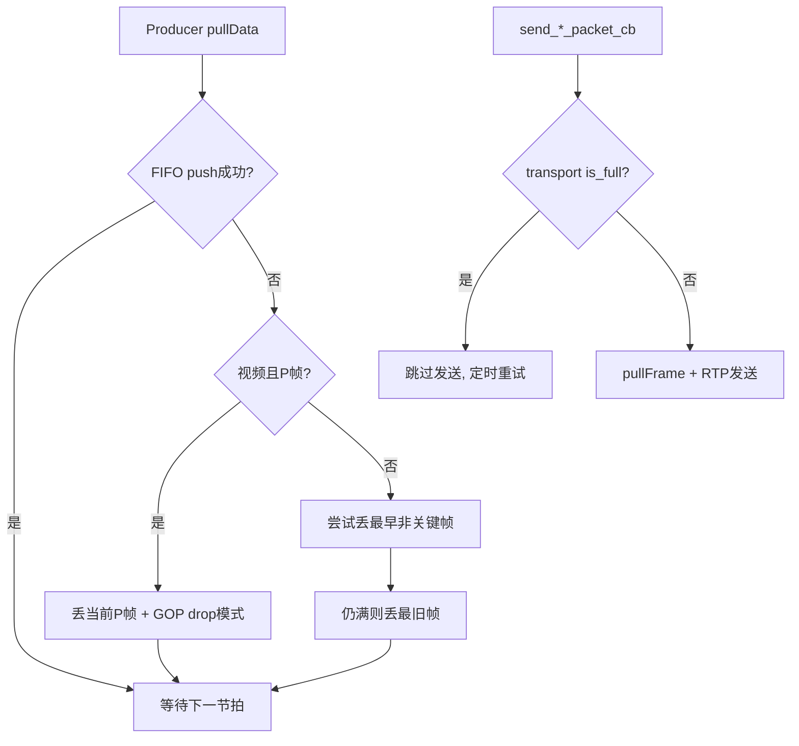

# Media / RTSP 当前架构基线（t32_yb）

- 文档日期：2026-03-01
- 目的：对 `t32_yb` 当前 RTSP 实现给出可直接对照代码的架构视图，便于与 `t32/doc/solution/20260227-media-rtsp-architecture-baseline.md` 做横向比对。
- 代码基线：`src/media/rtsp/*`、`src/media/fifo/*`、`src/media/base/*`、`src/hal/*`、`src/app/main_app.cpp`

## 1. 结论先行

1. `t32_yb` 的 RTSP 协议层仍是 `smolrtsp + libevent + rtsp.c`，但媒体源组织方式与 `t32` 不同：
   - `t32`：RTSP 层可在 FileSource / LiveSource 间切换。
   - `t32_yb`：RTSP 层统一只对接 `VideoSource/AudioSource`，平台差异下沉到 HAL（`HalProvider`）。
2. 平台切换是编译期完成：`BUILD_FOR_SIMULATION` 决定 HAL 实现（`Sim*` 或 `Ingenic*`），RTSP 主链路不变。
3. 会话生命周期采用“启动时预取 SPS/PPS + 客户端 PLAY 才开流”的组合机制：
   - 启动线程中短时预开 `videoSession` 提取 SPS/PPS 填充 SDP。
   - 真正推流在 `onSessionPlay()` 时启动音视频 session。
4. 流控是双层：
   - 网络层：`SmolRTSP_*Transport_is_full()` 背压检查。
   - 应用层：`MediaSession + MediaFIFO`，视频有 GOP 丢帧策略，音频满队列时丢新包。

## 2. 双平台架构（Simu / 真机）

### 2.1 编译与实现切换

- 编译开关：`BUILD_FOR_SIMULATION`
- HAL 工厂：`HalProvider::createVideo/createAudio`
  - simulation：`SimVideo/SimAudio`
  - target：`IngenicVideo/IngenicAudio`

### 2.2 架构总览



### 2.3 平台差异落点

| 维度 | Simulation | 真机 |
| :--- | :--- | :--- |
| HAL 实现 | `src/hal/simu/*` | `src/hal/ingenic/*` |
| 视频数据来源 | 模拟文件/合成帧（`SimVideo`） | 编码器码流（`IMP_Encoder_GetStream`） |
| 音频数据来源 | 模拟文件/合成波形（`SimAudio`） | AI/DMIC 采集 + 编码（`IngenicAudio`） |
| RTSP 主链路 | 与真机一致 | 与 simulation 一致 |

## 3. Media 模块当前架构

### 3.1 模块职责

| 模块 | 职责 |
| :--- | :--- |
| `src/media/base` | `IMediaSource` 与 `MediaParams` 抽象 |
| `src/media/fifo` | `MediaFIFO`：统一帧缓存与释放、丢帧策略 |
| `src/media/rtsp/VideoSource.*` | 将 `IVideoStream` 帧拼接为连续 buffer，透传 `pts` |
| `src/media/rtsp/AudioSource.*` | 将 `IAudioStream` 帧拼接为连续 buffer，透传 `pts` |
| `src/media/rtsp/MediaSession.*` | producer 线程 + FIFO + pull/release 静态回调 |
| `src/media/rtsp/RtspServer.*` | 业务入口、会话管理、回调注册、RTSP 参数下发 |
| `src/media/rtsp/rtsp.c` | RTSP/SDP/SETUP/PLAY/TEARDOWN 与 RTP 发送 |

### 3.2 运行时对象关系

```mermaid
graph LR
    RS[RtspServer] --> VS[VideoSource]
    RS --> AS[AudioSource]
    RS --> VSESS[videoSession]
    RS --> ASESS[audioSession]

    VSESS --> VFIFO[MediaFIFO(video)]
    ASESS --> AFIFO[MediaFIFO(audio)]

    CAPI[rtsp.c callbacks] --> VSESS
    CAPI --> ASESS

    VSESS -->|pullFrame/releaseFrame| CAPI
    ASESS -->|pullAudioFrame/releaseAudioFrame| CAPI
```

### 3.3 `MediaSource` 与 `MediaSession` 分工

- `VideoSource/AudioSource`：负责“从 HAL 取帧 + 内存拼接 + 释放 HAL 帧资源”。
- `MediaSession`：负责“生产节奏、缓存、丢帧策略、对 RTSP 回调出帧”。
- `rtsp.c`：只关心 pull/release 回调与 RTP 打包，不直接感知 HAL 细节。

### 3.4 当前实现注意事项

- `onSessionClosed()` 目前只执行 `uninitAudio()`，不会在断连时主动 `stop videoSession`。
- `initialize()` 在音频初始化失败时日志写“continue without audio”，但返回值是失败（导致整体初始化失败）。
- `MediaSession` 的统计计数在视频路径下未累计（视频 `frameInterval > 0` 分支没有增加 `frameCount_`）。

## 4. RTSP 架构与生命周期

### 4.1 启动与建链时序



### 4.2 协议面关键行为

1. DESCRIBE：动态生成 SDP，若已注入 SPS/PPS 则输出 `sprop-parameter-sets`。
2. SETUP：支持 TCP interleaved 和 UDP 两种 lower transport。
3. PLAY：按 session_id 创建 `AudioCtx/VideoCtx` 定时发送任务。
4. TEARDOWN/断连：触发 `FUNC_ID_ON_SESSION_CLOSED` 回调。

### 4.3 回调接口映射

| FUNC_ID | 回调实现 | 用途 |
| :--- | :--- | :--- |
| `FUNC_ID_PULL_VIDEO_FRAME` | `RtspServer::pullFrame` | 视频拉帧 |
| `FUNC_ID_RELEASE_VIDEO_FRAME` | `RtspServer::releaseFrame` | 视频释放 |
| `FUNC_ID_PULL_AUDIO_FRAME` | `RtspServer::pullAudioFrame` | 音频拉帧 |
| `FUNC_ID_RELEASE_AUDIO_FRAME` | `RtspServer::releaseAudioFrame` | 音频释放 |
| `FUNC_ID_ON_SESSION_PLAY` | `RtspServer::onSessionPlay` | 客户端 PLAY 后启动会话 |
| `FUNC_ID_ON_SESSION_CLOSED` | `RtspServer::onSessionClosed` | TEARDOWN/断连回收 |

## 5. 时间戳与 AV Sync（当前实现口径）

### 5.1 时间戳来源

- `VideoSource::pullData()`：`timestamp = VideoEncodedFrame.pts`
- `AudioSource::pullData()`：`timestamp = AudioEncodedFrame.pts`
- `MediaFIFO`：以 `timestamp_us` 字段透传给 RTSP 层

在 simulation 与真机 HAL 中，音频 `pts` 都按采样间隔累加；视频 `pts` 由 HAL 帧时间戳给出（simulation 按 fps 间隔累加）。

### 5.2 RTP 时间戳计算

- 视频：`rtp_ts = capture_ts_us * 90000 / 1e6`
- 音频：`rtp_ts = (capture_ts_us - base_capture_ts_us) * sample_rate / 1e6`

### 5.3 同步相关实现特征

- 视频侧以“采集时间 -> RTP 时钟”直接映射，天然可反映丢帧后的时间跳变。
- 音频侧以首帧为基准从 0 开始递增，避免与会话外绝对时间耦合。

## 6. 流控与背压

### 6.1 网络层背压

- 视频发送前检查：`SmolRTSP_NalTransport_is_full()`
- 音频发送前检查：`SmolRTSP_RtpTransport_is_full()`
- 缓冲满时不拉新帧，仅按定时器节拍重试，避免向 socket 持续灌包。

### 6.2 Session/FIFO 层策略

- 视频（有 FPS 节拍）：
  - FIFO 满且来的是 P 帧：丢新帧并进入 GOP 丢弃模式，直到遇到关键帧再恢复。
  - 关键帧入队失败：优先丢历史非关键帧，必要时丢最旧关键帧。
- 音频（无 frameInterval）：
  - FIFO 满时丢当前新包，保持消费端优先。



## 7. 与 t32 架构对照要点

| 对照维度 | t32 基线（20260227） | t32_yb 当前实现 |
| :--- | :--- | :--- |
| Source 形态 | RTSP 层显式区分 File/Live Source | RTSP 层统一 Source，平台差异由 HAL 提供器处理 |
| 源切换时机 | 运行时 `useFileSource` 选择 | 编译期 `BUILD_FOR_SIMULATION` 选择 HAL 实现 |
| 会话启动触发 | 首次 pullFrame 延迟启动 | RTSP PLAY 回调启动（另有启动期 SPS/PPS 预开） |
| SPS/PPS 策略 | 依赖 source/会话流中获取 | 启动时预开 session 抽取后注入 SDP |
| 断连回收 | 停止 session + close source（文档口径） | 目前关闭音频 session，视频 session 不在 close 回调中停止 |
| 背压实现 | 具备 transport 满判断 | 音视频发送回调均显式 `is_full` 检查 |

## 8. 建议的后续文档治理

- 将本文作为 `t32_yb` RTSP 当前主入口，与 `t32` 基线文档配对维护。
- 在后续对齐工作中建议增加“行为差异清单”附录：
  - 断连时视频 session 生命周期
  - 音频初始化失败时的降级策略
  - session 统计口径（视频计数）
