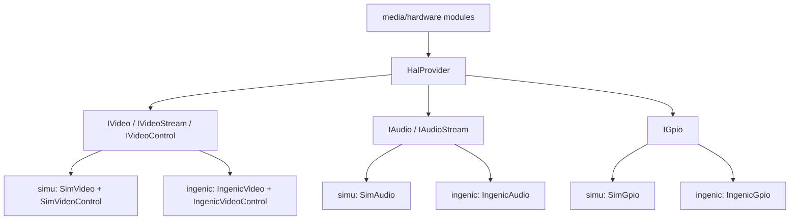

# t32_yb HAL 抽象架构与实现现状（Simu / Ingenic）

- 文档日期：2026-03-03
- 目标：梳理 `t32_yb` HAL 抽象分层、调用关系，以及 `simu` 与 `ingenic` 当前各自实现功能与边界。
- 代码范围：
  - `src/hal/include/*`
  - `src/hal/HalProvider.cpp`
  - `src/hal/simu/*`
  - `src/hal/ingenic/*`
  - `src/media/*`、`src/hardware/*` 中 HAL 调用入口

## 1. 结论先行

1. `t32_yb` 的 HAL 已形成清晰分层：接口层（`IVideo/IAudio/IGpio/IVideoControl`）+ 工厂层（`HalProvider`）+ 平台实现层（`simu` / `ingenic`）。
2. 平台切换是**编译期切换**，由 `BUILD_FOR_SIMULATION` 决定实际链接与实例化实现。
3. 业务模块（RTSP、录像、抓图、音频录制、GPIO、日夜切换）已普遍改为通过 HAL 访问平台能力。
4. `ingenic` 实现是“真机可用实现”，覆盖 ISP/FS/ENC/AI/DMIC/GPIO 主链路；`simu` 实现是“仿真可跑实现”，主要用于开发与联调。
5. 当前存在若干实现注意项，最关键的是 `simu` 的资源配置键名与解析逻辑不一致，导致样例资源可能无法按预期加载。

## 2. HAL 抽象分层

### 2.1 接口层

- 视频接口：
  - `IVideo`：`init/exit/createVideoStream`
  - `IVideoStream`：`configure/start/stop/polling/getFrame/releaseFrame/getInfo/requestIDR`
  - `IVideoControl`：`getISPMode/setISPMode`
- 音频接口：
  - `IAudio`：`init/exit/createAudioStream`
  - `IAudioStream`：`configure/start/stop/polling/getFrame/releaseFrame/getInfo/getCodecConfig`
- GPIO 接口：
  - `IGpio`：`export/unexport/direction/value/edge/active_low`

代码锚点：
- `src/hal/include/IVideo.h:96`
- `src/hal/include/IVideo.h:103`
- `src/hal/include/IAudio.h:71`
- `src/hal/include/IGpio.h:22`

### 2.2 工厂层

`HalProvider` 提供统一工厂：
- `createVideo()`
- `createAudio()`
- `createVideoControl()`
- `createGpio()`

代码锚点：
- `src/hal/include/HalProvider.h:7`
- `src/hal/HalProvider.cpp:9`

### 2.3 平台实现层与编译切换

- `BUILD_FOR_SIMULATION=ON`：`SimVideo/SimAudio/SimGpio`
- `BUILD_FOR_SIMULATION=OFF`：`IngenicVideo/IngenicAudio/IngenicGpio`

代码锚点：
- `src/hal/CMakeLists.txt:16`
- `src/hal/CMakeLists.txt:21`
- `src/hal/HalProvider.cpp:10`
- `src/hal/HalProvider.cpp:17`

### 2.4 架构图

## 3. 业务模块接入 HAL 现状

- RTSP：`RtspServer` 通过 `HalProvider` 创建视频/音频流并接入 `VideoSource/AudioSource`
  - `src/media/rtsp/RtspServer.cpp:371`
  - `src/media/rtsp/RtspServer.cpp:418`
- 录像：`VideoRecorder` 通过 HAL 获取视频与音频码流
  - `src/media/video/VideoRecorder.cpp:603`
  - `src/media/video/VideoRecorder.cpp:723`
- 抓图：`ImageSnap` 通过 HAL 视频 JPEG 流抓拍
  - `src/media/snap/ImageSnap.cpp:75`
- 音频录制：`AudioRecorder` 通过 HAL 音频流采集
  - `src/media/audio/AudioRecorder.cpp:86`
- GPIO：`GPIO` 类底层改为 `IGpio`
  - `src/hardware/gpio/GPIO.cpp:29`
- 日夜切换：`DayNightSwitch` 通过 `IVideoControl` 控 ISP 运行模式
  - `src/hardware/daynight/DayNightSwitch.cpp:173`

## 4. Simu 实现清单

### 4.1 视频（`SimVideo` / `SimVideoStream`）

- 已实现能力：
  - `configure/start/stop/polling/getFrame/releaseFrame/getInfo/requestIDR`
  - H264/H265：从样例码流按 NAL 起始码切 AU，并判断关键帧
  - JPEG：输出样例 JPEG
  - 按 `fps` 生成 `pts` 与节拍
- 代码锚点：
  - `src/hal/simu/SimVideo.cpp:22`
  - `src/hal/simu/SimVideo.cpp:173`
  - `src/hal/simu/SimVideo.cpp:271`
  - `src/hal/simu/SimVideo.cpp:296`

### 4.2 音频（`SimAudio` / `SimAudioStream`）

- 已实现能力：
  - `configure/start/stop/polling/getFrame/releaseFrame/getInfo`
  - AAC：ADTS 帧切分
  - G711A/G711U/PCM16：样例回放或正弦波模拟
  - `pts` 按采样间隔递增
- 未实现能力：
  - `getCodecConfig()` 当前固定返回 `false`
- 代码锚点：
  - `src/hal/simu/SimAudio.cpp:23`
  - `src/hal/simu/SimAudio.cpp:163`
  - `src/hal/simu/SimAudio.cpp:189`
  - `src/hal/simu/SimAudio.cpp:288`

### 4.3 GPIO / ISP 控制

- `SimGpio`：完整接口，内存态模拟
  - `src/hal/simu/SimGpio.cpp:3`
- `SimVideoControl`：内存态 DAY/NIGHT 状态读写
  - `src/hal/simu/SimVideo.cpp:317`

## 5. Ingenic 实现清单

### 5.1 视频（`IngenicVideo` / `IngenicVideoStream`）

- 已实现能力：
  - 设备初始化：ISP、Sensor、FrameSource、Encoder、系统绑定初始化
  - 流配置：H264/H265/JPEG，分辨率、fps、GOP、RC 模式（FIXQP/CBR/VBR/CVBR/AVBR/SMART）、IVDC
  - 运行控制：`start/stop/polling/getFrame/releaseFrame/requestIDR/getInfo`
  - `IngenicVideoControl`：ISP DAY/NIGHT 查询与切换
- 代码锚点：
  - `src/hal/ingenic/IngenicVideo.cpp:963`
  - `src/hal/ingenic/IngenicVideo.cpp:768`
  - `src/hal/ingenic/IngenicVideo.cpp:481`
  - `src/hal/ingenic/IngenicVideo.cpp:836`
  - `src/hal/ingenic/IngenicVideo.cpp:954`
  - `src/hal/ingenic/IngenicVideo.cpp:1015`

### 5.2 音频（`IngenicAudio` / `IngenicAudioStream`）

- 已实现能力：
  - 输入源：`AI` / `DMIC` / `AUTO`（自动优先 DMIC，失败回退 AI）
  - 编码：`PCM16` 透传、`G711A`、`G711U`、`AAC(FAAC)`
  - AAC 侧可导出 decoder specific info（DSI）给上层
  - 完整 `configure/start/stop/polling/getFrame/releaseFrame/getInfo/getCodecConfig`
- 代码锚点：
  - `src/hal/ingenic/IngenicAudio.cpp:59`
  - `src/hal/ingenic/IngenicAudio.cpp:123`
  - `src/hal/ingenic/IngenicAudio.cpp:178`
  - `src/hal/ingenic/IngenicAudio.cpp:270`
  - `src/hal/ingenic/IngenicAudio.cpp:278`

### 5.3 GPIO（`IngenicGpio`）

- 已实现能力：
  - 基于 `/sys/class/gpio` 的导出、方向、读写、边沿、active_low
- 代码锚点：
  - `src/hal/ingenic/IngenicGpio.cpp:6`
  - `src/hal/ingenic/IngenicGpio.cpp:20`

## 6. Simu vs Ingenic 功能覆盖矩阵

| 维度 | Simu | Ingenic |
| :--- | :--- | :--- |
| Video init/exit | 返回 true（轻量） | 完整 ISP/Sensor/FS/ENC 生命周期 |
| Video 编码输出 | 样例文件/模拟 | 真机编码器码流 |
| requestIDR | 恒 true | 真实 `IMP_Encoder_RequestIDR` |
| Audio 输入设备 | 模拟（无真实设备） | AI/DMIC/AUTO |
| Audio 编码 | AAC/PCMA/PCMU/PCM16（仿真） | AAC(FAAC)/PCMA/PCMU/PCM16（真机） |
| Audio codec config | 未实现（false） | AAC DSI 可获取 |
| GPIO | 内存态模拟 | sysfs 真机 GPIO |
| ISP day/night | 内存态状态位 | 真机 ISP 运行模式切换 |

## 7. 当前实现注意事项

1. `simu` 资源配置键名与代码解析逻辑不一致。
   - 代码读取键：`"base"`、`"h264"`、`"h265"`、`"jpg"`、`"aac"` 等
   - 配置文件实际结构：`"base_dir"` + `"video"/"audio"/"image"` 嵌套
   - 结果：样例文件路径解析存在落空风险
   - 代码锚点：
     - `src/hal/simu/SimVideo.cpp:58`
     - `src/hal/simu/SimAudio.cpp:58`
     - `src/hal/simu/res/config.json:2`

2. `simu` 的 `getCodecConfig()` 未实现，AAC 场景下上层若依赖 codec config 需要额外兼容。
   - `src/hal/simu/SimAudio.cpp:288`

3. `RtspServer` 的 HAL 设备对象在 `initVideo/initAudio` 中是局部变量，当前只长期持有 stream/session 对象。
   - 这在当前实现下可运行，但属于生命周期边界需要持续关注的点（尤其后续做资源统一释放或多会话并发时）。
   - 代码锚点：
     - `src/media/rtsp/RtspServer.cpp:371`
     - `src/media/rtsp/RtspServer.cpp:418`
     - `src/media/rtsp/RtspServer.h:63`

## 8. 小结

`t32_yb` 的 HAL 架构已完成“平台差异下沉”的主目标，`simu` 与 `ingenic` 两套实现都具备可用主链路。下一步重点不在“是否有 HAL”，而在“仿真一致性与生命周期细节”收敛，特别是 `simu` 配置解析与 codec config 补齐，以保障联调行为与真机更一致。
