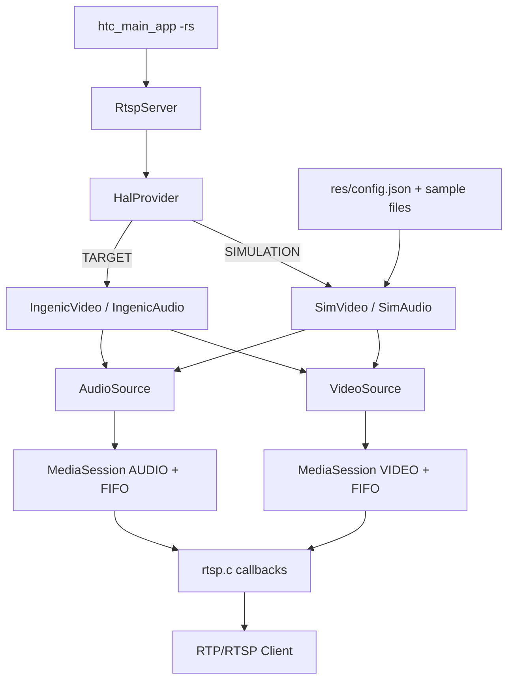
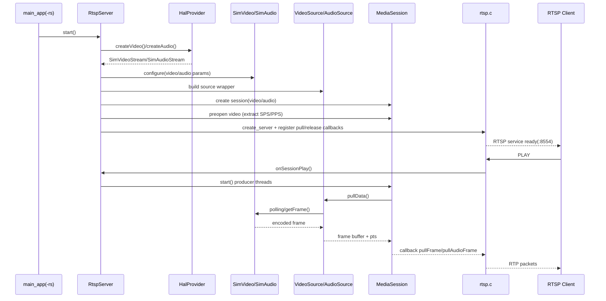

# RTSP 在 Simulation 模式下与 HAL 衔接说明

## 1. 背景与目标

本文用于帮助新同学快速理解：在 `-DBUILD_FOR_SIMULATION=ON` 时，RTSP Server 的 video/audio 源如何准备，以及 RTSP 如何与 HAL 层（`simu` / `ingenic` 两套实现）衔接。

文档日期：2026-03-04

---

## 2. 一句话结论

在 simulation 模式下，RTSP 并不直接读 `tests/assets/configs/rtsp_config.ini`；它通过 `RtspServer -> HalProvider -> SimVideo/SimAudio` 获取数据，`Sim*` 再从 `res/config.json` 定位媒体样本文件。

---

## 3. 模式开关与实现选择

### 3.1 编译开关

- `BUILD_FOR_SIMULATION` 在顶层 CMake 定义并传入。  
  参考：[CMakeLists.txt](/home/zengping/project/huntcam/code/t32_yb/CMakeLists.txt:10)

### 3.2 HAL 实现切换（核心）

- `BUILD_FOR_SIMULATION=ON` 时：
  - `hal_audio` -> `src/hal/simu/SimAudio.cpp`
  - `hal_video` -> `src/hal/simu/SimVideo.cpp`
  - `hal_gpio` -> `src/hal/simu/SimGpio.cpp`
  参考：[src/hal/CMakeLists.txt](/home/zengping/project/huntcam/code/t32_yb/src/hal/CMakeLists.txt:16)

- `HalProvider` 运行时工厂同样按宏切换：
  - sim：`SimVideo/SimAudio/SimGpio`
  - 真机：`IngenicVideo/IngenicAudio/IngenicGpio`
  参考：[src/hal/HalProvider.cpp](/home/zengping/project/huntcam/code/t32_yb/src/hal/HalProvider.cpp:9)

---

## 4. RTSP Server 在 simu 下的音视频源准备

## 4.1 命令入口

- `./bin/htc_main_app -rs` 会进入 `CMD_RTSP_SERVER` 分支并启动 `RtspServer`。  
  参考：[src/app/main_app.cpp](/home/zengping/project/huntcam/code/t32_yb/src/app/main_app.cpp:778)  
  参考：[src/app/main_app.cpp](/home/zengping/project/huntcam/code/t32_yb/src/app/main_app.cpp:1201)

## 4.2 RtspServer 初始化阶段

`RtspServer` 在构造时调用 `initialize()`，依次执行：

1. `initVideo()`：创建 HAL video stream 并配置参数  
2. `initAudio()`：创建 HAL audio stream 并配置参数  

参考：[src/media/rtsp/RtspServer.cpp](/home/zengping/project/huntcam/code/t32_yb/src/media/rtsp/RtspServer.cpp:147)

当前代码中的默认参数（simu 同样使用）：

- Video：`H264`, `1280x720`, `15fps`
  参考：[src/media/rtsp/RtspServer.cpp](/home/zengping/project/huntcam/code/t32_yb/src/media/rtsp/RtspServer.cpp:387)
- Audio：`G711A`, `8000Hz`, mono, `320 samples/frame`
  参考：[src/media/rtsp/RtspServer.cpp](/home/zengping/project/huntcam/code/t32_yb/src/media/rtsp/RtspServer.cpp:432)

## 4.3 SimVideo/SimAudio 的媒体来源

`SimVideo::start()` 与 `SimAudio::start()` 都会读取：

- `res/config.json`
  参考：[src/hal/simu/SimVideo.cpp](/home/zengping/project/huntcam/code/t32_yb/src/hal/simu/SimVideo.cpp:35)
  参考：[src/hal/simu/SimAudio.cpp](/home/zengping/project/huntcam/code/t32_yb/src/hal/simu/SimAudio.cpp:36)

默认配置文件在：

- [src/hal/simu/res/config.json](/home/zengping/project/huntcam/code/t32_yb/src/hal/simu/res/config.json:1)

构建时会复制到运行目录：

- `build_sim/bin/res/*`
  参考：[src/hal/CMakeLists.txt](/home/zengping/project/huntcam/code/t32_yb/src/hal/CMakeLists.txt:34)

## 4.4 文件缺失时的回退行为

- Video 源文件缺失：走空样本路径，帧内容可能无效。  
  参考：[src/hal/simu/SimVideo.cpp](/home/zengping/project/huntcam/code/t32_yb/src/hal/simu/SimVideo.cpp:176)
- Audio 源文件缺失：会合成音频（如 G711A/PCM）。  
  参考：[src/hal/simu/SimAudio.cpp](/home/zengping/project/huntcam/code/t32_yb/src/hal/simu/SimAudio.cpp:192)

---

## 5. RTSP 与 HAL 的衔接机制

衔接路径：

1. `RtspServer::initVideo/initAudio` 通过 `HalProvider` 创建 `IVideoStream/IAudioStream`  
2. 包装成 `VideoSource/AudioSource`（统一 `pullData/releaseData` 接口）  
3. 交给 `MediaSession`（producer thread + FIFO）  
4. `rtsp.c` 通过回调持续从 `MediaSession` 拉帧并封包 RTP

关键代码：

- 拉流回调注册：  
  [src/media/rtsp/RtspServer.cpp](/home/zengping/project/huntcam/code/t32_yb/src/media/rtsp/RtspServer.cpp:333)
- VideoSource 从 HAL stream 拉帧：  
  [src/media/rtsp/VideoSource.cpp](/home/zengping/project/huntcam/code/t32_yb/src/media/rtsp/VideoSource.cpp:29)
- AudioSource 从 HAL stream 拉帧：  
  [src/media/rtsp/AudioSource.cpp](/home/zengping/project/huntcam/code/t32_yb/src/media/rtsp/AudioSource.cpp:29)
- MediaSession 生产线程/FIFO：  
  [src/media/rtsp/MediaSession.cpp](/home/zengping/project/huntcam/code/t32_yb/src/media/rtsp/MediaSession.cpp:126)
- RTSP C 层建服与发送：  
  [src/media/rtsp/rtsp.c](/home/zengping/project/huntcam/code/t32_yb/src/media/rtsp/rtsp.c:1140)

---

## 6. 架构图（Mermaid）

---

## 7. 启动与推流流程图（Mermaid）

---

## 8. 现状注意点（对测试影响大）

1. `tests/assets/configs/rtsp_config.ini` 当前主要是测试脚本使用，非 RtspServer 直接读取配置源。  
2. 你若在 `build_sim` 目录启动程序，`res/config.json` 相对路径可能与预期不一致，需要确认当前工作目录与资源路径。  
3. `--no-audio` 参数已解析，但目前未看到传入 `RtspServer` 生效的设置接口。

---

## 9. 建议的新同学验证步骤

1. 确认 `build_sim/CMakeCache.txt` 中 `BUILD_FOR_SIMULATION:BOOL=ON`。  
2. 确认 `build_sim/bin/res/config.json` 与样本文件存在。  
3. 启动 `./bin/htc_main_app -rs`，查看日志中 `onSessionPlay`、`MediaSession started`。  
4. 用 `ffplay rtsp://localhost:8554/live` 验证推流。  
