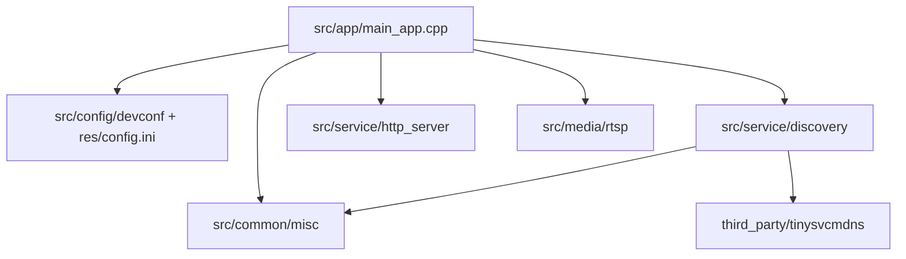
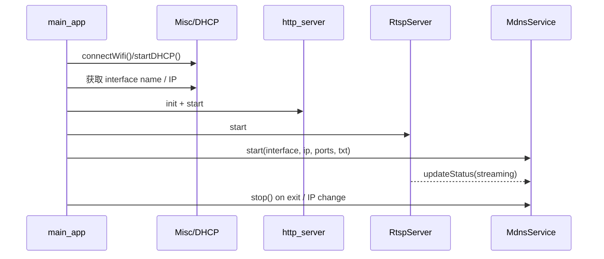

# T32 端 mDNS 引入方案与目录落点

## 1. 背景与目标

- 输入文档：`t32_yb/doc/spec/mdns-device-discovery-spec.md`
- 目标：评估在 `t32_yb` 端引入 mDNS/DNS-SD 的可行方案，并明确：
  - 第三方 source code 放哪里
  - 我们自己的实现放哪些目录
  - 启动链路和配置从哪里接入

---

## 2. 现状判断

### 2.1 当前代码分层

从仓库结构看，`t32_yb` 当前已经形成比较清晰的分层：

- `third_party/`：第三方依赖源码
- `src/service/`：服务层能力（`http_server`、`daemon`、`camera`）
- `src/network/`：偏“主动连接型”的网络客户端能力（如 `MgmtServClient`、`Rtmp`、`UsbDongle`）
- `src/app/`：可执行程序入口与生命周期编排
- `src/config/`：配置读取
- `src/common/misc/`：接口名/IP 获取等通用网络辅助能力

### 2.2 mDNS 在当前工程中的定位

**mDNS 不应放到 `src/network/`，更不应放到 `src/hal/`。**

原因：

1. `src/network/` 当前主要是“设备主动向外连接”的网络客户端能力，不是“局域网服务注册/发现服务”。
2. mDNS 的职责是把本机 HTTP/RTSP 服务发布到局域网，生命周期应跟随服务启动/停止。
3. mDNS 不依赖硬件抽象，不属于 HAL。
4. 当前 `main_app.cpp` 已经负责 HTTP Server 与 RTSP Server 的启动编排，mDNS 放在服务层并由 `main_app` 调用最顺。

结论：**mDNS 在 `t32_yb` 中应定义为“服务注册能力”，落在 `src/service/`。**

---

## 3. 推荐接入方案

### 3.1 总体原则

- 第三方库与业务封装分离
- mDNS 作为 **in-process service** 集成到 `htc_main_app`
- 在网络接口和 IP 已就绪后启动
- 与 HTTP/RTSP 服务共享生命周期
- 由我们自己的封装屏蔽第三方库细节，避免上层直接依赖 tinysvcmdns API

### 3.2 推荐架构



---

## 4. 目录落点建议

### 4.1 第三方 source code 放置位置

推荐新增：

```text
t32_yb/third_party/tinysvcmdns/
├── CMakeLists.txt
├── LICENSE
├── README.md
├── mdns.c
├── mdns.h
├── mdnsd.c
└── mdnsd.h
```

说明：

- 与 `civetweb`、`md5`、`jsoncpp`、`smolrtsp` 的组织方式一致
- upstream 原始代码尽量少改，便于后续升级和问题回溯
- 在 `t32_yb/third_party/CMakeLists.txt` 中 `add_subdirectory(tinysvcmdns)`
- 建议编译成 **静态库**：`tinysvcmdns`

### 4.2 我们自己的实现目录

推荐新增：

```text
t32_yb/src/service/discovery/
├── CMakeLists.txt
├── MdnsService.h
├── MdnsService.cpp
├── MdnsTxtRecord.h
└── MdnsTxtRecord.cpp
```

职责划分：

- `MdnsService`
  - 封装第三方库初始化、启动、停止、重注册
  - 统一处理 hostname / service name / TXT record
  - 提供 `start()` / `stop()` / `updateStatus()` / `refresh()` 接口
- `MdnsTxtRecord`
  - 负责把设备信息拼装成 TXT Record
  - 管理 `model/sn/fw_ver/rtsp_port/ctrl_port/mac/status`

### 4.3 相关配套改动目录

除了 `third_party/` 和 `src/service/discovery/`，还需要配套改动以下目录：

- `t32_yb/src/service/CMakeLists.txt`
  - 新增 `add_subdirectory(discovery)`
- `t32_yb/src/app/main_app.cpp`
  - 在 HTTP/RTSP 启动点附近接入 `MdnsService`
- `t32_yb/src/common/misc/`
  - 复用/补充网络接口名、IP、MAC 获取辅助函数
- `t32_yb/src/common/Common.h`
  - 新增 mDNS 配置键常量
- `t32_yb/res/config.ini`
  - 增加 `[MDNS]` 配置段

---

## 5. 为什么推荐放在 `src/service/discovery/`

相对其他放法，这个位置最合理：

### 5.1 不推荐放 `src/network/`

- 该目录当前是客户端型网络能力，语义不对
- mDNS 不是“向平台服务端发消息”，而是“对局域网发布本机服务”
- 放进去会让后续 SSDP/mDNS/Bonjour/server publish/client transport 混在一起

### 5.2 不推荐放 `src/media/rtsp/`

- mDNS 不只发布 RTSP，还要发布 HTTP 控制端口和设备元数据
- discovery 是横跨 HTTP + RTSP 的系统能力，不应耦合到媒体模块

### 5.3 不推荐做独立 daemon

- 当前 `htc_main_app` 已经能确定网络接口、IP 和服务启动时机
- 独立 daemon 会额外引入进程间同步、端口状态同步、退出回收问题
- 对当前项目规模来说是过度设计

---

## 6. 启动链路建议

### 6.1 推荐时序



### 6.2 实际挂载点

优先挂在 `CMD_MOBILE` 路径：

- 该路径已经启动 WiFi、DHCP、HTTP Server、RTSP Server
- 与“手机发现设备并添加”的目标最匹配

可选扩展：

- 若后续 `CMD_RTSP_SERVER` 也希望被手机端发现，可在该路径复用同一套 `MdnsService`
- 如果只有 RTSP 没有 HTTP 控制接口，则要在 TXT Record 中明确当前 `ctrl_port` 是否可用

Simu 环境建议：

- **Simu 也复用 `CMD_MOBILE` 作为测试入口**，这样最接近真机业务路径
- 但 `BUILD_FOR_SIMULATION` 下不应继续执行真实的 `connectWifi()` / `startDHCP()`，因为当前实现会调用真机 WiFi 脚本和 `udhcpc`
- Simu 下应视本地网卡为“已就绪”，直接读取本机接口/IP，然后启动 HTTP / RTSP / mDNS
- `CMD_RTSP_SERVER` 可作为补充测试路径，但它不包含 HTTP Server，不适合作为完整发现链路的主验证入口

### 6.3 V1 接入建议

V1 先做静态注册：

1. 网络连接完成
2. DHCP 成功
3. `Misc::getIPAddress(Misc::getNetworkInterfaceName())` 获取 IP
4. 启动 HTTP / RTSP
5. 调用 `MdnsService::start(...)`
6. 退出时 `MdnsService::stop()`

### 6.4 V2 增强建议

后续再补：

- IP 变化自动重注册
- WiFi 断开自动下线
- RTSP session 状态驱动 `status=ready/streaming`

---

## 7. 配置建议

### 7.1 建议新增配置段

在 `t32_yb/res/config.ini` 及真机配置文件中新增：

```ini
[MDNS]
Enable=1
ServiceType=_t32cam._tcp
InstanceName=T32Camera
HostName=t32cam
CtrlPort=8080
RtspPort=8554
```

说明：

- `Enable`：总开关
- `ServiceType`：建议默认 `_t32cam._tcp`
- `InstanceName`：服务实例名，建议默认取 `PName` 或 `PID`
- `HostName`：主机名，建议默认取 `PID` 的简化形式，避免空格
- `CtrlPort` / `RtspPort`：从配置读取，避免端口硬编码散落

### 7.2 TXT 字段映射建议

| TXT 字段 | 推荐来源 |
|---|---|
| `model` | `INI_KEY_PMODEL` |
| `sn` | `INI_KEY_PID`（V1 固定使用 PID） |
| `fw_ver` | `CAMERA_VERSION` |
| `rtsp_port` | `[MDNS].RtspPort` |
| `ctrl_port` | `[MDNS].CtrlPort` |
| `mac` | 当前工作网卡 MAC |
| `status` | V1 固定 `ready` |

备注：

- 当前工程里没有现成的通用 MAC 获取函数，建议补到 `src/common/misc/`
- `sn` 建议 **不要直接用网卡 MAC 替代**，因为设备可能运行在 `wlan0` / `eth0` / `usb0` 等不同接口上，MAC 更适合作为 `mac` 字段而不是主设备标识
- `PID` 更接近当前业务侧设备唯一标识，V1 用它最稳；如果后续有独立出厂 SN，可再替换 `sn`

---

## 8. 代码职责边界建议

### 8.1 `MdnsService` 只做发布，不做网络管理

`MdnsService` 内部只关心：

- 当前网卡名
- 当前 IP
- 当前 hostname
- 当前 service instance
- 当前 TXT record
- 启停和重注册

不负责：

- WiFi 连接
- DHCP 获取
- HTTP/RTSP 生命周期决策

这些仍由 `main_app.cpp` 负责。

### 8.2 `main_app.cpp` 负责编排

`main_app.cpp` 保持“系统 orchestration”职责：

- 选定网络接口
- 连网 / DHCP
- 启动 HTTP / RTSP
- 调用 `MdnsService`
- 退出时统一 stop/deinit

---

## 9. 推荐的最小实现清单

### 9.1 第三方部分

- `third_party/tinysvcmdns/CMakeLists.txt`
- `third_party/CMakeLists.txt` 增加子目录

### 9.2 自有代码部分

- `src/service/discovery/CMakeLists.txt`
- `src/service/discovery/MdnsService.h`
- `src/service/discovery/MdnsService.cpp`
- `src/service/discovery/MdnsTxtRecord.h`
- `src/service/discovery/MdnsTxtRecord.cpp`

### 9.3 集成部分

- `src/service/CMakeLists.txt`
- `src/app/main_app.cpp`
- `src/common/misc/Misc.h`
- `src/common/misc/Misc.cpp`
- `src/common/Common.h`
- `res/config.ini`

---

## 10. 最终建议

### 10.1 推荐结论

**推荐采用：`third_party/tinysvcmdns + src/service/discovery/MdnsService` 的 in-process 集成方案。**

### 10.2 目录落点结论

第三方 source code：

- `t32_yb/third_party/tinysvcmdns/`

我们自己的实现主目录：

- `t32_yb/src/service/discovery/`

配套改动目录：

- `t32_yb/src/app/`
- `t32_yb/src/common/misc/`
- `t32_yb/src/common/`
- `t32_yb/res/`

### 10.3 不建议的做法

- 不建议把 mDNS 主实现放到 `src/network/`
- 不建议耦合进 `src/media/rtsp/`
- 不建议单独做 daemon 进程

### 10.4 本轮已确认决策

1. V1 真机功能路径以 `CMD_MOBILE` 为主。
2. V1 Simu 测试也复用 `CMD_MOBILE`，但需在 `BUILD_FOR_SIMULATION` 下跳过真实 WiFi / DHCP 动作。
3. `sn` 字段 V1 使用 `PID`。
4. `mac` 字段单独上报当前工作网卡 MAC。
5. `status` 字段 V1 固定为 `ready`。

这个方案和当前 `t32_yb` 的工程结构最一致，后续也便于继续扩展成 SSDP / 多发现协议共存。
