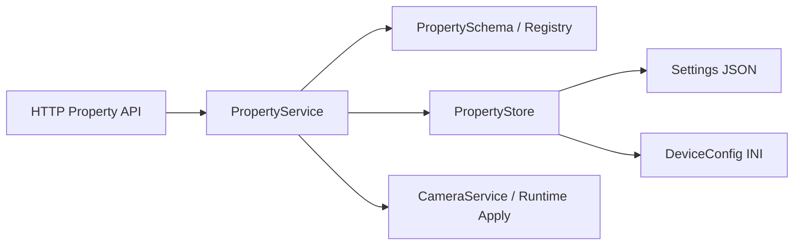

# 相机属性存储方案

## 背景与目标

当前工程已经区分了两类持久化数据：

- 媒体索引与缩略图：`src/storage/` 中的 SQLite 双库
- 设备与业务配置：`Settings` JSON 与 `DeviceConfig` INI

HTTP API 已经规划了 `/api/v1/camera/properties*`，但属性定义、候选值、校验和持久化还没有收敛到统一实现。

本方案的目标是：

- 明确数据库与配置系统的职责边界
- 为 HTTP 属性接口提供统一的 schema、校验和持久化入口
- 不为相机属性新增 SQLite 配置库

## 现状

### 已有数据库职责

- `media_file.db`
  - 表：`media_files`
  - 用途：照片/录像文件元数据索引
- `media_thumb.db`
  - 表：`thumbnails`
  - 用途：缩略图缓存

### 已有配置职责

- `Settings`
  - JSON 文件
  - 保存拍照、录像、PIR、时间戳等业务设置
- `DeviceConfig`
  - INI 文件
  - 保存设备基础信息、服务器地址、端口、mDNS、机型能力等配置

### 当前问题

- HTTP property API 仍是占位实现
- 属性“当前值”和“属性定义/候选值”没有分层
- 候选值并非纯静态常量，部分取决于硬件能力和机型裁剪

## 决策

### 1. 数据库存储边界

- `media_file.db` 继续只存媒体元数据
- `media_thumb.db` 继续只存缩略图
- 相机属性不新增 SQLite `system_config` 表

### 2. 相机属性采用 Schema + Store 分层

- `PropertySchema`
  - 定义属性名、类型、显示名、默认值、候选值、范围、只读性
- `PropertyStore`
  - 负责读取/写入当前值
  - 当前阶段复用 `Settings` 与 `DeviceConfig`
- `PropertyService`
  - 统一完成校验、持久化、默认值恢复和 HTTP JSON 导出

### 3. 属性候选值不存数据库

属性候选值主要由固件和硬件能力决定，不建议入库：

- 机型支持哪些视频规格
- 某个分辨率对应哪些 fps
- 某个属性是否只读

这些内容由代码在运行时根据机型能力生成，更容易保证一致性。

## 架构设计

## 属性分类

### 适合数据库

- 照片/录像文件索引
- 缩略图缓存

### 适合配置存储

- 分辨率
- FPS
- 码率
- PIR 开关与灵敏度
- 最大录像时长
- 时间戳叠加
- 循环录像

### 不落库，运行时生成

- 属性候选值
- 范围与步长
- 只读性
- 机型能力裁剪结果

## 落地策略

### 短期

- 新增统一属性服务
- 继续复用 `Settings` + `DeviceConfig`
- HTTP `/api/v1/camera/properties*` 统一走属性服务

### 中期

- 逐步把散落在 `RemoteCtrlClient` 的参数映射下沉到属性服务
- 视需要把配置源收敛到单一配置文件或统一配置模块

## 首批实现范围

本轮只覆盖已有稳定映射的核心属性：

- `resolution`
- `fps`
- `bitrate`
- `pir_enabled`
- `pir_sensitivity`
- `loop_recording`
- `max_record_duration`
- `timestamp_overlay`

## 约束与风险

- 不修改 `src/hal/**`
- 现有底层真实能力仍以旧配置和已有业务逻辑为准
- `resolution` 与 `fps` 在当前存储模型下本质上耦合到同一个 `videoSize`，单独设置其中一个属性可能带动另一个属性变化

## 备选方案对比

| 方案 | 描述 | 结论 |
| --- | --- | --- |
| SQLite 配置库 | 新增 `system_config` / `property_definitions` 表 | 不选，嵌入式维护成本更高，且候选值依赖硬件能力 |
| 纯文件配置 + 代码 schema | 当前值写文件，候选值由代码生成 | 采用 |
| 全部静态写死在 HTTP 层 | 快速但不可维护 | 不选 |
