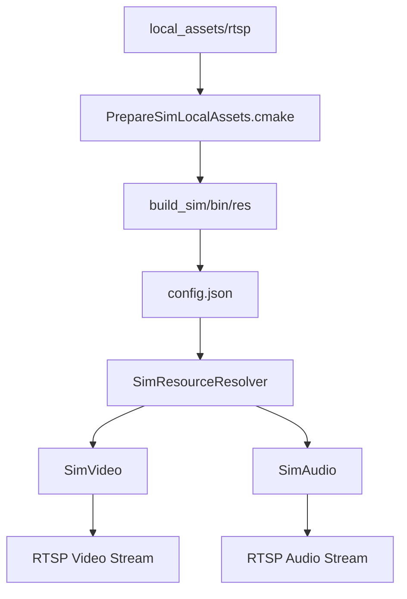

# RTSP Simu HAL 修改实施报告

## 背景与目标

背景：

- Android RTSP client 连接 simulation RTSP 服务时，画面出现明显抖动
- 服务端日志未发现致命异常，但默认 H.264 测试源确认包含 `B-frame`
- 切换到无 `B-frame` 的 H.264 测试源后，客户端观感恢复正常

目标：

- 将 simulation 默认视频源切到 `no-B-frame`
- 消除 HAL simu 资源加载对 `cwd` 的隐式依赖
- 保持大体积音视频资源不纳入 Git 管理
- 形成一份可提交给 HAL PIC 的实施确认报告

## 方案概述

本次修改分成两层：

1. HAL 内部收口 simulation 资源解析与错误处理
2. HAL 外围补齐本地大资源目录、拷贝脚本与使用文档

实现后的资源链路如下：

## HAL 实施内容

### 1. 新增统一资源解析器

新增文件：

- [SimResourceResolver.h](/home/zengping/project/huntcam/code/t32_yb/src/hal/simu/SimResourceResolver.h)

实际行为：

- 按以下优先级定位 `config.json`
  - `SIM_RESOURCE_CONFIG`
  - `SIM_RESOURCE_DIR/config.json`
  - `exe_dir/res/config.json`
  - 兼容旧链路 `res/config.json`
- 资源文件路径统一相对 `config.json` 所在目录解析
- 解决 `SimVideo` / `SimAudio` 原先依赖启动目录的问题

### 2. `SimVideo` 改为 fail-fast

更新文件：

- [SimVideo.cpp](/home/zengping/project/huntcam/code/t32_yb/src/hal/simu/SimVideo.cpp)

实际修改点：

- 接入统一资源解析器，不再直接固定读取相对路径
- 只读取配置中的 `video.h264` / `video.h265` / `image.jpg`
- 删除静默 fallback 到 `sample_video.h264` 的逻辑
- 如果配置缺失、文件打不开或文件为空，`start()` 直接失败
- 启动时打印明确日志：
  - 配置文件路径
  - 最终打开的视频文件路径
  - 打开失败原因或文件大小

当前结论：

- simulation 视频源配置错误时会尽早暴露问题
- 不再因为隐式替代源导致客户端问题被掩盖

### 3. `SimAudio` 与视频统一路径解析

更新文件：

- [SimAudio.cpp](/home/zengping/project/huntcam/code/t32_yb/src/hal/simu/SimAudio.cpp)

实际修改点：

- 接入统一资源解析器
- `start()` 时补齐内部状态复位
- 启动时打印选中的音频文件路径和文件大小
- 文件缺失或打开失败时打印显式告警

保留策略：

- 音频侧仍保留 synthetic audio fallback
- 本次只对视频链路采用 fail-fast

### 4. simulation 默认 H.264 源切到 no-B

更新文件：

- [config.json](/home/zengping/project/huntcam/code/t32_yb/src/hal/simu/res/config.json)

实际修改点：

- 将 `base_dir` 收口为 `base: "."`
- 默认 `video.h264` 改为 `full_frame_camera_no_b_30s.h264`

说明：

- 默认 H.264 测试源已切到无 `B-frame` 版本
- 不额外引入多级 fallback 配置字段

### 5. CMake 增加外部资源准备机制

更新文件：

- [src/hal/CMakeLists.txt](/home/zengping/project/huntcam/code/t32_yb/src/hal/CMakeLists.txt)
- [PrepareSimLocalAssets.cmake](/home/zengping/project/huntcam/code/t32_yb/src/hal/PrepareSimLocalAssets.cmake)

实际修改点：

- 保留 `src/hal/simu/res -> build_sim/bin/res` 的基础复制
- 增加 `local_assets/rtsp` 到运行目录的可选资源准备逻辑
- 若本地存在 `full_frame_camera.h264`，且缺少 `full_frame_camera_no_b_30s.h264`，则在 `ffmpeg` 可用时自动生成
- 自动把外部 `g711a` 音频与 `no-B` 视频复制到 `build_sim/bin/res`
- 处理 same-file / symlink 场景，避免无意义重复拷贝

## HAL 外围配套修改

以下内容不属于 `src/hal/**`，但用于支撑本次变更落地：

- [.gitignore](/home/zengping/project/huntcam/code/t32_yb/.gitignore)
  - 忽略 `local_assets/*`
- [local_assets/README.md](/home/zengping/project/huntcam/code/t32_yb/local_assets/README.md)
  - 约定外部大资源目录结构
- [use_rtsp_no_b_source.sh](/home/zengping/project/huntcam/code/t32_yb/script/use_rtsp_no_b_source.sh)
  - 生成 no-B 源并切换 runtime `config.json`
- [PC_BUILD_GUIDE.md](/home/zengping/project/huntcam/code/t32_yb/doc/PC_BUILD_GUIDE.md)
  - 补充本地资源与 no-B 切换说明

约束保持不变：

- 大体积音视频资源不进入 Git
- 缺失指定视频源时不做静默 fallback

## 验证结果

### 构建验证

已完成：

- `cmake --build build_sim -j$(nproc)`

结果：

- 编译通过

### 运行验证

验证方式：

- 从 `build_sim` 目录启动 RTSP 服务，确认不再依赖旧的 `cwd` 假设
- 服务端日志输出到 `/tmp/t32_rtsp_hal_logs/app.log`

关键现象：

- 视频日志显示已打开 `build_sim/bin/res/full_frame_camera_no_b_30s.h264`
- 音频日志显示已打开 `build_sim/bin/res/full_frame_camera_g711a.alaw`
- RTSP `DESCRIBE` 阶段已正常产出视频与音频 SDP 信息
- 首帧视频与音频均正常发送

结论：

- simulation 默认 no-B 视频源已生效
- HAL 资源解析已从依赖 `cwd` 改为依赖配置文件位置
- 视频源缺失时会按预期 fail-fast

## 影响与风险

正向影响：

- Android RTSP client 默认测试链路更稳定
- 资源准备不完整时更早暴露问题
- simulation 启动目录差异带来的次生问题被收敛

剩余风险：

1. 本地 `local_assets/rtsp` 未准备资源时，视频链路会直接失败
2. 当前音频仍允许 fallback 到 synthetic audio，音视频策略并不完全对称
3. 客户端侧仍出现过 `ffmpeg` 非单调 DTS 告警，该问题不在本次 HAL 修改范围内

## PIC 评审关注点

建议 PIC review 时重点确认以下内容：

1. simulation 默认视频源切为 no-B 是否符合后续维护预期
2. `SimVideo` 改为 fail-fast 是否符合调试与问题暴露策略
3. `SimAudio` 保留 synthetic fallback 是否可接受
4. 本地大资源目录与 build copy/prepare 机制是否符合项目资源管理边界
5. `SimResourceResolver` 的配置优先级是否满足后续 simulation 扩展需求

## 结论

本次 HAL 修改已按计划实施完成，实际结果符合以下目标：

- 默认 H.264 测试源切到 no-B
- 视频链路取消静默 fallback
- simulation 资源解析不再绑定启动目录
- 大资源仍保持仓外或 `.gitignore` 管理方式

该版本已经具备提交 PIC 进行实现确认和维护 review 的条件。
