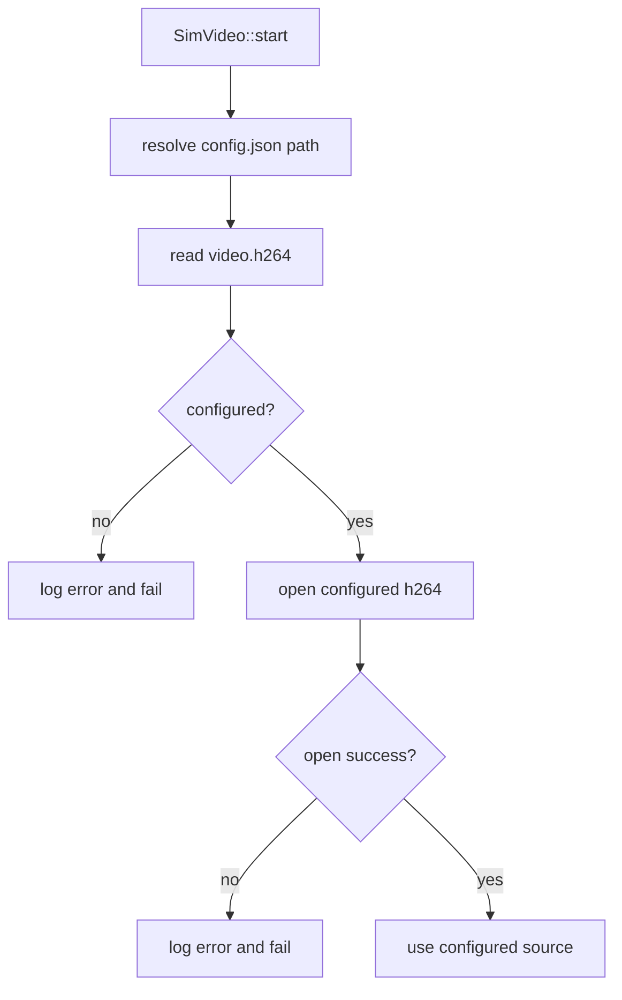

# RTSP Simu 默认 No-B 视频源 HAL 变更提案

## 背景与目标

现状：

- Android RTSP client 在当前默认 simu 视频源下出现明显抖动
- 排查后确认当前默认 H.264 测试源包含大量 `B-frame`
- 使用无 `B-frame` 的 H.264 测试源后，客户端观感恢复正常

目标：

- 让 simulation 模式下的 RTSP 默认视频源优先支持 `no-B-frame`
- 同时避免继续依赖手工改 `build_sim/bin/res/config.json`
- 尽量把改动收敛在 HAL simu 资源选择层，不影响 RTSP 协议层

## 建议的变更层级

建议分成两档 review：

### 方案 A：最小 HAL 变更

- 只解决“simulation 默认优先用 no-B 视频源”

### 方案 B：推荐一起收口

- 在方案 A 基础上，顺手修掉 simu 资源路径依赖 `cwd` 的问题
- 同时补上资源加载失败日志

本提案推荐采用 **方案 B**。

## 变更范围

### 1. [src/hal/simu/SimVideo.cpp](/home/zengping/project/huntcam/code/t32_yb/src/hal/simu/SimVideo.cpp)

当前问题点：

- [SimVideo.cpp:38](/home/zengping/project/huntcam/code/t32_yb/src/hal/simu/SimVideo.cpp:38) 固定读取相对路径 `res/config.json`
- [SimVideo.cpp:63](/home/zengping/project/huntcam/code/t32_yb/src/hal/simu/SimVideo.cpp:63) 当前只按 `h264` 字段取文件
- [SimVideo.cpp:78](/home/zengping/project/huntcam/code/t32_yb/src/hal/simu/SimVideo.cpp:78) 存在静默 fallback 到 `sample_video.h264`
- [SimVideo.cpp:101](/home/zengping/project/huntcam/code/t32_yb/src/hal/simu/SimVideo.cpp:101) 文件打开失败时没有明确日志，后续容易退化成次生问题

建议更新内容：

1. 新增 simu 资源路径解析函数
   - 基于可执行文件目录或 build 运行目录解析 `res/config.json`
   - 不再直接依赖当前 `cwd`

2. 保持视频源选择逻辑简单明确
   - 继续只读取 `video.h264`
   - 由 `config.json` 直接把 `h264` 指向默认的 `no-B` 文件
   - 不再增加 `h264_no_b -> h264 -> fallback` 这种链式选择

3. 取消静默 fallback
   - 如果 `video.h264` 未配置、为空或文件打不开，直接打印错误并 `return false`
   - 不再自动回退到 `sample_video.h264`
   - 不再继续产出“空帧”或“隐式替代源”

4. 启动时打印明确日志
   - 最终选中的视频文件路径
   - 配置文件路径
   - 文件打开失败原因

5. 保持现有 `buildNextFrame()` 和 AU 切分逻辑不变
   - 本次确认问题根因不是 NAL 切分算法
   - 这里只改“加载哪个文件”以及“加载失败如何失败”

### 2. [src/hal/simu/SimAudio.cpp](/home/zengping/project/huntcam/code/t32_yb/src/hal/simu/SimAudio.cpp)

当前问题点：

- [SimAudio.cpp:36](/home/zengping/project/huntcam/code/t32_yb/src/hal/simu/SimAudio.cpp:36) 与 `SimVideo` 一样固定读 `res/config.json`
- 音频同样存在 `cwd` 依赖

建议更新内容：

1. 复用与 `SimVideo` 相同的 simu 资源路径解析逻辑
2. 启动时打印所选音频文件路径
3. 文件打开失败时打印明确告警

说明：

- 这部分不是为了 `no-B` 本身
- 但如果只改视频不改音频，simulation 资源定位逻辑会继续分裂

### 3. [src/hal/simu/res/config.json](/home/zengping/project/huntcam/code/t32_yb/src/hal/simu/res/config.json)

建议更新内容：

- 直接把默认 `h264` 配置切到 `no-B` 文件，例如：

```json
"video": {
    "h264": "full_frame_camera_no_b_30s.h264",
    "h265": "sample_video.h265"
}
```

这样做的好处：

- HAL 侧实现最简单
- 不需要额外的多级选择逻辑
- 哪个文件是默认 H.264 源，一眼能看清
- 如果后续要切回带 B 帧版本，只需要改配置，不需要改代码

### 4. [src/hal/CMakeLists.txt](/home/zengping/project/huntcam/code/t32_yb/src/hal/CMakeLists.txt)

当前问题点：

- [src/hal/CMakeLists.txt:34](/home/zengping/project/huntcam/code/t32_yb/src/hal/CMakeLists.txt:34) 只会把 `src/hal/simu/res` 整体复制到 `build_sim/bin/res`
- 如果 `no-B` 文件不在 `src/hal/simu/res`，重编译后运行目录里不会稳定存在

建议更新内容，二选一：

1. 如果接受把 `no-B` 测试文件纳入 `src/hal/simu/res`
   - `POST_BUILD copy_directory` 保持不变

2. 如果不想把大文件直接纳入 `src/hal/simu/res`
   - 增加一个额外 copy step，把本地外部资源目录中的 `full_frame_camera_no_b_30s.h264` 拷贝到 `${CMAKE_BINARY_DIR}/bin/res`
   - 或新增一个独立 prepare target 负责生成/拷贝该文件

本提案更推荐：

- **不要把大二进制直接塞进 `src/hal/simu/res`**
- **不要继续依赖 `tests/assets/video` 这类 Git 管理目录来承载大资源**
- 更适合从仓库外部或仓库内 `.gitignore` 忽略的本地资源目录拷贝到 `build_sim/bin/res`

## 推荐实现方式



建议默认策略：

- simulation 模式默认直接把 `video.h264` 指向 `no-B` 文件
- 如果该文件不存在或无法打开，直接失败

这样对 Android RTSP client 的体验更稳。

## 为什么建议一起修路径问题

如果只把 `config.json` 改到 `no-B` 文件，但不改路径解析，仍然有两个问题：

1. 从 `build_sim` 启动时，`res/config.json` 仍可能找错目录
2. 即使配置指向 `no-B` 文件，也可能因为路径解析失败而直接打不开资源

所以：

- **no-B 选择逻辑**
- **simu 资源路径解析**

这两项最好一起处理。

## 风险与影响

### 正向影响

- Android 客户端默认测试链路更稳定
- 减少由 `B-frame` 引起的客户端兼容性问题
- simulation 启动方式更一致，不再过度依赖 `cwd`

### 风险

1. 如果直接把 `h264` 默认切成 `no-B`，会改变现有测试基线
2. 如果取消 fallback，资源准备不完整时会更早失败
3. 如果 `no-B` 文件体积较大，放进源码树会增加仓库负担
4. 如果路径解析改动不谨慎，可能影响 audio/video/image 三类资源加载

## 建议的 review 结论

建议按下面口径评审：

1. 同意 HAL simu 默认 H.264 源直接切到 `no-B` 文件
2. 同意取消 `SimVideo` 的静默 fallback，改为缺失即报错失败
3. 同意把 `SimAudio` 一并收口到同一套路径解析逻辑
4. 不建议把大 `no-B` 文件直接长期纳入 `src/hal/simu/res`
5. 更建议通过 build copy/prepare 机制，把本地外部大资源目录中的测试源放到 `build_sim/bin/res`

## 本次若获批，预计实际改动文件

- [src/hal/simu/SimVideo.cpp](/home/zengping/project/huntcam/code/t32_yb/src/hal/simu/SimVideo.cpp)
- [src/hal/simu/SimAudio.cpp](/home/zengping/project/huntcam/code/t32_yb/src/hal/simu/SimAudio.cpp)
- [src/hal/simu/res/config.json](/home/zengping/project/huntcam/code/t32_yb/src/hal/simu/res/config.json)
- [src/hal/CMakeLists.txt](/home/zengping/project/huntcam/code/t32_yb/src/hal/CMakeLists.txt)

以上就是 HAL 侧拟变更内容，当前仅供 review，不落代码。
