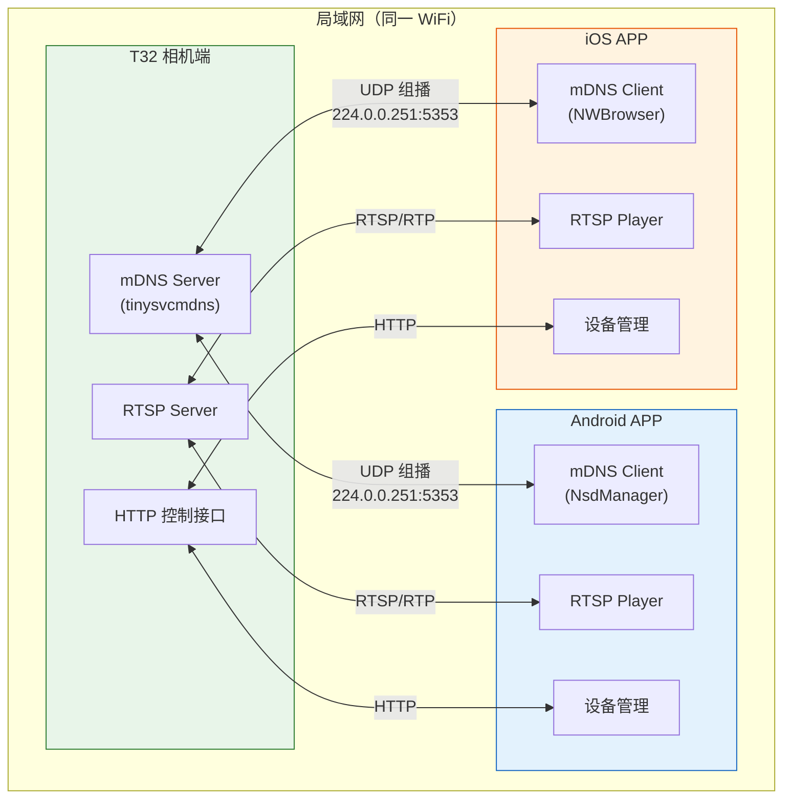
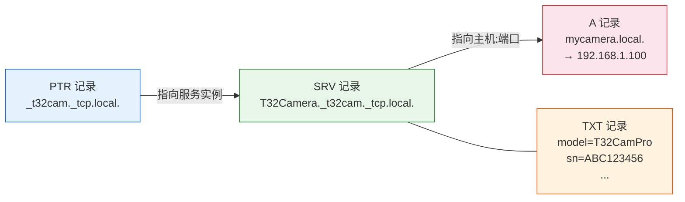
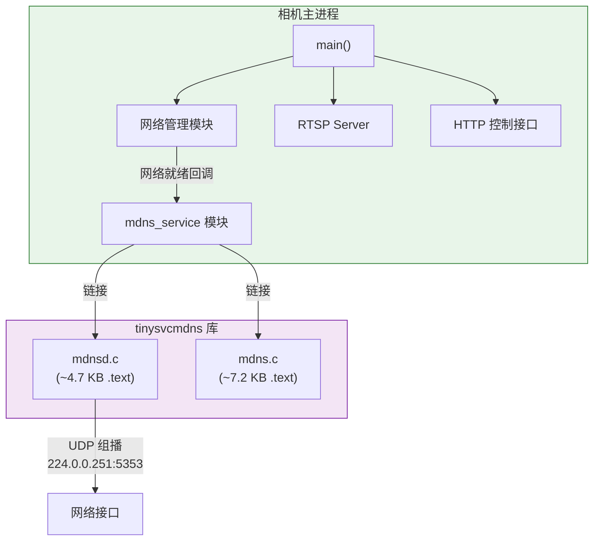
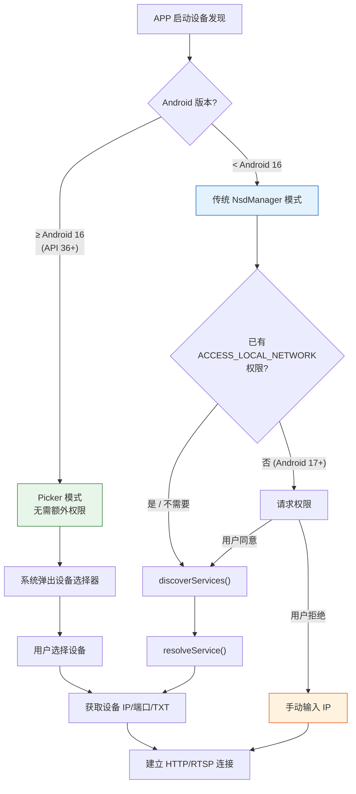
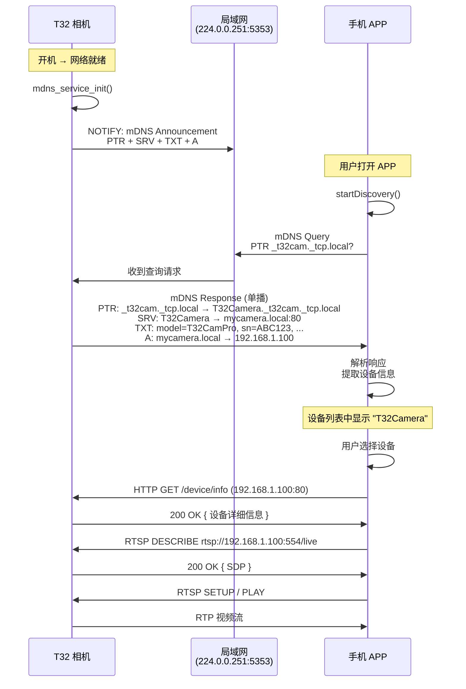
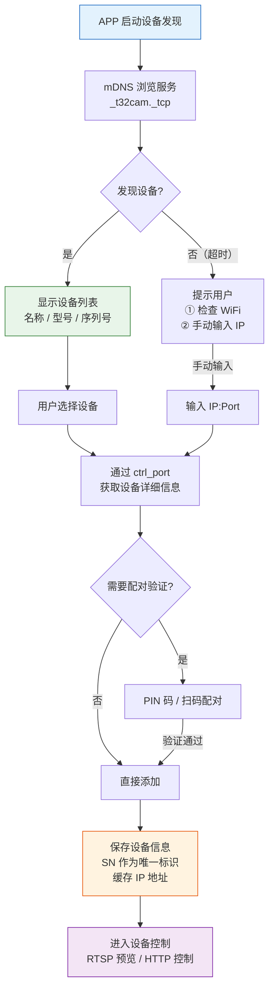
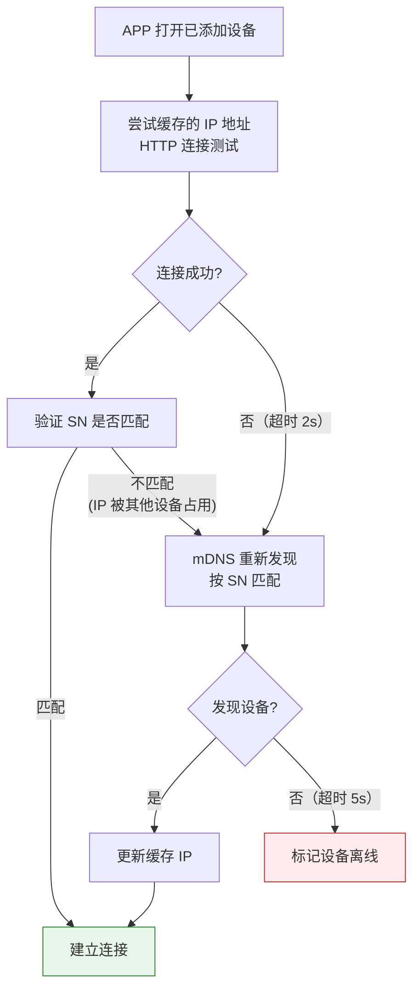
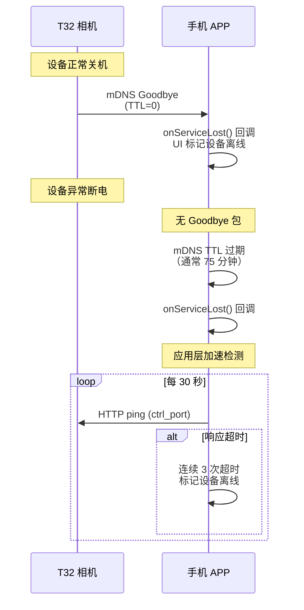
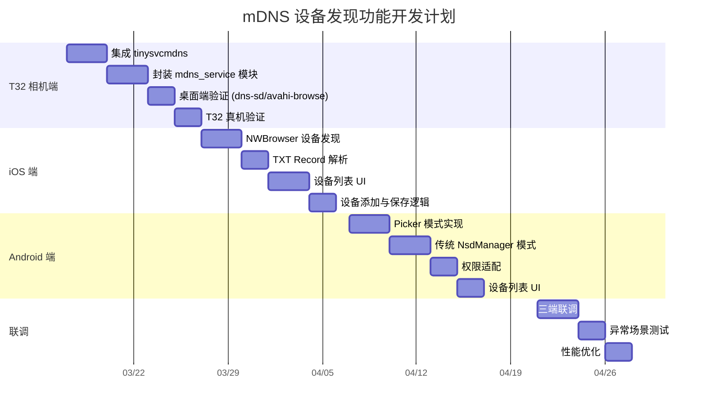

# mDNS 设备发现协议 — 三端技术方案

> **T32 相机端 / Android 端 / iOS 端**
>
> 版本：1.0 | 日期：2026-03-13 | 作者：技术部

---

## 1. 概述

### 1.1 项目背景

- 基于君正 T32 芯片的 IP 相机产品，运行 Linux 系统
- 需要手机 APP（Android/iOS）在局域网内发现相机设备并添加
- 选用 mDNS/DNS-SD（Multicast DNS + DNS Service Discovery）作为设备发现协议

### 1.2 方案选型理由

mDNS 对比 SSDP 的优势：

- iOS 原生支持 Bonjour（NWBrowser），不需要申请 `com.apple.developer.networking.multicast` entitlement
- Android 原生 NsdManager 支持 mDNS/DNS-SD，且 Android 17 的 Picker 模式可绕过 `ACCESS_LOCAL_NETWORK` 权限
- T32 Linux 端可使用极轻量的 tinysvcmdns 库（约 14-16 KB Flash），无外部依赖
- mDNS 在消费级 IoT 生态中更主流（HomeKit、Matter、Chromecast 等均使用 mDNS）

### 1.3 系统架构总览



---

## 2. 协议定义

### 2.1 服务类型定义

- **服务类型：** `_t32cam._tcp`（产品相关的唯一标识）
- **说明：** 下划线开头，`_tcp` 表示传输层协议

### 2.2 服务实例名

- **格式：** `"{设备名称}"`（如 `"T32Camera-Living-Room"`）
- 设备名称在出厂时设定，用户可通过 APP 修改

### 2.3 TXT Record 字段定义

| 键 | 值示例 | 说明 |
|---|---|---|
| `model` | `T32CamPro` | 设备型号 |
| `sn` | `ABC123456` | 设备序列号 |
| `fw_ver` | `1.2.3` | 固件版本 |
| `rtsp_port` | `554` | RTSP 流端口 |
| `ctrl_port` | `80` | HTTP 控制接口端口 |
| `mac` | `AA:BB:CC:DD:EE:FF` | MAC 地址 |
| `status` | `ready` | 设备状态（ready / streaming / updating） |

### 2.4 DNS 记录说明



- **PTR 记录：** `_t32cam._tcp.local.` → `T32Camera-Living-Room._t32cam._tcp.local.`
- **SRV 记录：** `T32Camera-Living-Room._t32cam._tcp.local.` → `mycamera.local:80`
- **TXT 记录：** 携带上述 KV 信息
- **A 记录：** `mycamera.local.` → `192.168.x.x`

---

## 3. T32 相机端实现方案

### 3.1 技术选型

- 使用 [tinysvcmdns](https://github.com/Pro/tinysvcmdns) 库
- 纯 C 实现，零外部依赖，仅需 socket + pthread
- Flash 占用约 14-16 KB（MIPS32 架构 `-Os` 编译）
- RAM 占用约 200 字节 BSS + 少量堆内存

### 3.2 模块设计



- **mdns_service 模块：** 封装 tinysvcmdns，提供初始化/注册/注销接口
- **与主应用集成：** 作为库链接到相机主进程，不需要独立 daemon
- **生命周期：** 随主进程启动/退出

### 3.3 核心代码示例

```c
#include "mdnsd.h"
#include <arpa/inet.h>

static struct mdnsd *g_mdns_server = NULL;
static struct mdns_service *g_mdns_svc = NULL;

int mdns_service_init(const char *device_name, const char *ip_addr,
                      uint16_t ctrl_port, uint16_t rtsp_port,
                      const char *model, const char *serial) {
    g_mdns_server = mdnsd_start();
    if (!g_mdns_server) return -1;

    uint32_t ip = inet_addr(ip_addr);
    char hostname[64];
    snprintf(hostname, sizeof(hostname), "%s.local", device_name);
    mdnsd_set_hostname(g_mdns_server, hostname, ip);

    char rtsp_str[8], ctrl_str[8];
    snprintf(rtsp_str, sizeof(rtsp_str), "%u", rtsp_port);
    snprintf(ctrl_str, sizeof(ctrl_str), "%u", ctrl_port);

    const char *txt[] = {
        "model=", model,     // 注意：实际拼接为 "model=T32CamPro"
        "sn=", serial,
        "rtsp_port=", rtsp_str,
        "ctrl_port=", ctrl_str,
        "status=ready",
        NULL
    };
    // 注：实际使用时需要拼接完整的 KV 字符串

    g_mdns_svc = mdnsd_register_svc(g_mdns_server,
        device_name, "_t32cam._tcp.local", ctrl_port, NULL, txt);

    return (g_mdns_svc != NULL) ? 0 : -1;
}

void mdns_service_deinit(void) {
    if (g_mdns_server) {
        mdnsd_stop(g_mdns_server);
        g_mdns_server = NULL;
        g_mdns_svc = NULL;
    }
}
```

### 3.4 网络配置注意事项

- 确保 T32 的 WiFi 驱动支持组播（multicast）
- 组播地址：`224.0.0.251`，端口：`5353`
- 防火墙（如果有 iptables）需放行 UDP 5353
- 如果 T32 同时作为 AP 和 STA，需确认组播包在正确接口上发送

### 3.5 集成步骤

1. 将 `mdns.c`、`mdns.h`、`mdnsd.c`、`mdnsd.h` 加入工程 Makefile
2. 编译选项添加 `-lpthread`
3. 在网络就绪后调用 `mdns_service_init()`
4. 在网络断开或进程退出时调用 `mdns_service_deinit()`
5. IP 地址变化时，需要重新注册服务

---

## 4. Android 端实现方案

### 4.1 技术选型

- **语言：** Kotlin
- **主方案：** NsdManager Picker 模式（Android 16+，无需 `ACCESS_LOCAL_NETWORK` 权限）
- **备选方案 A：** NsdManager 传统模式（Android 4.1+，Android 17+ 需 `ACCESS_LOCAL_NETWORK` 权限）
- **备选方案 B：** RxDNSSD（第三方库，稳定性优于 NsdManager 传统模式）
- **兜底：** 手动输入 IP 地址

### 4.2 权限要求

| 权限 | 用途 | 版本要求 |
|---|---|---|
| `INTERNET` | 网络通信 | 所有版本 |
| `ACCESS_WIFI_STATE` | 获取 WiFi 状态 | 所有版本 |
| `CHANGE_WIFI_STATE` | MulticastLock | 所有版本 |
| `ACCESS_FINE_LOCATION` | WiFi 扫描 | Android 10+ |
| `ACCESS_LOCAL_NETWORK` | 本地网络访问 | Android 17+（SDK 37+），仅传统模式需要 |

### 4.3 方案选择流程



### 4.4 Picker 模式实现（推荐，Android 16+）

```kotlin
class CameraDiscoveryManager(private val context: Context) {
    private val nsdManager = context.getSystemService(Context.NSD_SERVICE) as NsdManager

    fun discoverWithPicker(onFound: (NsdServiceInfo) -> Unit) {
        val discoveryRequest = DiscoveryRequest.Builder("_t32cam._tcp")
            .setFlags(DiscoveryRequest.FLAG_SHOW_PICKER)
            .build()

        nsdManager.registerServiceInfoCallback(
            discoveryRequest,
            context.mainExecutor,
            object : NsdManager.ServiceInfoCallback {
                override fun onServiceUpdated(serviceInfo: NsdServiceInfo) {
                    // 用户已选择设备，可直接连接
                    val host = serviceInfo.hostAddresses.firstOrNull()
                    val port = serviceInfo.port
                    val txtRecords = serviceInfo.attributes
                    onFound(serviceInfo)
                }

                override fun onServiceLost() { /* 设备离线 */ }
                override fun onServiceInfoCallbackRegistrationFailed(errorCode: Int) { /* 错误处理 */ }
                override fun onServiceInfoCallbackUnregistered() { /* 清理 */ }
            }
        )
    }
}
```

**优点：**
- 无需 `ACCESS_LOCAL_NETWORK` 权限
- 系统级 UI，用户体验一致
- 只暴露用户选择的设备

### 4.5 传统模式实现（兼容旧版本）

```kotlin
class CameraDiscoveryLegacy(private val context: Context) {
    private val nsdManager = context.getSystemService(Context.NSD_SERVICE) as NsdManager
    private val wifiManager = context.getSystemService(Context.WIFI_SERVICE) as WifiManager
    private var multicastLock: WifiManager.MulticastLock? = null

    private val discoveredDevices = mutableListOf<CameraDevice>()

    data class CameraDevice(
        val name: String,
        val host: InetAddress,
        val port: Int,
        val model: String,
        val serialNumber: String,
        val rtspPort: Int,
        val firmwareVersion: String
    )

    fun startDiscovery() {
        // 必须持有 MulticastLock
        multicastLock = wifiManager.createMulticastLock("camera_discovery").apply {
            setReferenceCounted(true)
            acquire()
        }

        nsdManager.discoverServices(
            "_t32cam._tcp",
            NsdManager.PROTOCOL_DNS_SD,
            discoveryListener
        )
    }

    private val discoveryListener = object : NsdManager.DiscoveryListener {
        override fun onServiceFound(serviceInfo: NsdServiceInfo) {
            nsdManager.resolveService(serviceInfo, resolveListener)
        }
        override fun onServiceLost(serviceInfo: NsdServiceInfo) {
            discoveredDevices.removeAll { it.name == serviceInfo.serviceName }
        }
        override fun onDiscoveryStarted(serviceType: String) {}
        override fun onDiscoveryStopped(serviceType: String) {}
        override fun onStartDiscoveryFailed(serviceType: String, errorCode: Int) {}
        override fun onStopDiscoveryFailed(serviceType: String, errorCode: Int) {}
    }

    private val resolveListener = object : NsdManager.ResolveListener {
        override fun onServiceResolved(serviceInfo: NsdServiceInfo) {
            val attrs = serviceInfo.attributes
            val device = CameraDevice(
                name = serviceInfo.serviceName,
                host = serviceInfo.host,
                port = serviceInfo.port,
                model = attrs["model"]?.decodeToString() ?: "",
                serialNumber = attrs["sn"]?.decodeToString() ?: "",
                rtspPort = attrs["rtsp_port"]?.decodeToString()?.toIntOrNull() ?: 554,
                firmwareVersion = attrs["fw_ver"]?.decodeToString() ?: ""
            )
            discoveredDevices.add(device)
        }
        override fun onResolveFailed(serviceInfo: NsdServiceInfo, errorCode: Int) {}
    }

    fun stopDiscovery() {
        nsdManager.stopServiceDiscovery(discoveryListener)
        multicastLock?.release()
    }
}
```

### 4.6 已知问题与对策

| 问题 | 现象 | 对策 |
|---|---|---|
| NsdManager Resolve 卡死 | 同时 resolve 多个服务时回调不触发 | 串行 resolve，加超时机制（3秒），超时后跳过 |
| 组播包被省电过滤 | 锁屏后收不到设备广播 | 持有 MulticastLock + 使用前台服务 |
| Android 17+ 权限阻塞 | 默认阻塞本地网络 | 优先用 Picker 模式；传统模式需申请 `ACCESS_LOCAL_NETWORK` |
| IPv6 地址解析异常 | resolve 返回 IPv6 link-local 地址 | 过滤，优先使用 IPv4 地址 |

### 4.7 AndroidManifest.xml 配置

```xml
<uses-permission android:name="android.permission.INTERNET" />
<uses-permission android:name="android.permission.ACCESS_WIFI_STATE" />
<uses-permission android:name="android.permission.CHANGE_WIFI_STATE" />
<uses-permission android:name="android.permission.ACCESS_FINE_LOCATION" />
<uses-permission android:name="android.permission.ACCESS_LOCAL_NETWORK" />

<!-- 声明 mDNS 服务类型 -->
<intent-filter>
    <action android:name="android.net.nsd.SERVICE_TYPE" />
    <data android:value="_t32cam._tcp" />
</intent-filter>
```

---

## 5. iOS 端实现方案

### 5.1 技术选型

- **语言：** Swift
- 使用 Apple Network.framework 的 NWBrowser（iOS 13+）
- Bonjour 原生支持，无需额外 entitlement
- 只需在 Info.plist 声明服务类型和本地网络用途

### 5.2 权限配置

Info.plist 需要添加：

```xml
<key>NSLocalNetworkUsageDescription</key>
<string>需要访问本地网络以发现和连接您的相机设备</string>
<key>NSBonjourServices</key>
<array>
    <string>_t32cam._tcp</string>
</array>
```

- `NSLocalNetworkUsageDescription`：首次触发本地网络弹窗的说明文字
- `NSBonjourServices`：声明要发现的服务类型，iOS 14+ 必须声明

### 5.3 核心实现代码

```swift
import Network

class CameraDiscoveryManager {
    private var browser: NWBrowser?
    private var connections: [String: NWConnection] = [:]

    struct CameraDevice {
        let name: String
        let host: String
        let port: UInt16
        let model: String
        let serialNumber: String
        let rtspPort: UInt16
        let firmwareVersion: String
    }

    var onDeviceFound: ((CameraDevice) -> Void)?
    var onDeviceLost: ((String) -> Void)?

    func startDiscovery() {
        let params = NWParameters()
        params.includePeerToPeer = true

        browser = NWBrowser(
            for: .bonjour(type: "_t32cam._tcp", domain: nil),
            using: params)

        browser?.browseResultsChangedHandler = { [weak self] results, changes in
            for change in changes {
                switch change {
                case .added(let result):
                    self?.resolveService(result)
                case .removed(let result):
                    if case .service(let name, _, _, _) = result.endpoint {
                        self?.onDeviceLost?(name)
                    }
                default:
                    break
                }
            }
        }

        browser?.stateUpdateHandler = { state in
            switch state {
            case .ready:
                print("Browser ready")
            case .failed(let error):
                print("Browser failed: \(error)")
            default:
                break
            }
        }

        browser?.start(queue: .main)
    }

    private func resolveService(_ result: NWBrowser.Result) {
        let connection = NWConnection(to: result.endpoint, using: .tcp)

        connection.stateUpdateHandler = { [weak self] state in
            if case .ready = state {
                if let endpoint = connection.currentPath?.remoteEndpoint,
                   case .hostPort(let host, let port) = endpoint {
                    if case .service(let name, _, _, _) = result.endpoint {
                        let metadata = result.metadata
                        var txtDict: [String: String] = [:]
                        if case .bonjour(let txtRecord) = metadata {
                            // 解析 TXT record 数据
                        }

                        let device = CameraDevice(
                            name: name,
                            host: "\(host)",
                            port: port.rawValue,
                            model: txtDict["model"] ?? "",
                            serialNumber: txtDict["sn"] ?? "",
                            rtspPort: UInt16(txtDict["rtsp_port"] ?? "554") ?? 554,
                            firmwareVersion: txtDict["fw_ver"] ?? ""
                        )
                        self?.onDeviceFound?(device)
                    }
                }
                connection.cancel()
            }
        }

        connection.start(queue: .main)
    }

    func stopDiscovery() {
        browser?.cancel()
        browser = nil
    }
}
```

### 5.4 使用 NetServiceBrowser 的替代方案（兼容 iOS 12 及更早）

```swift
import Foundation

class CameraDiscoveryLegacy: NSObject, NetServiceBrowserDelegate, NetServiceDelegate {
    private let browser = NetServiceBrowser()
    private var services: [NetService] = []

    func startDiscovery() {
        browser.delegate = self
        browser.searchForServices(ofType: "_t32cam._tcp", inDomain: "local.")
    }

    func netServiceBrowser(_ browser: NetServiceBrowser, didFind service: NetService,
                           moreComing: Bool) {
        services.append(service)
        service.delegate = self
        service.resolve(withTimeout: 5.0)
    }

    func netServiceDidResolveAddress(_ sender: NetService) {
        guard let addresses = sender.addresses else { return }
        let txtData = sender.txtRecordData()
        // 解析 TXT record 和地址信息
    }
}
```

> **注意：** `NetServiceBrowser` 在 iOS 15+ 已标记 deprecated，新项目应使用 NWBrowser。

### 5.5 已知问题与对策

| 问题 | 现象 | 对策 |
|---|---|---|
| 本地网络权限弹窗 | 用户拒绝后无法发现设备 | 引导用户到设置中开启；提供手动输入 IP 的兜底方案 |
| 后台发现受限 | APP 进入后台后 NWBrowser 停止 | 回到前台时重新启动 browser |
| mDNS 缓存延迟 | 设备上线后几秒才被发现 | UI 上显示"正在搜索"状态，允许手动刷新 |

---

## 6. 三端交互流程

### 6.1 设备发现时序图



### 6.2 设备添加流程



### 6.3 设备重连流程



### 6.4 设备离线检测

- **mDNS TTL 机制：** 设备正常退出时发送 goodbye 包（TTL=0）
- **APP 端回调：** NWBrowser/NsdManager 的 `onServiceLost` 回调
- **应用层心跳：** 已添加设备定期检测在线状态



---

## 7. 资源占用总结

| 项目 | T32 相机端 | Android APP | iOS APP |
|---|---|---|---|
| Flash/安装包增量 | ~14-16 KB | 忽略（系统 API） | 忽略（系统 API） |
| RAM 增量 | ~2-4 KB | ~1 MB（NsdManager 服务） | ~1 MB（NWBrowser） |
| 外部依赖 | 无（pthread 系统自带） | 无 | 无 |
| 最低系统版本 | Linux 2.6+（T32 满足） | Android 4.1（API 16） | iOS 13（NWBrowser） |
| 网络开销 | 极低（仅组播包） | 极低 | 极低 |

---

## 8. 风险与对策总结

| 风险 | 严重程度 | 影响范围 | 对策 |
|---|---|---|---|
| 路由器/AP 禁用组播 | 中 | 三端均受影响 | APP 提供手动输入 IP 功能 |
| AP 隔离模式 | 中 | 三端均受影响 | APP 检测并提示用户关闭 AP 隔离 |
| Android NsdManager 稳定性 | 低 | Android | 串行 resolve + 超时处理；备选 RxDNSSD |
| Android 17 权限收紧 | 中 | Android | Picker 模式绕过权限 |
| iOS 用户拒绝本地网络权限 | 中 | iOS | 引导开启 + 手动 IP 兜底 |
| T32 WiFi 驱动不支持组播 | 低 | T32 | 验证驱动，必要时添加内核配置 |
| 多相机同名冲突 | 低 | 三端 | mDNS 自动追加编号（RFC 6762） |

---

## 9. 开发计划建议



### 阶段一：T32 端（1-2 周）
- 集成 tinysvcmdns 到工程
- 实现 mdns_service 封装模块
- 验证 macOS/Linux 上 `dns-sd` 或 `avahi-browse` 能发现服务
- 验证 TXT record 内容正确

### 阶段二：iOS 端（1-2 周）
- 实现 NWBrowser 设备发现
- TXT Record 解析
- 设备列表 UI
- 设备添加与保存逻辑

### 阶段三：Android 端（1-2 周）
- 实现 Picker 模式（主路径）
- 实现传统 NsdManager 模式（兼容路径）
- 权限适配（Android 17 `ACCESS_LOCAL_NETWORK`）
- 设备列表 UI

### 阶段四：联调与优化（1 周）
- 三端联调
- 异常场景测试（网络切换、设备离线、权限拒绝等）
- 性能优化（发现速度、功耗）
